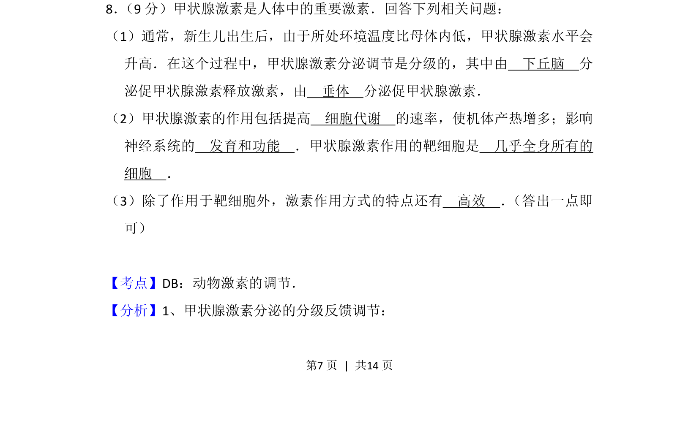
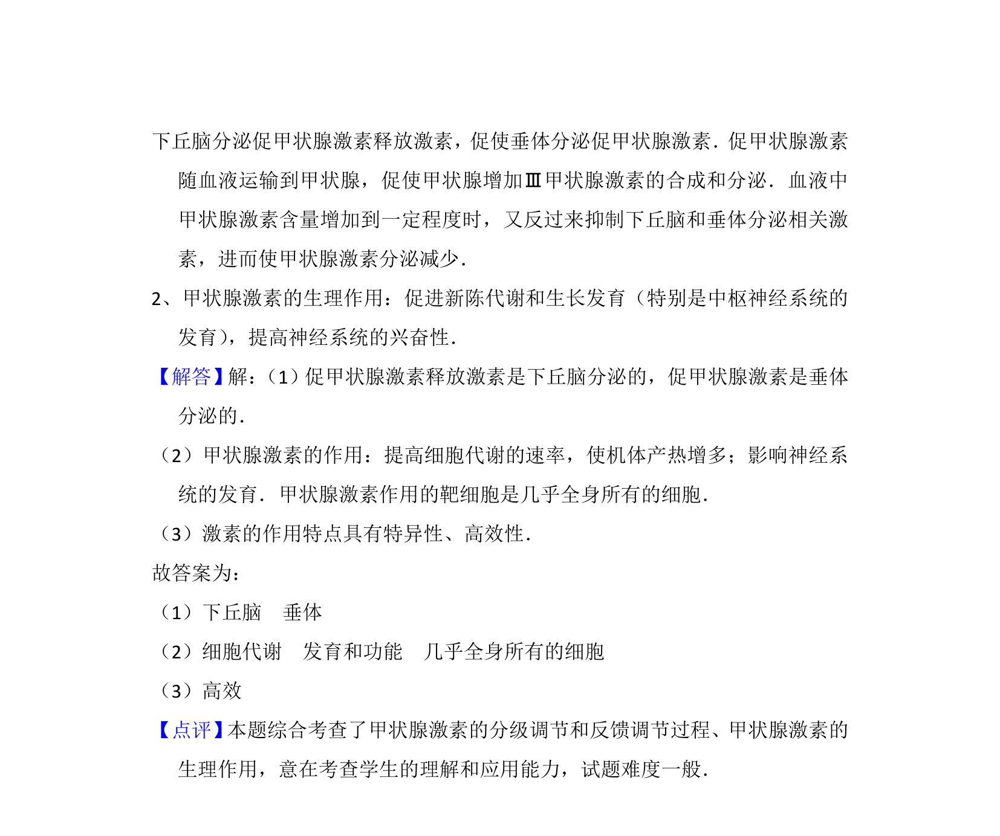

## 题面

## 摘要

本题通过填空形式考查甲状腺激素的分级调节、生理作用及激素调节特点。

## 关联考点

- [[338-甲状腺激素|甲状腺激素]]
- [[472-分级调节|分级调节]]
- [[630-激素作用特点|激素作用特点]]

## 答案与解析

> 📄 原 PDF 第 7 页：`素材/真题/吉林/2008-2024·（吉林）生物高考真题/2015年高考生物试卷（新课标Ⅱ）（解析卷）.pdf`

<!-- 题干文本-start -->
## 题干文本
8． （9分）甲状腺激素是人体中的重要激素．回答下列相关问题：
（1）通常，新生儿出生后，由于所处环境温度比母体内低，甲状腺激素水平会
升高．在这个过程中，甲状腺激素分泌调节是分级的，其中由　下丘脑　分
泌促甲状腺激素释放激素，由　垂体　分泌促甲状腺激素．
（2）甲状腺激素的作用包括提高　细胞代谢　的速率，使机体产热增多；影响
神经系统的　发育和功能　．甲状腺激素作用的靶细胞是　几乎全身所有的
细胞　．
（3）除了作用于靶细胞外，激素作用方式的特点还有　高效　． （答出一点即
可）
<!-- 题干文本-end -->

<!-- 解析文本-start -->
## 解析文本
【考点】DB：动物激素的调节．菁优网版权所有
【分析】1、甲状腺激素分泌的分级反馈调节：
<!-- 解析文本-end -->
