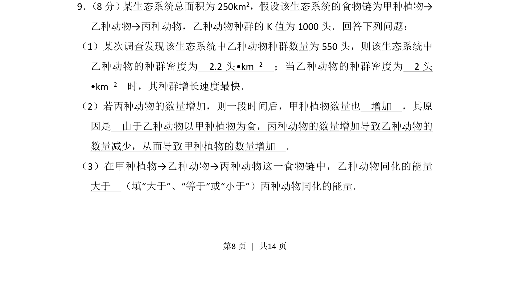
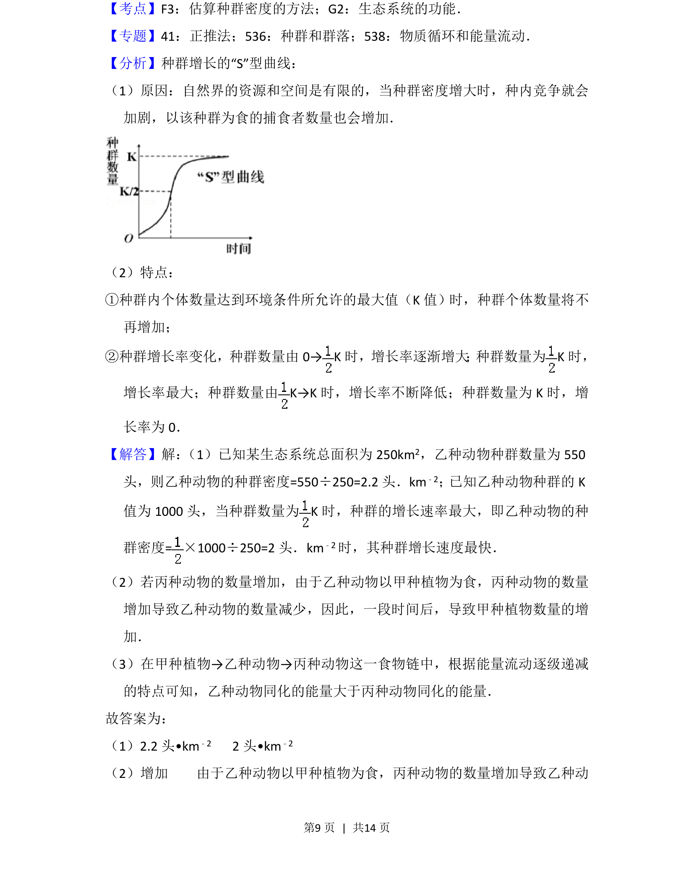
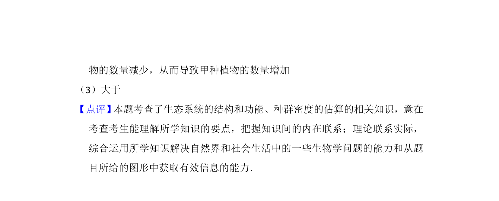

## 题面

## 摘要

该题考查生态系统中的种群密度计算、食物链关系和能量流动特点。

## 关联考点

- [[370-种群密度|种群密度]]
- [[028-食物链|食物链]]
- [[385-生态系统能量流动|能量流动]]

## 答案与解析

> 📄 原 PDF 第 8 页：`素材/真题/吉林/2008-2024·（吉林）生物高考真题/2015年高考生物试卷（新课标Ⅱ）（解析卷）.pdf`
