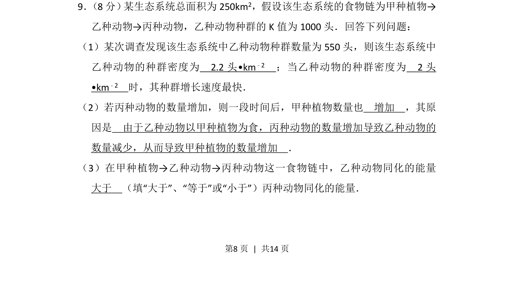
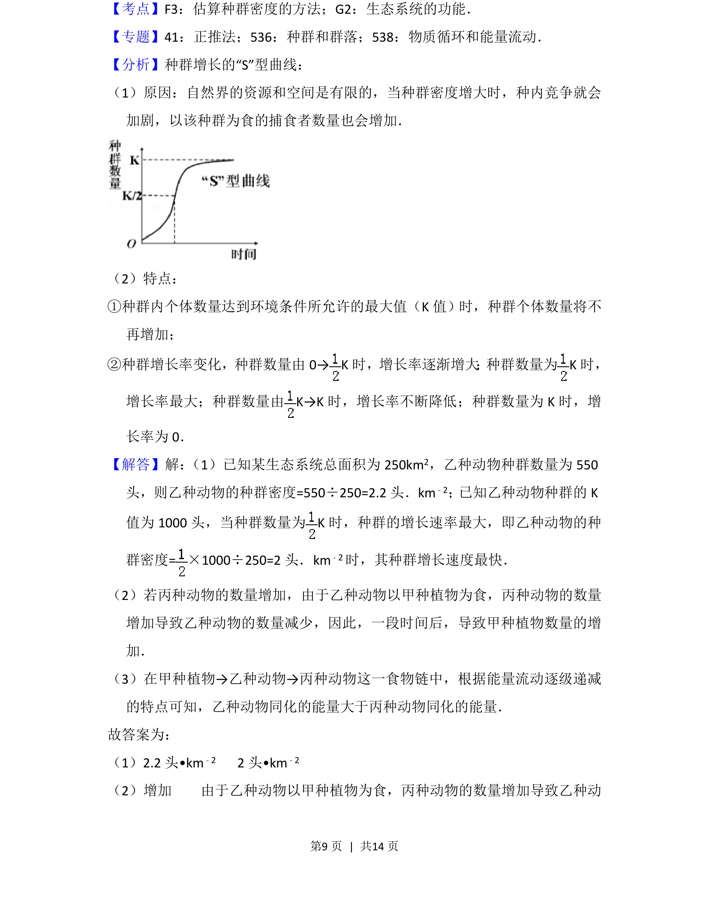
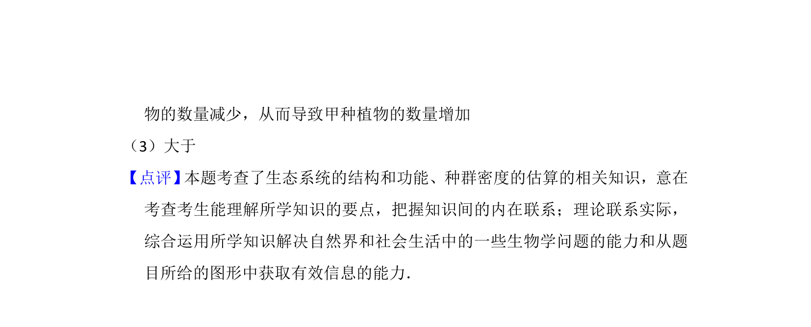

## 题面

## 摘要

该题考查生态系统中的种群密度计算、食物链关系和能量流动特点。

## 关联考点

- [[370-种群密度|种群密度]]
- [[028-食物链|食物链]]
- [[385-生态系统能量流动|能量流动]]

## 答案与解析

> 📄 原 PDF 第 8 页：`素材/真题/吉林/2008-2024·（吉林）生物高考真题/2015年高考生物试卷（新课标Ⅱ）（解析卷）.pdf`

<!-- 题干文本-start -->
## 题干文本
9． （8分） 某生态系统总面积为250km2，假设该生态系统的食物链为甲种植物→
乙种动物→丙种动物，乙种动物种群的K值为1000头．回答下列问题：
（1）某次调查发现该生态系统中乙种动物种群数量为550头，则该生态系统中
乙种动物的种群密度为　2.2头•km ﹣2　；当乙种动物的种群密度为　2头
•km﹣2　时，其种群增长速度最快．
（2）若丙种动物的数量增加，则一段时间后，甲种植物数量也　增加　，其原
因是　由于乙种动物以甲种植物为食，丙种动物的数量增加导致乙种动物的
数量减少，从而导致甲种植物的数量增加　．
（3）在甲种植物→乙种动物→丙种动物这一食物链中，乙种动物同化的能量　
大于　（填“大于”、“等于”或“小于”）丙种动物同化的能量．
<!-- 题干文本-end -->

<!-- 解析文本-start -->
## 解析文本

<!-- 解析文本-end -->
