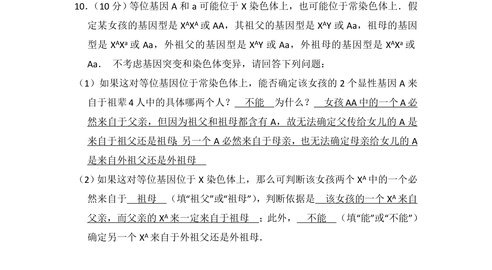
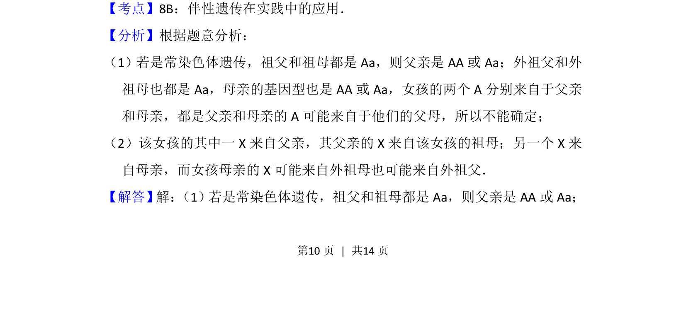
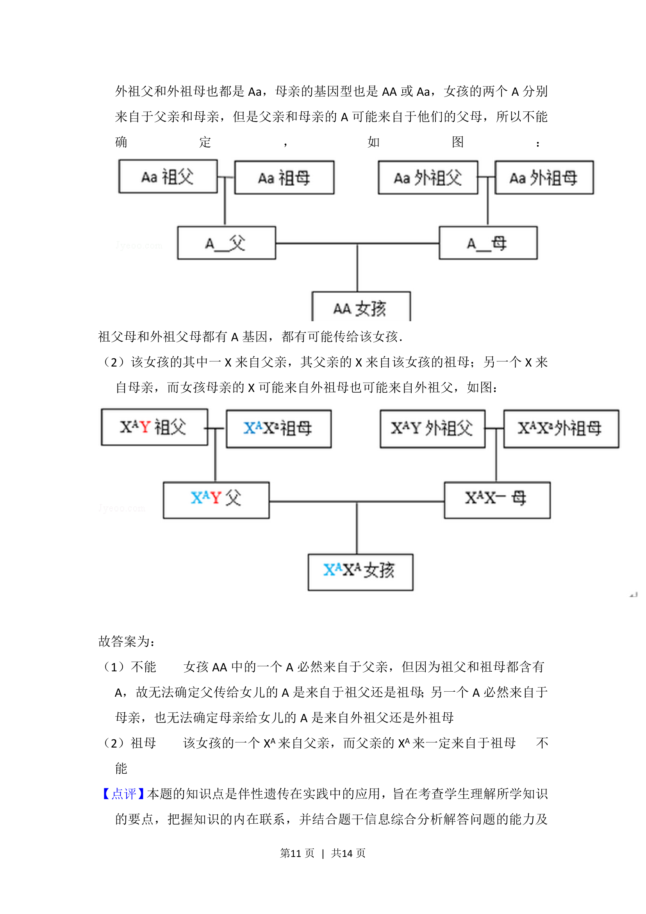

## 题面

## 摘要

探究常染色体与X染色体遗传中显性基因来源的推断方法

## 关联考点

- [[804-常染色体遗传|常染色体遗传]]
- [[276-伴性遗传|伴性遗传]]
- [[579-基因来源推理|基因来源推理]]

## 答案与解析

> 📄 原 PDF 第 10 页：`素材/真题/吉林/2008-2024·（吉林）生物高考真题/2015年高考生物试卷（新课标Ⅱ）（解析卷）.pdf`

<!-- 题干文本-start -->
## 题干文本
10． （10分） 等位基因A和a可能位于X染色体上，也可能位于常染色体上．假
定某女孩的基因型是X AXA或AA，其祖父的基因型是X AY或Aa，祖母的基因
型是X AXa或Aa，外祖父的基因型是X AY或Aa，外祖母的基因型是X AXa或
Aa． 不考虑基因突变和染色体变异，请回答下列问题：
（1）如果这对等位基因位于常染色体上，能否确定该女孩的2个显性基因A来
自于祖辈4人中的具体哪两个人？　不能　为什么？　女孩AA中的一个A必
然来自于父亲，但因为祖父和祖母都含有A，故无法确定父传给女儿的A是
来自于祖父还是祖母 ； 另一个A必然来自于母亲，也无法确定母亲给女儿的A
是来自外祖父还是外祖母　
（2） 如果这对等位基因位于X染色体上，那么可判断该女孩两个XA中的一个必
然来自于　祖母　（填“祖父”或“祖母”） ，判断依据是　该女孩的一个XA来自
父亲，而父亲的X A来一定来自于祖母　；此外，　不能　（填“能”或“不能”）
确定另一个X A来自于外祖父还是外祖母．
<!-- 题干文本-end -->

<!-- 解析文本-start -->
## 解析文本
【考点】8B：伴性遗传在实践中的应用．菁优网版权所有
【分析】根据题意分析：
（1）若是常染色体遗传，祖父和祖母都是Aa，则父亲是AA或Aa；外祖父和外
祖母也都是Aa，母亲的基因型也是AA或Aa，女孩的两个A分别来自于父亲
和母亲，都是父亲和母亲的A可能来自于他们的父母，所以不能确定；
（2）该女孩的其中一X来自父亲，其父亲的X来自该女孩的祖母；另一个X来
自母亲，而女孩母亲的X可能来自外祖母也可能来自外祖父．
【解答】解： （1）若是常染色体遗传，祖父和祖母都是Aa，则父亲是AA或Aa；
<!-- 解析文本-end -->
