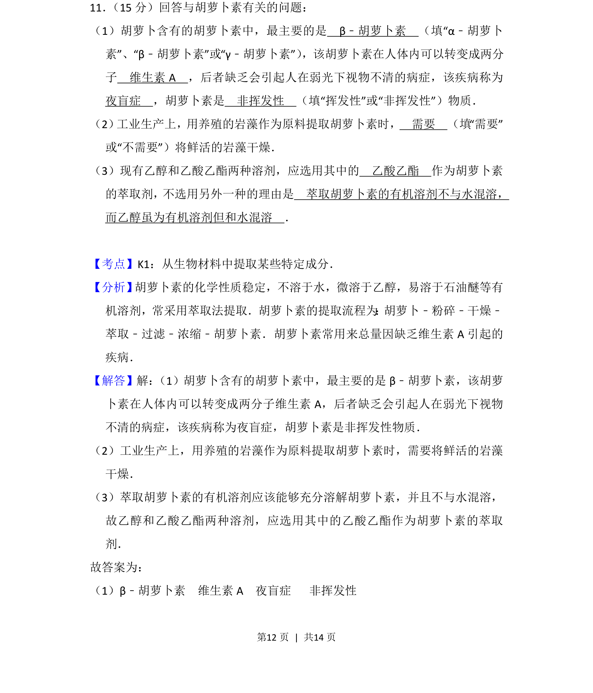
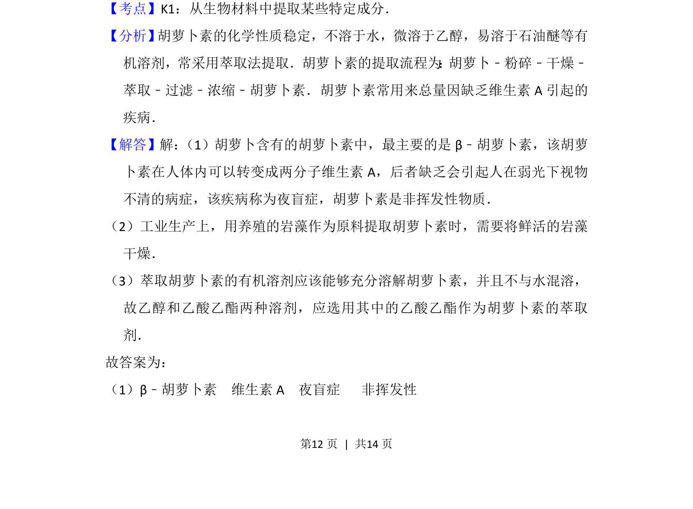
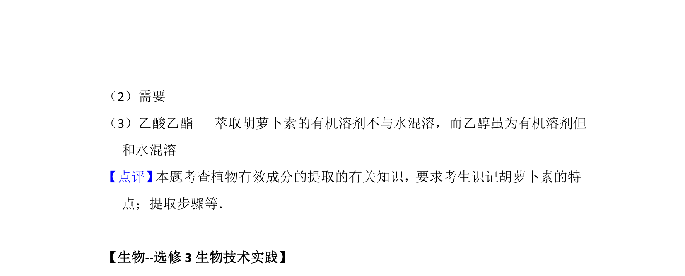

## 题面

## 摘要

本题考查胡萝卜素的种类、性质及萃取提取的相关知识。

## 关联考点

- [[465-β-胡萝卜素|β-胡萝卜素]]
- [[685-维生素A|维生素A]]
- [[776-萃取法|萃取法]]
- [[496-水溶性|水溶性]]

## 答案与解析

> 📄 原 PDF 第 12 页：`素材/真题/吉林/2008-2024·（吉林）生物高考真题/2015年高考生物试卷（新课标Ⅱ）（解析卷）.pdf`

<!-- 题干文本-start -->
## 题干文本
11． （15分）回答与胡萝卜素有关的问题：
（1）胡萝卜含有的胡萝卜素中，最主要的是　β﹣胡萝卜素　（填“α﹣胡萝卜
素”、“β﹣胡萝卜素”或“γ﹣胡萝卜素”） ，该胡萝卜素在人体内可以转变成两分
子　维生素A　，后者缺乏会引起人在弱光下视物不清的病症，该疾病称为　
夜盲症　，胡萝卜素是　非挥发性　（填“挥发性”或“非挥发性”）物质．
（2） 工业生产上，用养殖的岩藻作为原料提取胡萝卜素时，　需要　（填“需要”
或“不需要”）将鲜活的岩藻干燥．
（3）现有乙醇和乙酸乙酯两种溶剂，应选用其中的　乙酸乙酯　作为胡萝卜素
的萃取剂，不选用另外一种的理由是　萃取胡萝卜素的有机溶剂不与水混溶，
而乙醇虽为有机溶剂但和水混溶　．
<!-- 题干文本-end -->

<!-- 解析文本-start -->
## 解析文本
【考点】K1：从生物材料中提取某些特定成分．菁优网版权所有
【分析】 胡萝卜素的化学性质稳定，不溶于水，微溶于乙醇，易溶于石油醚等有
机溶剂，常采用萃取法提取．胡萝卜素的提取流程为 ： 胡萝卜﹣粉碎﹣干燥﹣
萃取﹣过滤﹣浓缩﹣胡萝卜素．胡萝卜素常用来总量因缺乏维生素A引起的
疾病．
【解答】解： （1）胡萝卜含有的胡萝卜素中，最主要的是β﹣胡萝卜素，该胡萝
卜素在人体内可以转变成两分子维生素A，后者缺乏会引起人在弱光下视物
不清的病症，该疾病称为夜盲症，胡萝卜素是非挥发性物质．
（2）工业生产上，用养殖的岩藻作为原料提取胡萝卜素时，需要将鲜活的岩藻
干燥．
（3）萃取胡萝卜素的有机溶剂应该能够充分溶解胡萝卜素，并且不与水混溶，
故乙醇和乙酸乙酯两种溶剂，应选用其中的乙酸乙酯作为胡萝卜素的萃取
剂．
故答案为：
（1）β﹣胡萝卜素  维生素A  夜盲症   非挥发性
<!-- 解析文本-end -->
