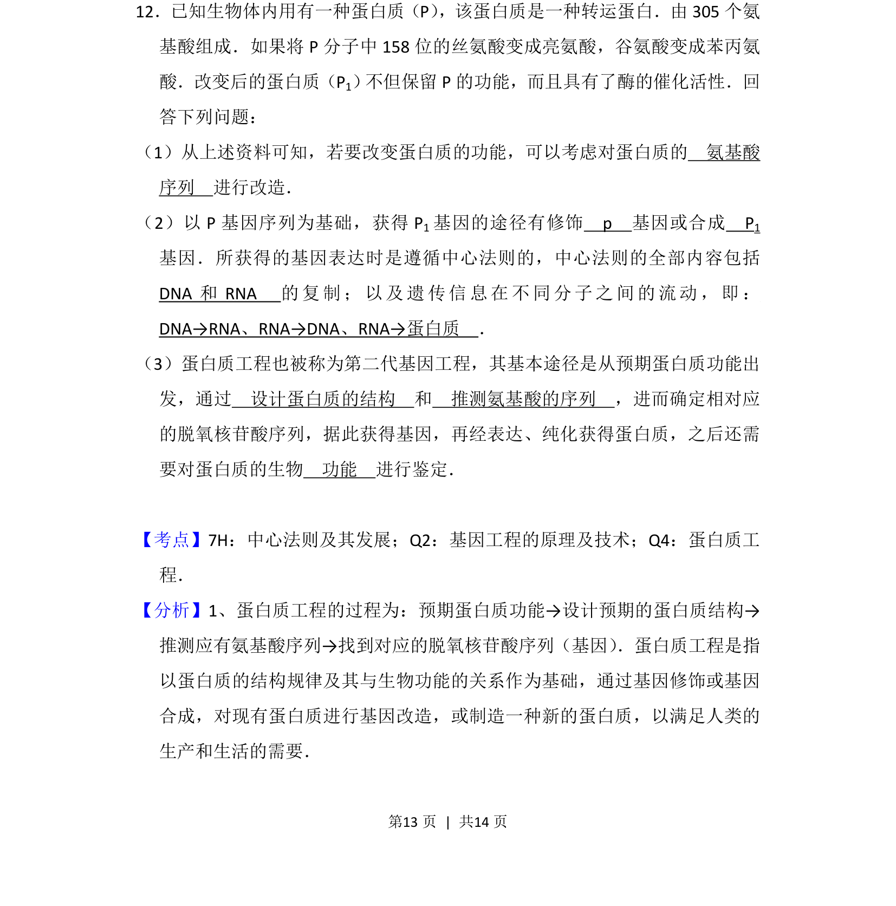
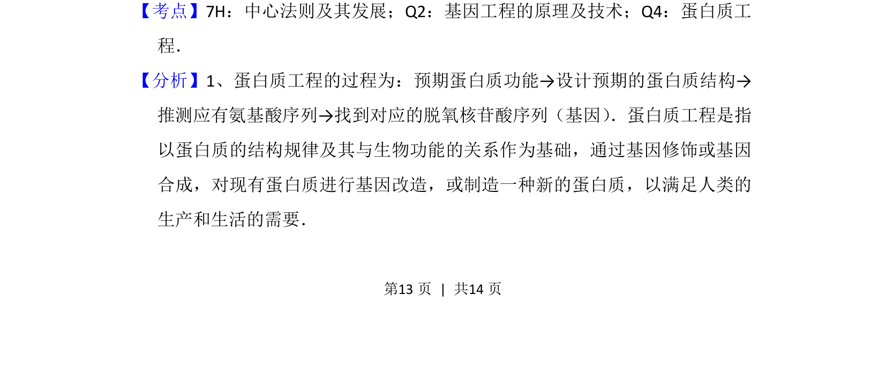
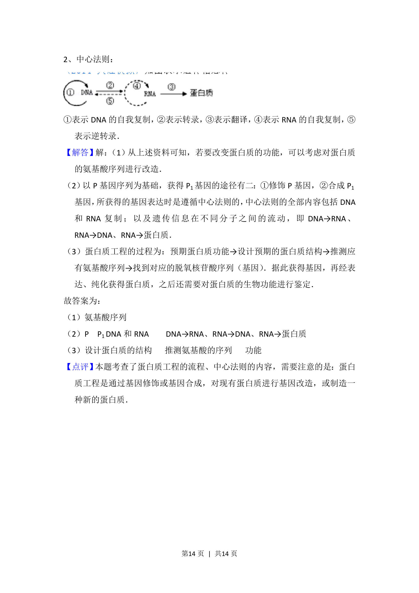

## 题面

## 摘要

本题考查蛋白质结构改造的途径及相关中心法则、蛋白质工程流程。

## 关联考点

- [[295-中心法则|中心法则]]
- [[411-基因工程|基因工程]]
- [[698-蛋白质工程|蛋白质工程]]

## 答案与解析

> 📄 原 PDF 第 13 页：`素材/真题/吉林/2008-2024·（吉林）生物高考真题/2015年高考生物试卷（新课标Ⅱ）（解析卷）.pdf`
