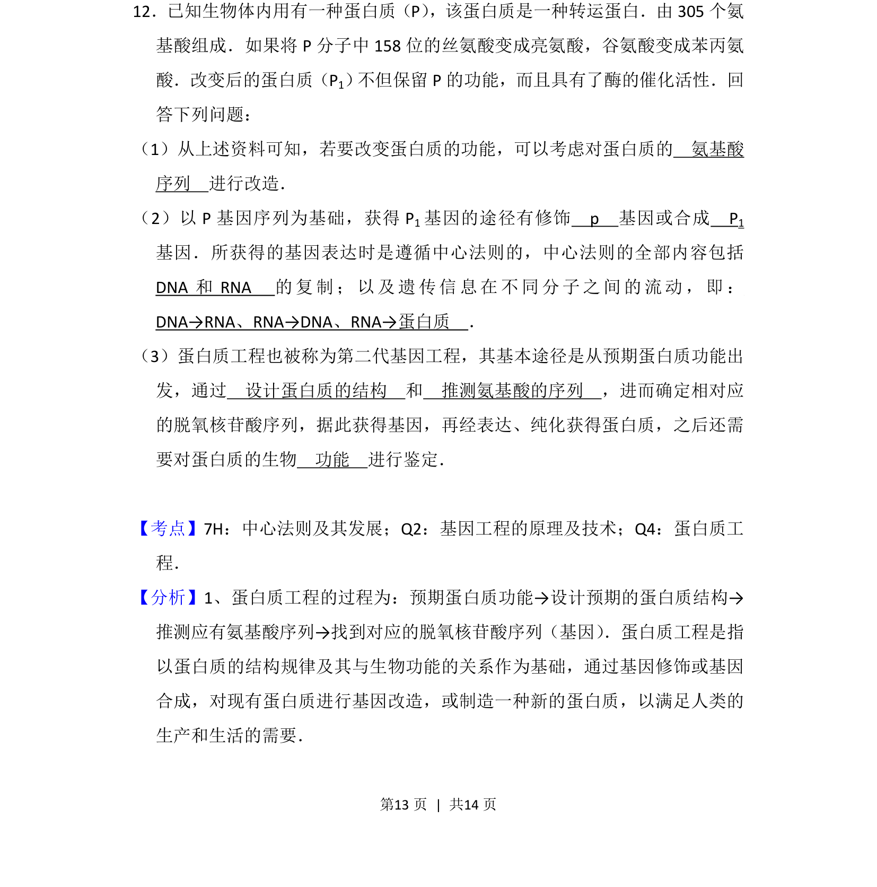
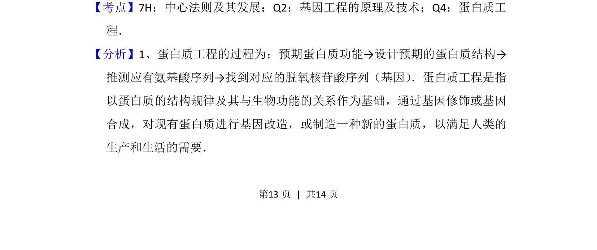
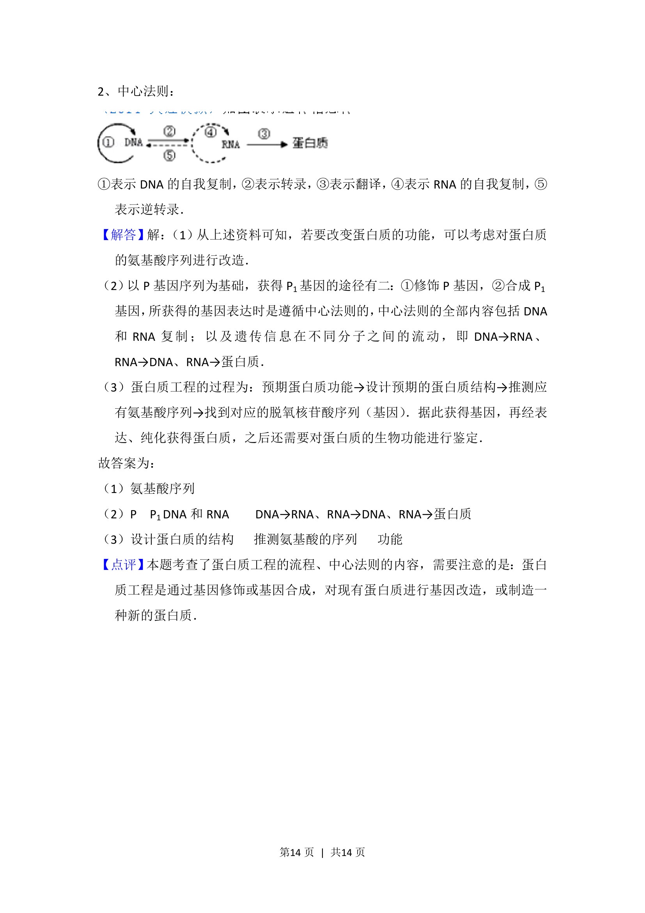

## 题面

## 摘要

本题考查蛋白质结构改造的途径及相关中心法则、蛋白质工程流程。

## 关联考点

- [[295-中心法则|中心法则]]
- [[411-基因工程|基因工程]]
- [[698-蛋白质工程|蛋白质工程]]

## 答案与解析

> 📄 原 PDF 第 13 页：`素材/真题/吉林/2008-2024·（吉林）生物高考真题/2015年高考生物试卷（新课标Ⅱ）（解析卷）.pdf`

<!-- 题干文本-start -->
## 题干文本
12．已知生物体内用有一种蛋白质（P） ，该蛋白质是一种转运蛋白．由305个氨
基酸组成．如果将P分子中158位的丝氨酸变成亮氨酸，谷氨酸变成苯丙氨
酸．改变后的蛋白质（P1） 不但保留P的功能，而且具有了酶的催化活性．回
答下列问题：
（1）从上述资料可知，若要改变蛋白质的功能，可以考虑对蛋白质的　氨基酸
序列　进行改造．
（2）以P基因序列为基础，获得P 1基因的途径有修饰　p　基因或合成　P 1　
基因．所获得的基因表达时是遵循中心法则的，中心法则的全部内容包括　
DNA和RNA　的复制；以及遗传信息在不同分子之间的流动，即：　
DNA→RNA、RNA→DNA、RNA→蛋白质　．
（3）蛋白质工程也被称为第二代基因工程，其基本途径是从预期蛋白质功能出
发，通过　设计蛋白质的结构　和　推测氨基酸的序列　，进而确定相对应
的脱氧核苷酸序列，据此获得基因，再经表达、纯化获得蛋白质，之后还需
要对蛋白质的生物　功能　进行鉴定．
<!-- 题干文本-end -->

<!-- 解析文本-start -->
## 解析文本
【考点】7H：中心法则及其发展；Q2：基因工程的原理及技术；Q4：蛋白质工
程．菁优网版权所有
【分析】1、蛋白质工程的过程为：预期蛋白质功能→设计预期的蛋白质结构→
推测应有氨基酸序列→找到对应的脱氧核苷酸序列（基因） ．蛋白质工程是指
以蛋白质的结构规律及其与生物功能的关系作为基础，通过基因修饰或基因
合成，对现有蛋白质进行基因改造，或制造一种新的蛋白质，以满足人类的
生产和生活的需要．
<!-- 解析文本-end -->
