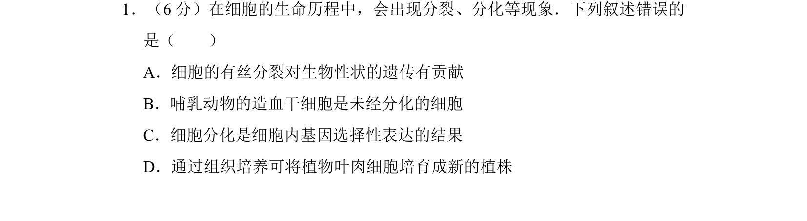

## 题面

## 摘要

该题考查细胞生命历程中的分裂与分化现象，要求找出错误叙述的选项。

## 关联考点

- [[045-细胞分化|细胞分化]]
- [[046-细胞分裂|有丝分裂]]
- [[基因表达]]
- [[178-组织培养|组织培养]]

## 答案与解析

> 📄 原 PDF 第 1 页：`素材/真题/吉林/2008-2024·（吉林）生物高考真题/2016年高考生物试卷（新课标Ⅱ）（解析卷）.pdf`
