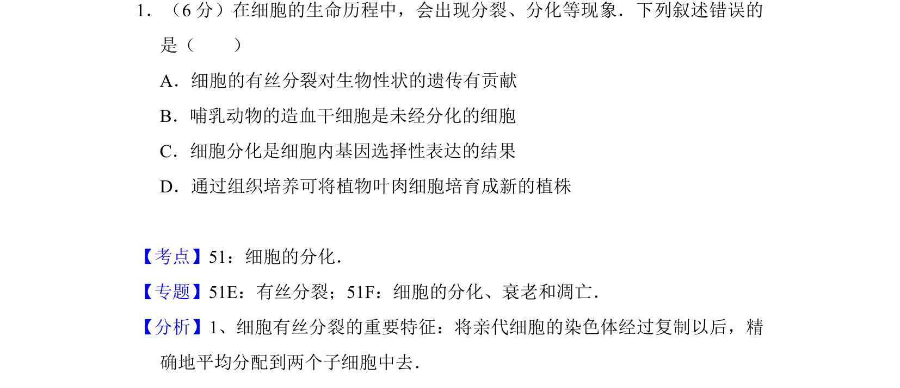
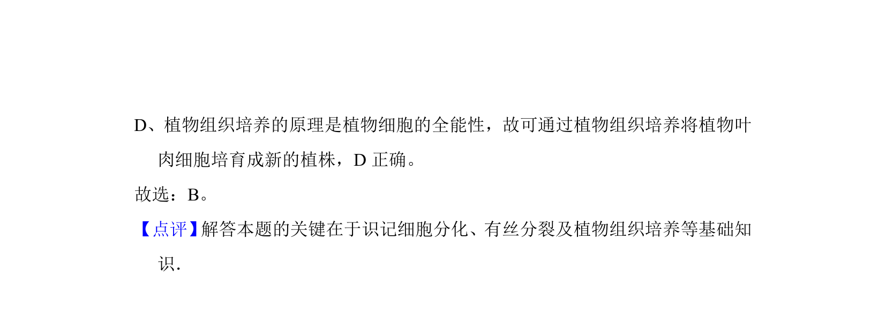

## 题面

## 摘要

该题考查细胞生命历程中的分裂与分化现象，要求找出错误叙述的选项。

## 关联考点

- [[045-细胞分化|细胞分化]]
- [[046-细胞分裂|有丝分裂]]
- [[843-基因的表达|基因表达]]
- [[178-组织培养|组织培养]]

## 答案与解析

> 📄 原 PDF 第 1 页：`素材/真题/吉林/2008-2024·（吉林）生物高考真题/2016年高考生物试卷（新课标Ⅱ）（解析卷）.pdf`

<!-- 题干文本-start -->
## 题干文本
1．（6分）在细胞的生命历程中，会出现分裂、分化等现象．下列叙述错误的
是（　　）
A．细胞的有丝分裂对生物性状的遗传有贡献
B．哺乳动物的造血干细胞是未经分化的细胞
C．细胞分化是细胞内基因选择性表达的结果
D．通过组织培养可将植物叶肉细胞培育成新的植株
<!-- 题干文本-end -->

<!-- 解析文本-start -->
## 解析文本
【考点】51：细胞的分化．菁优网版权所有
【专题】51E：有丝分裂；51F：细胞的分化、衰老和凋亡．
【分析】1、细胞有丝分裂的重要特征：将亲代细胞的染色体经过复制以后，精
确地平均分配到两个子细胞中去．
<!-- 解析文本-end -->
