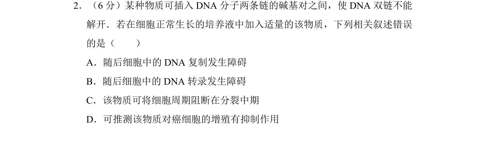
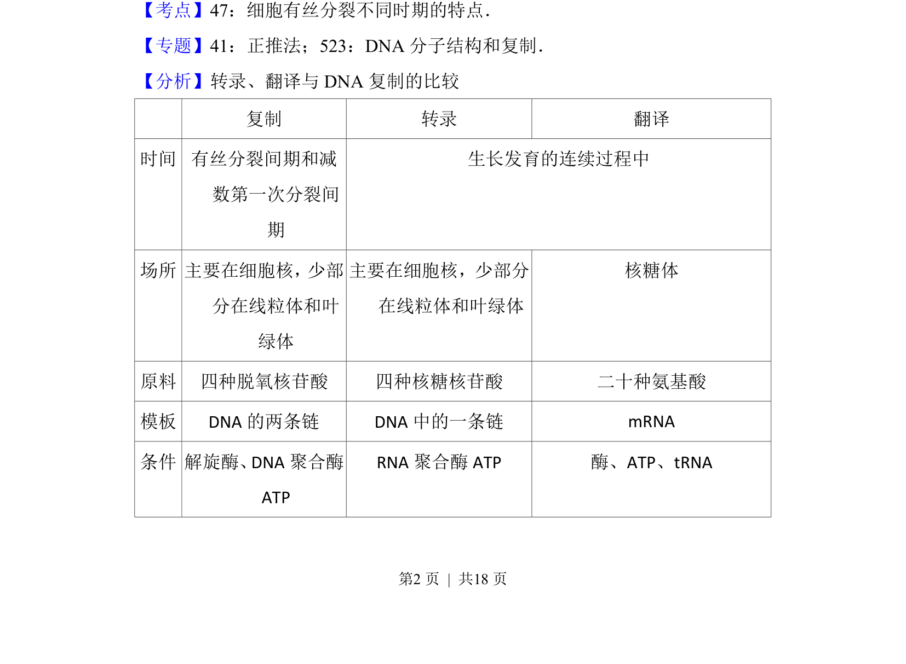
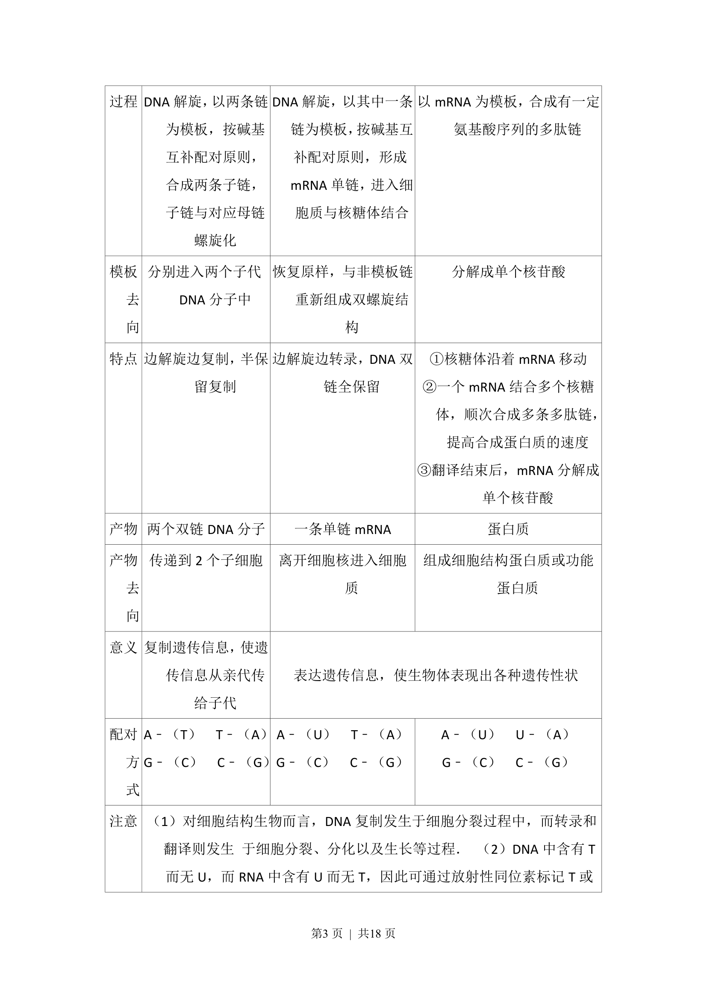
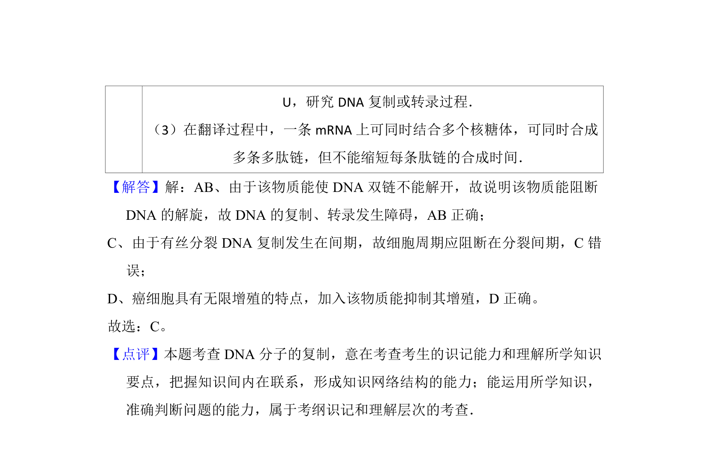

## 题面

## 摘要

本题简述细胞有丝分裂对维持亲代与子代遗传性状稳定性的意义。

## 关联考点

- [[046-细胞分裂|有丝分裂]]
- [[200-染色体|染色体]]
- [[719-遗传物质|遗传物质]]
- [[668-稳定性|稳定性]]

## 答案与解析

> 📄 原 PDF 第 2 页：`素材/真题/吉林/2008-2024·（吉林）生物高考真题/2016年高考生物试卷（新课标Ⅱ）（解析卷）.pdf`
