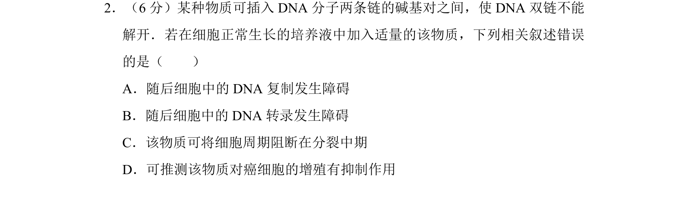
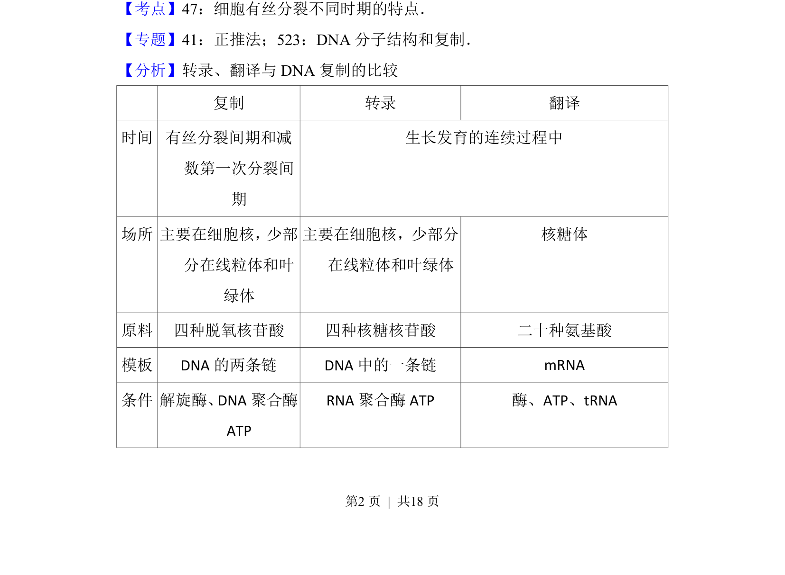
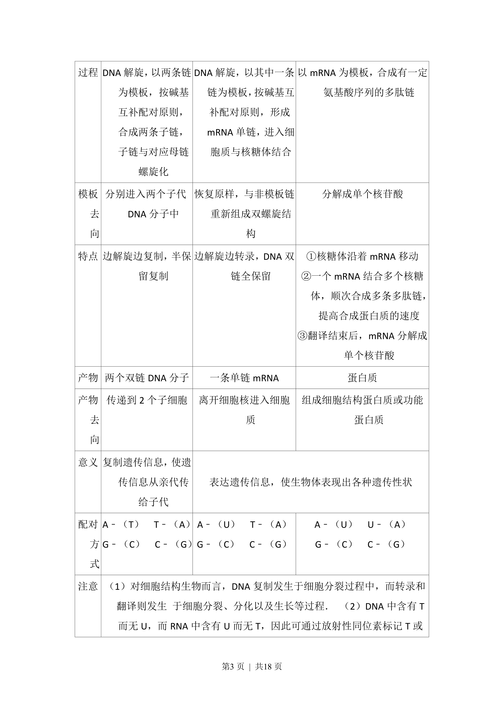
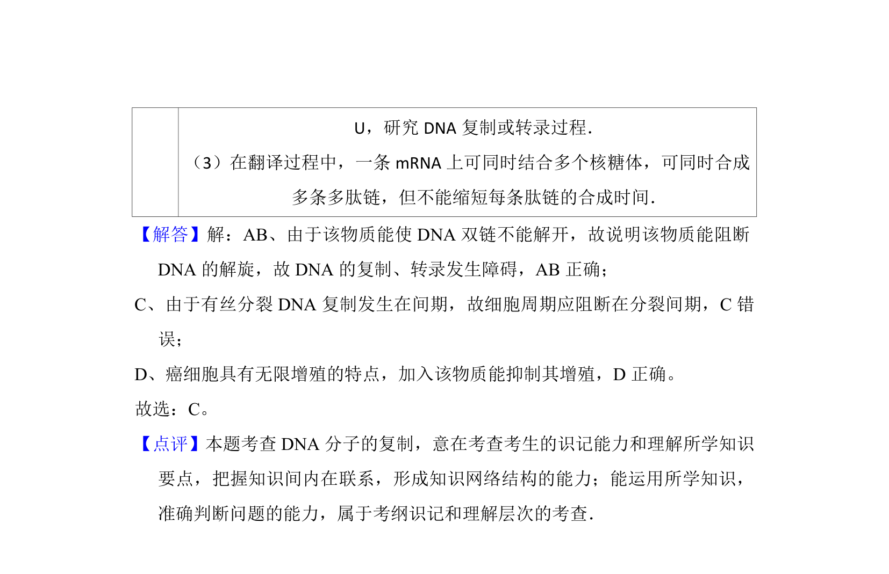

## 题面

## 摘要

本题简述细胞有丝分裂对维持亲代与子代遗传性状稳定性的意义。

## 关联考点

- [[046-细胞分裂|有丝分裂]]
- [[200-染色体|染色体]]
- [[719-遗传物质|遗传物质]]
- [[668-稳定性|稳定性]]

## 答案与解析

> 📄 原 PDF 第 2 页：`素材/真题/吉林/2008-2024·（吉林）生物高考真题/2016年高考生物试卷（新课标Ⅱ）（解析卷）.pdf`

<!-- 题干文本-start -->
## 题干文本
2．（6分）某种物质可插入DNA分子两条链的碱基对之间，使DNA双链不能
解开．若在细胞正常生长的培养液中加入适量的该物质，下列相关叙述错误
的是（　　）
A．随后细胞中的DNA复制发生障碍
B．随后细胞中的DNA转录发生障碍
C．该物质可将细胞周期阻断在分裂中期
D．可推测该物质对癌细胞的增殖有抑制作用
<!-- 题干文本-end -->

<!-- 解析文本-start -->
## 解析文本
【考点】47：细胞有丝分裂不同时期的特点．菁优网版权所有
【专题】41：正推法；523：DNA分子结构和复制．
【分析】转录、翻译与DNA复制的比较
复制 转录 翻译
时间 有丝分裂间期和减
数第一次分裂间
期
生长发育的连续过程中
场所 主要在细胞核， 少部
分在线粒体和叶
绿体
主要在细胞核，少部分
在线粒体和叶绿体
核糖体
原料 四种脱氧核苷酸 四种核糖核苷酸 二十种氨基酸
模板 DNA的两条链 DNA中的一条链 mRNA
条件 解旋酶、DNA聚合酶
ATP
RNA聚合酶ATP 酶、ATP、tRNA
<!-- 解析文本-end -->
