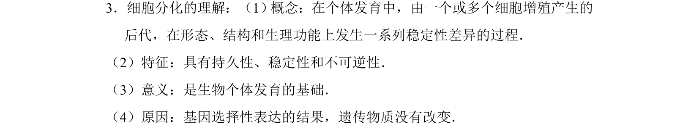
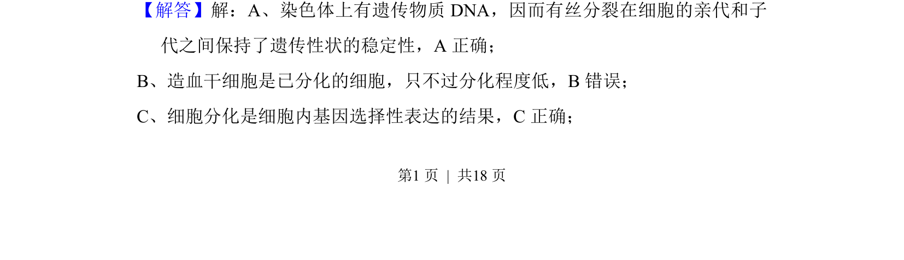
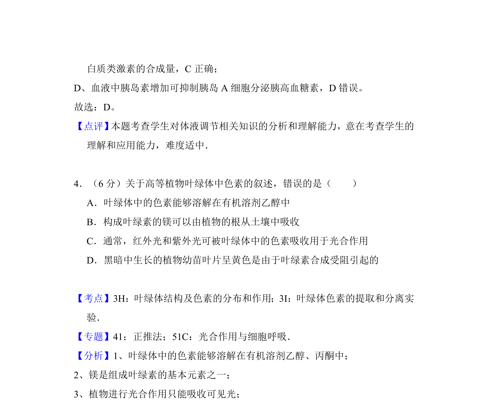

## 题面

## 摘要

该题考查细胞分化的概念、特征及与有丝分裂的对比，涉及遗传物质稳定性与基因表达。

## 关联考点

- [[045-细胞分化|细胞分化]]
- [[583-基因选择性表达|基因选择性表达]]
- [[046-细胞分裂|有丝分裂]]

## 答案与解析

> 📄 原 PDF 第 4 页：`素材/真题/吉林/2008-2024·（吉林）生物高考真题/2016年高考生物试卷（新课标Ⅱ）（解析卷）.pdf`
