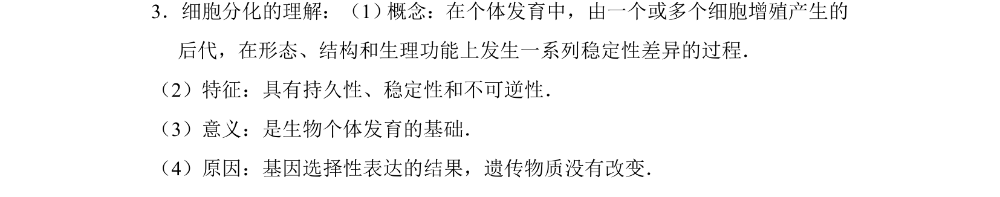
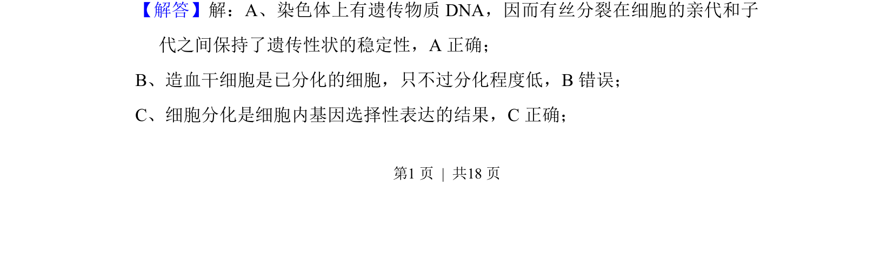
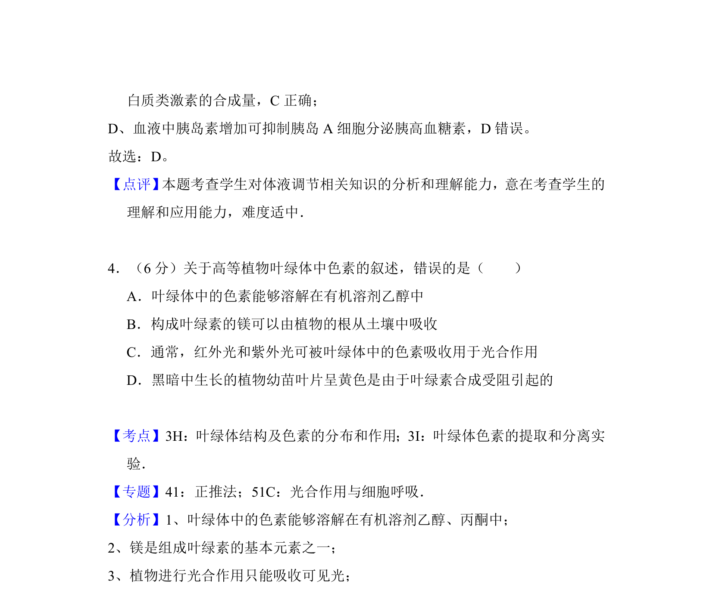

## 题面

## 摘要

该题考查细胞分化的概念、特征及与有丝分裂的对比，涉及遗传物质稳定性与基因表达。

## 关联考点

- [[045-细胞分化|细胞分化]]
- [[583-基因选择性表达|基因选择性表达]]
- [[046-细胞分裂|有丝分裂]]

## 答案与解析

> 📄 原 PDF 第 4 页：`素材/真题/吉林/2008-2024·（吉林）生物高考真题/2016年高考生物试卷（新课标Ⅱ）（解析卷）.pdf`

<!-- 题干文本-start -->
## 题干文本
3．（6分）下列关于动物激素的叙述，错误的是（　　）
A．机体内、外环境的变化可影响激素的分泌
B．切除动物垂体后，血液中生长激素的浓度下降
C．通过对转录的调节可影响蛋白质类激素的合成量
D．血液中胰岛素增加可促进胰岛B细胞分泌胰高血糖素
<!-- 题干文本-end -->

<!-- 解析文本-start -->
## 解析文本
【考点】DB：动物激素的调节．菁优网版权所有
【专题】41：正推法；532：神经调节与体液调节．
【分析】本题考查了高等动物神经调节和体液调节的相关知识．
神经调节和体液调节都是机体调节生命活动的基本方式， 激素调节是体液调节的
主要内容．神经调节和体液调节既互相联系，又互相影响
【解答】解：A、激素的含量处于动态平衡中，激素的分泌量可随内、外环境的
改变而变化，A正确；
B、动物的生长激素是由垂体分泌的，切除动物垂体后，血液中生长激素的浓度
下降，B正确；
C、蛋白质类激素的合成需要通过转录和翻译过程，通过对转录的调节可影响蛋
<!-- 解析文本-end -->
