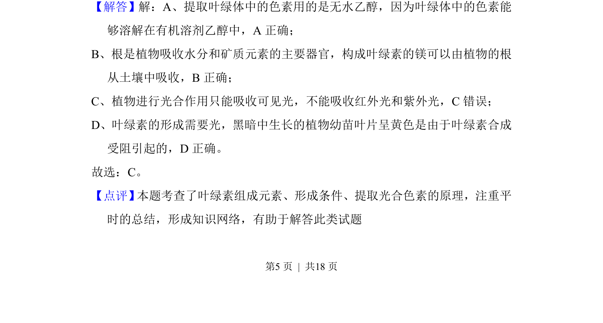

## 题面

## 摘要

考查叶绿体色素的溶解性、镁元素吸收、光的吸收特性及叶绿素合成条件

## 关联考点

- [[474-叶绿体结构及色素的分布和作用|叶绿体结构及色素的分布和作用]]
- [[568-叶绿体色素的提取和分离实验|叶绿体色素的提取和分离实验]]

## 答案与解析

> 📄 原 PDF 第 5 页：`素材/真题/吉林/2008-2024·（吉林）生物高考真题/2016年高考生物试卷（新课标Ⅱ）（解析卷）.pdf`
