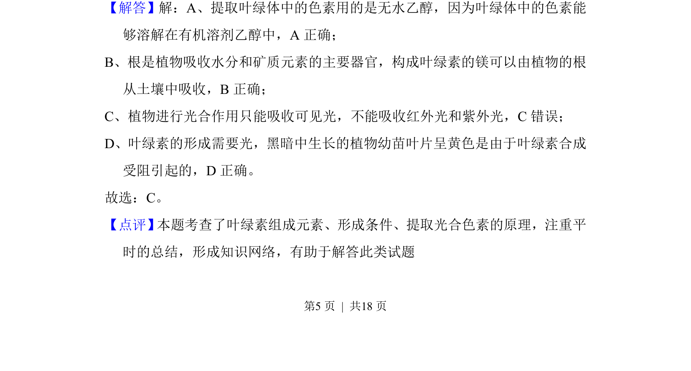

## 题面

## 摘要

考查叶绿体色素的溶解性、镁元素吸收、光的吸收特性及叶绿素合成条件

## 关联考点

- [[474-叶绿体结构及色素的分布和作用|叶绿体结构及色素的分布和作用]]
- [[568-叶绿体色素的提取和分离实验|叶绿体色素的提取和分离实验]]

## 答案与解析

> 📄 原 PDF 第 5 页：`素材/真题/吉林/2008-2024·（吉林）生物高考真题/2016年高考生物试卷（新课标Ⅱ）（解析卷）.pdf`

<!-- 题干文本-start -->
## 题干文本
4．（6分）关于高等植物叶绿体中色素的叙述，错误的是（　　）
A．叶绿体中的色素能够溶解在有机溶剂乙醇中
B．构成叶绿素的镁可以由植物的根从土壤中吸收
C．通常，红外光和紫外光可被叶绿体中的色素吸收用于光合作用
D．黑暗中生长的植物幼苗叶片呈黄色是由于叶绿素合成受阻引起的
<!-- 题干文本-end -->

<!-- 解析文本-start -->
## 解析文本
【考点】3H：叶绿体结构及色素的分布和作用；3I：叶绿体色素的提取和分离实
验．菁优网版权所有
【专题】41：正推法；51C：光合作用与细胞呼吸．
【分析】1、叶绿体中的色素能够溶解在有机溶剂乙醇、丙酮中；
2、镁是组成叶绿素的基本元素之一；
3、植物进行光合作用只能吸收可见光；
4、叶绿素的形成需要光。
【解答】解：A、提取叶绿体中的色素用的是无水乙醇，因为叶绿体中的色素能
够溶解在有机溶剂乙醇中，A正确；
B、根是植物吸收水分和矿质元素的主要器官，构成叶绿素的镁可以由植物的根
从土壤中吸收，B正确；
C、植物进行光合作用只能吸收可见光，不能吸收红外光和紫外光，C错误；
D、叶绿素的形成需要光，黑暗中生长的植物幼苗叶片呈黄色是由于叶绿素合成
受阻引起的，D正确。
故选：C。
【点评】 本题考查了叶绿素组成元素、形成条件、提取光合色素的原理，注重平
时的总结，形成知识网络，有助于解答此类试题
<!-- 解析文本-end -->
