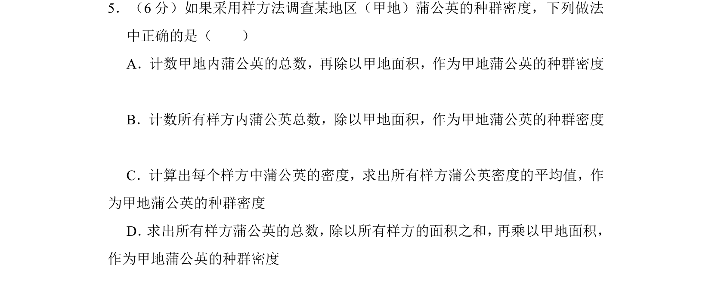
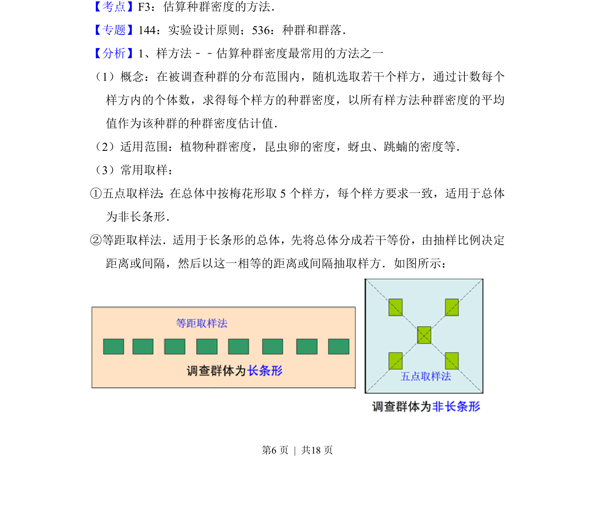
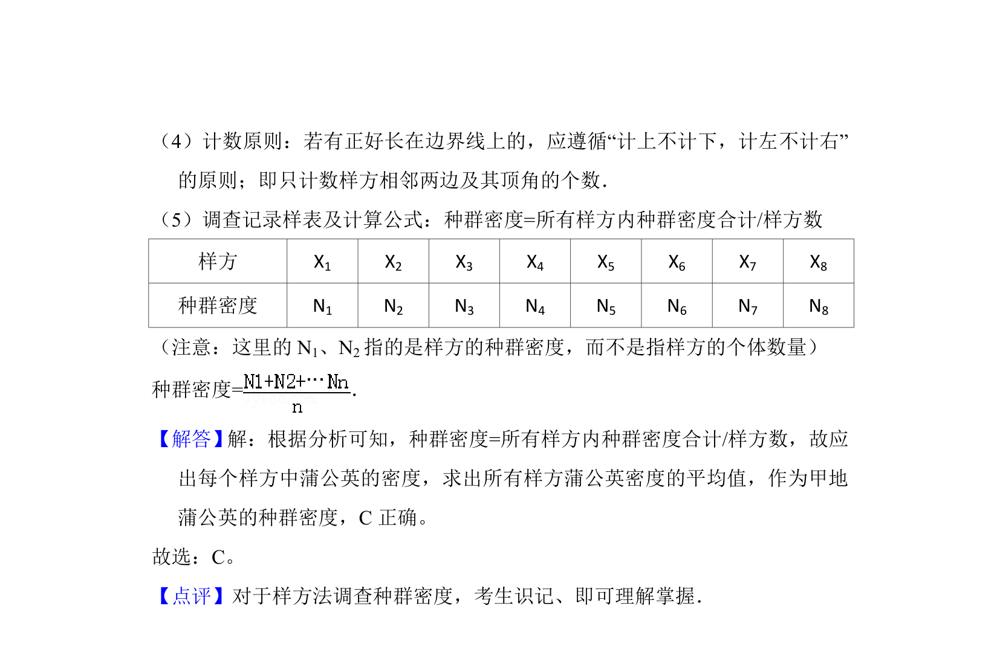

## 题面

## 摘要

样方法调查种群密度的正确操作步骤。

## 关联考点

- [[366-样方法|样方法]]
- [[370-种群密度|种群密度]]
- [[055-平均数|平均值]]

## 答案与解析

> 📄 原 PDF 第 6 页：`素材/真题/吉林/2008-2024·（吉林）生物高考真题/2016年高考生物试卷（新课标Ⅱ）（解析卷）.pdf`

<!-- 题干文本-start -->
## 题干文本
5．（6分）如果采用样方法调查某地区（甲地）蒲公英的种群密度，下列做法
中正确的是（　　）
A．计数甲地内蒲公英的总数，再除以甲地面积，作为甲地蒲公英的种群密度
B．计数所有样方内蒲公英总数，除以甲地面积，作为甲地蒲公英的种群密度
C．计算出每个样方中蒲公英的密度，求出所有样方蒲公英密度的平均值，作
为甲地蒲公英的种群密度
D． 求出所有样方蒲公英的总数， 除以所有样方的面积之和， 再乘以甲地面积，
作为甲地蒲公英的种群密度
<!-- 题干文本-end -->

<!-- 解析文本-start -->
## 解析文本
【考点】F3：估算种群密度的方法．菁优网版权所有
【专题】144：实验设计原则；536：种群和群落．
【分析】1、样方法﹣﹣估算种群密度最常用的方法之一
（1）概念：在被调查种群的分布范围内，随机选取若干个样方，通过计数每个
样方内的个体数，求得每个样方的种群密度，以所有样方法种群密度的平均
值作为该种群的种群密度估计值．
（2）适用范围：植物种群密度，昆虫卵的密度，蚜虫、跳蝻的密度等．
（3）常用取样：
①五点取样法：在总体中按梅花形取5个样方，每个样方要求一致，适用于总体
为非长条形． 
②等距取样法． 适用于长条形的总体， 先将总体分成若干等份， 由抽样比例决定
距离或间隔，然后以这一相等的距离或间隔抽取样方．如图所示：
<!-- 解析文本-end -->
