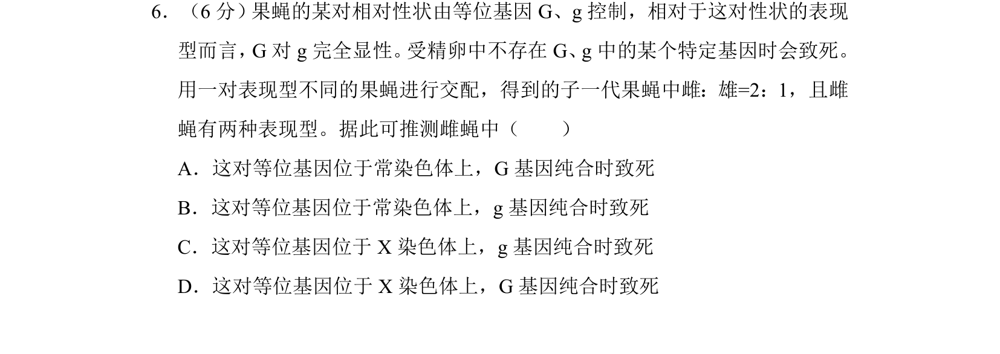
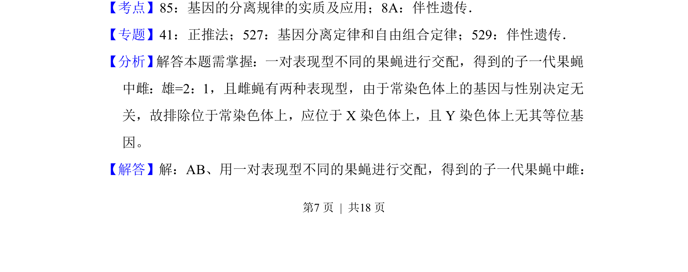
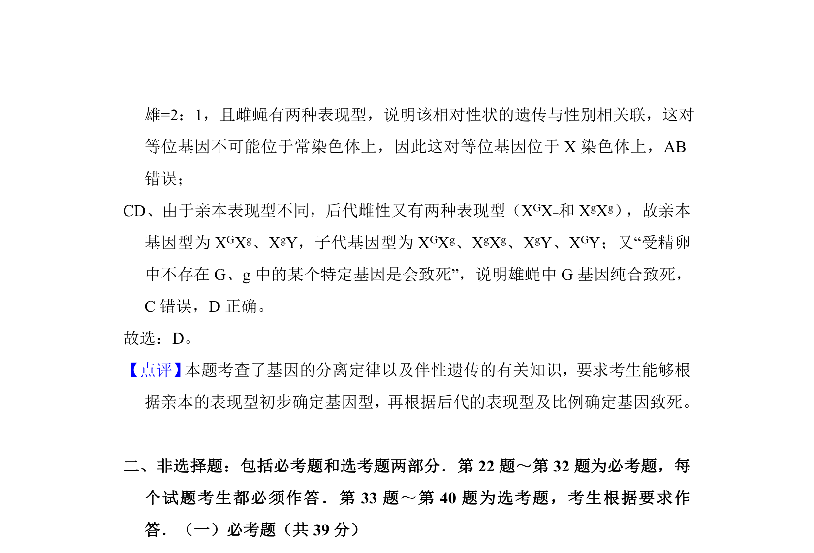

## 题面

## 摘要

该题通过果蝇交配子代性别比和表现型，推断致死基因的位置与显隐性关系

## 关联考点

- [[574-基因分离规律|基因分离规律]]
- [[276-伴性遗传|伴性遗传]]

## 答案与解析

> 📄 原 PDF 第 7 页：`素材/真题/吉林/2008-2024·（吉林）生物高考真题/2016年高考生物试卷（新课标Ⅱ）（解析卷）.pdf`

<!-- 题干文本-start -->
## 题干文本
6．（6分） 果蝇的某对相对性状由等位基因G、g控制，相对于这对性状的表现
型而言，G对g完全显性。 受精卵中不存在G、g中的某个特定基因时会致死。
用一对表现型不同的果蝇进行交配，得到的子一代果蝇中雌：雄=2：1，且雌
蝇有两种表现型。据此可推测雌蝇中（　　）
A．这对等位基因位于常染色体上，G基因纯合时致死
B．这对等位基因位于常染色体上，g基因纯合时致死
C．这对等位基因位于X染色体上，g基因纯合时致死
D．这对等位基因位于X染色体上，G基因纯合时致死
<!-- 题干文本-end -->

<!-- 解析文本-start -->
## 解析文本
【考点】85：基因的分离规律的实质及应用；8A：伴性遗传．菁优网版权所有
【专题】41：正推法；527：基因分离定律和自由组合定律；529：伴性遗传．
【分析】 解答本题需掌握：一对表现型不同的果蝇进行交配，得到的子一代果蝇
中雌：雄=2：1，且雌蝇有两种表现型，由于常染色体上的基因与性别决定无
关，故排除位于常染色体上，应位于X染色体上，且Y染色体上无其等位基
因。
【解答】解：AB、用一对表现型不同的果蝇进行交配，得到的子一代果蝇中雌：
<!-- 解析文本-end -->
