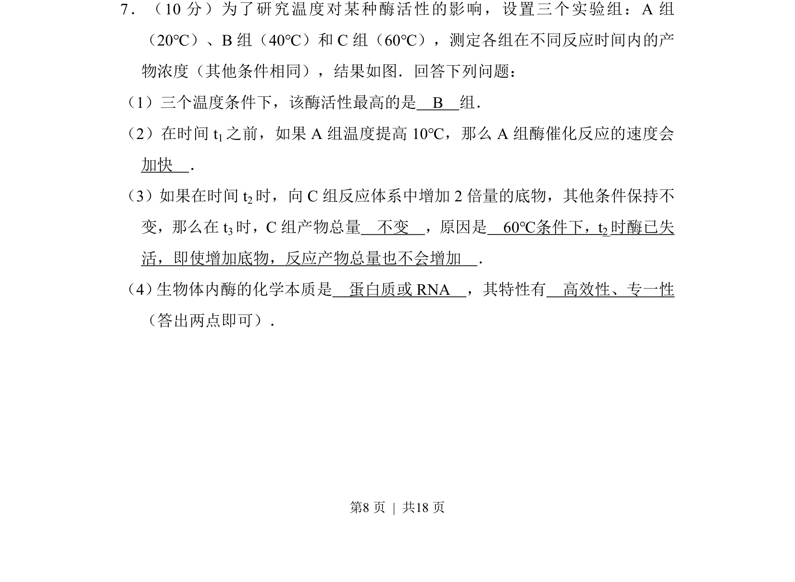
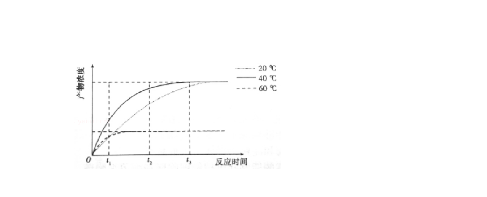
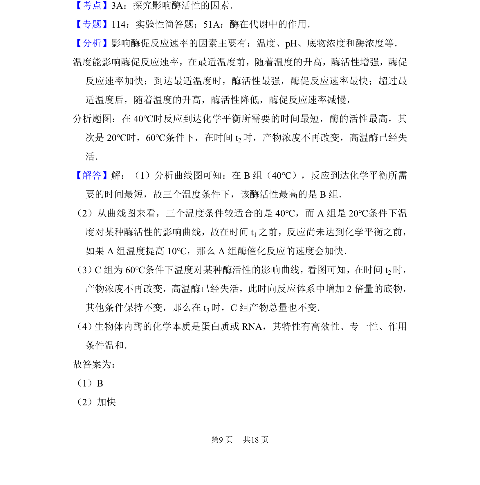
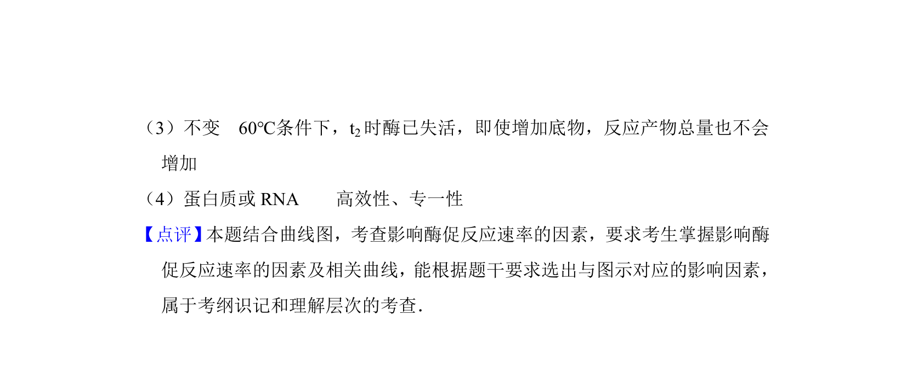

## 题面

## 摘要

本题通过酶促反应实验，考查温度对酶活性的影响及底物浓度与酶活性的关系。

## 关联考点

- [[518-酶活性|酶活性]]
- [[629-温度对酶活性的影响|温度对酶活性的影响]]
- [[243-酶的特性|酶的特性]]
- [[595-底物浓度|底物浓度]]

## 答案与解析

> 📄 原 PDF 第 8 页：`素材/真题/吉林/2008-2024·（吉林）生物高考真题/2016年高考生物试卷（新课标Ⅱ）（解析卷）.pdf`
