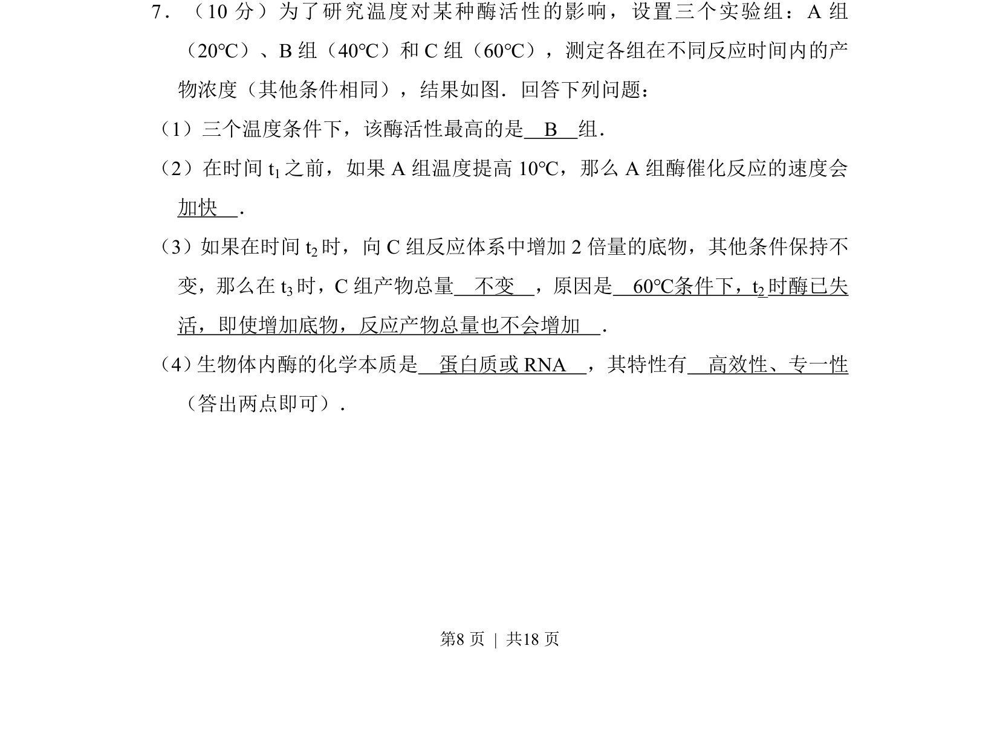
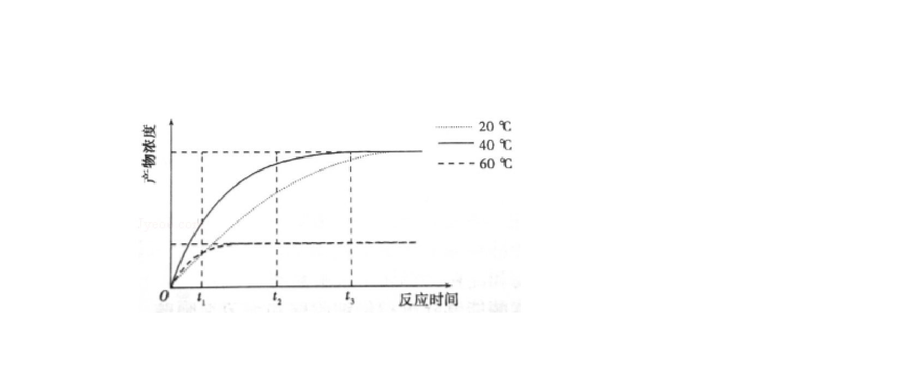
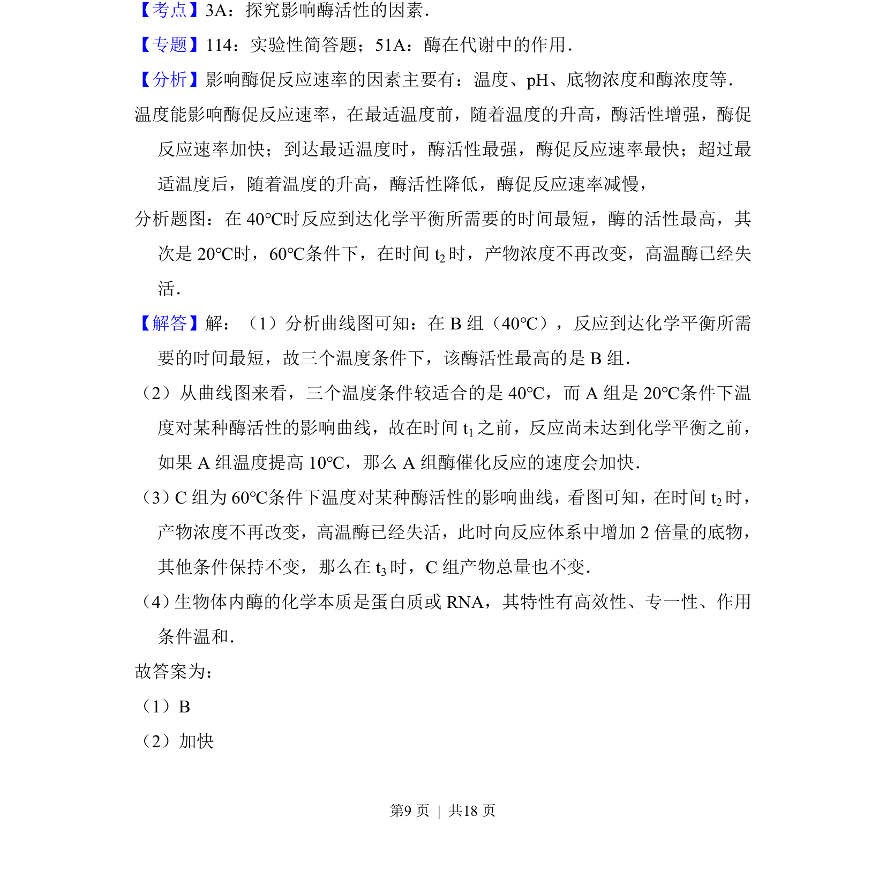
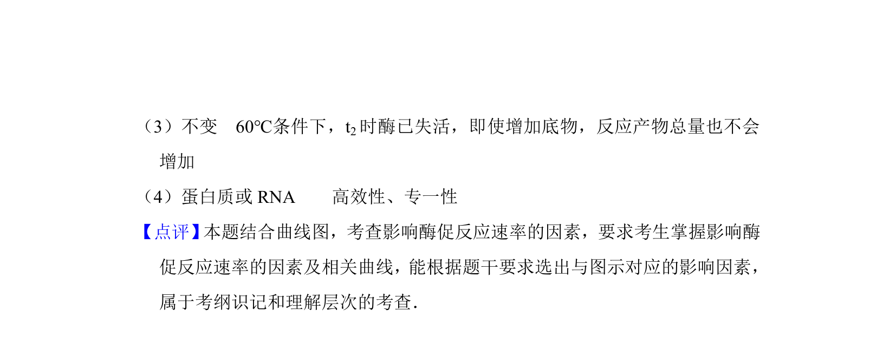

## 题面

## 摘要

本题通过酶促反应实验，考查温度对酶活性的影响及底物浓度与酶活性的关系。

## 关联考点

- [[518-酶活性|酶活性]]
- [[629-温度对酶活性的影响|温度对酶活性的影响]]
- [[243-酶的特性|酶的特性]]
- [[595-底物浓度|底物浓度]]

## 答案与解析

> 📄 原 PDF 第 8 页：`素材/真题/吉林/2008-2024·（吉林）生物高考真题/2016年高考生物试卷（新课标Ⅱ）（解析卷）.pdf`

<!-- 题干文本-start -->
## 题干文本
7．（10分）为了研究温度对某种酶活性的影响，设置三个实验组：A组
（20℃）、B组（40℃）和C组（60℃），测定各组在不同反应时间内的产
物浓度（其他条件相同），结果如图．回答下列问题：
（1）三个温度条件下，该酶活性最高的是　B　组．
（2）在时间t 1之前，如果A组温度提高10℃，那么A组酶催化反应的速度会　
加快　．
（3）如果在时间t 2时，向C组反应体系中增加2倍量的底物，其他条件保持不
变，那么在t 3时，C组产物总量　不变　，原因是　60℃条件下，t2时酶已失
活，即使增加底物，反应产物总量也不会增加　．
（4） 生物体内酶的化学本质是　蛋白质或RNA　，其特性有　高效性、专一性　
（答出两点即可）．
<!-- 题干文本-end -->

<!-- 解析文本-start -->
## 解析文本

<!-- 解析文本-end -->
