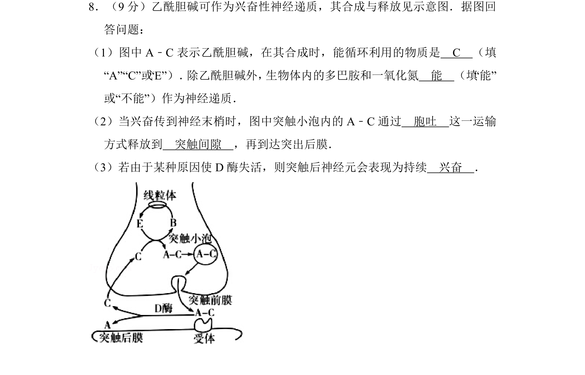
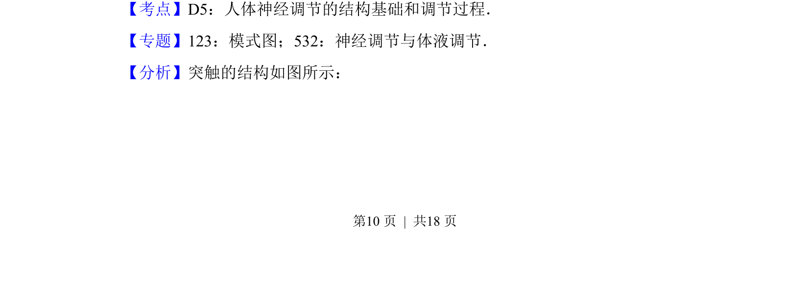

## 题面

## 摘要

本题通过乙酰胆碱合成释放示意图，考查兴奋传递中神经递质的循环利用、释放方式及酶失活影响。

## 关联考点

- [[325-神经递质|神经递质]]
- [[259-胞吐|胞吐]]
- [[突触间隙]]
- [[兴奋持续]]

## 答案与解析

> 📄 原 PDF 第 10 页：`素材/真题/吉林/2008-2024·（吉林）生物高考真题/2016年高考生物试卷（新课标Ⅱ）（解析卷）.pdf`
