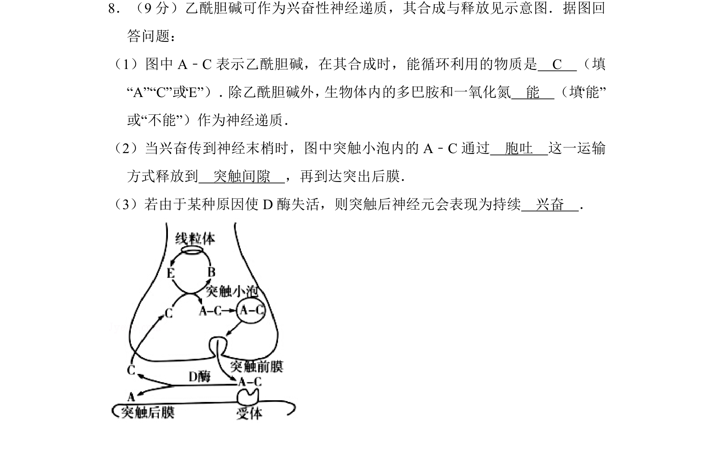
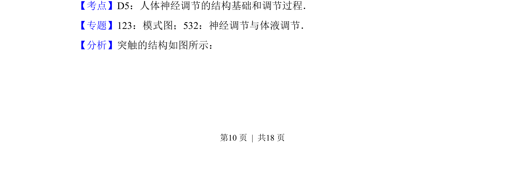
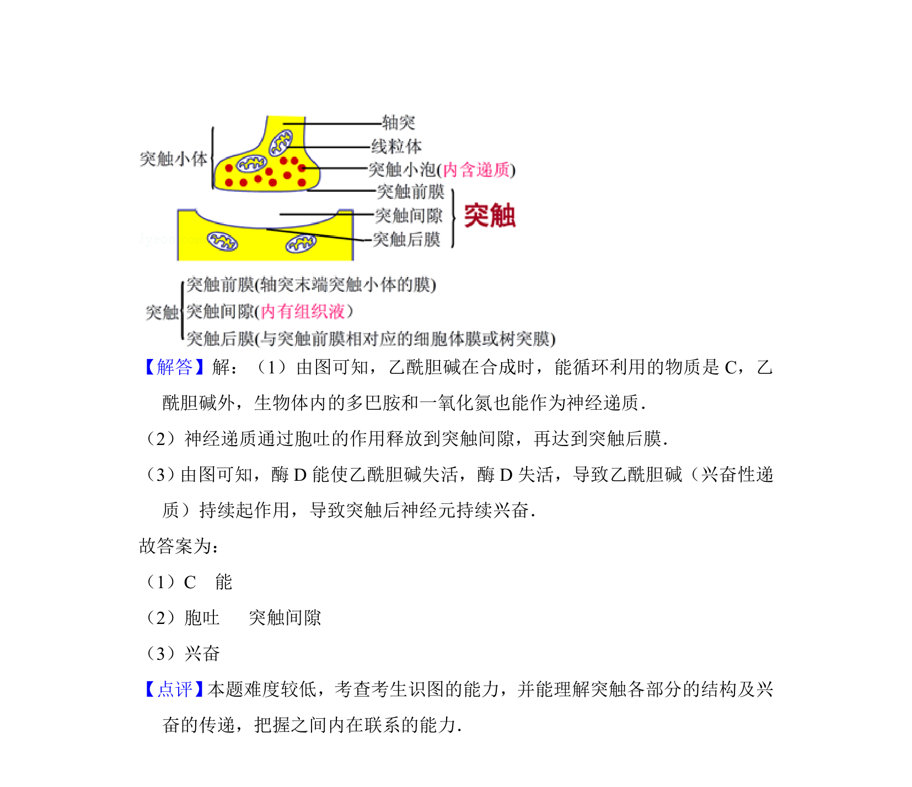

## 题面

## 摘要

本题通过乙酰胆碱合成释放示意图，考查兴奋传递中神经递质的循环利用、释放方式及酶失活影响。

## 关联考点

- [[325-神经递质|神经递质]]
- [[259-胞吐|胞吐]]
- [[670-突触间隙|突触间隙]]
- [[550-兴奋持续|兴奋持续]]

## 答案与解析

> 📄 原 PDF 第 10 页：`素材/真题/吉林/2008-2024·（吉林）生物高考真题/2016年高考生物试卷（新课标Ⅱ）（解析卷）.pdf`

<!-- 题干文本-start -->
## 题干文本
8．（9分）乙酰胆碱可作为兴奋性神经递质，其合成与释放见示意图．据图回
答问题：
（1）图中A﹣C表示乙酰胆碱，在其合成时，能循环利用的物质是　C　（填
“A”“C”或“E”）． 除乙酰胆碱外， 生物体内的多巴胺和一氧化氮　能　（填“能”
或“不能”）作为神经递质．
（2）当兴奋传到神经末梢时，图中突触小泡内的A﹣C通过　胞吐　这一运输
方式释放到　突触间隙　，再到达突出后膜．
（3）若由于某种原因使D酶失活，则突触后神经元会表现为持续　兴奋　．
<!-- 题干文本-end -->

<!-- 解析文本-start -->
## 解析文本
【考点】D5：人体神经调节的结构基础和调节过程．菁优网版权所有
【专题】123：模式图；532：神经调节与体液调节．
【分析】突触的结构如图所示：
<!-- 解析文本-end -->
