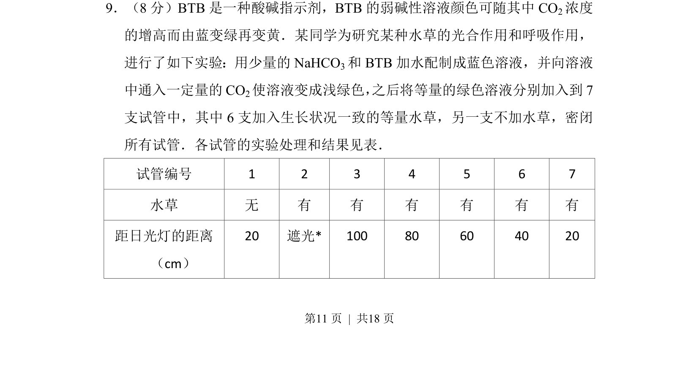
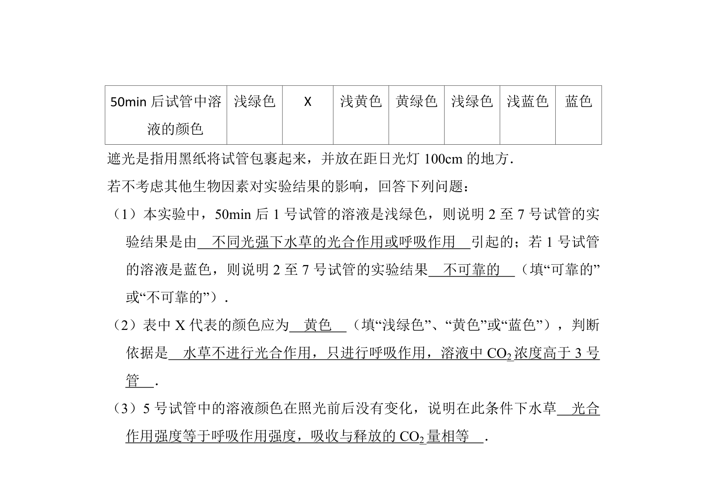
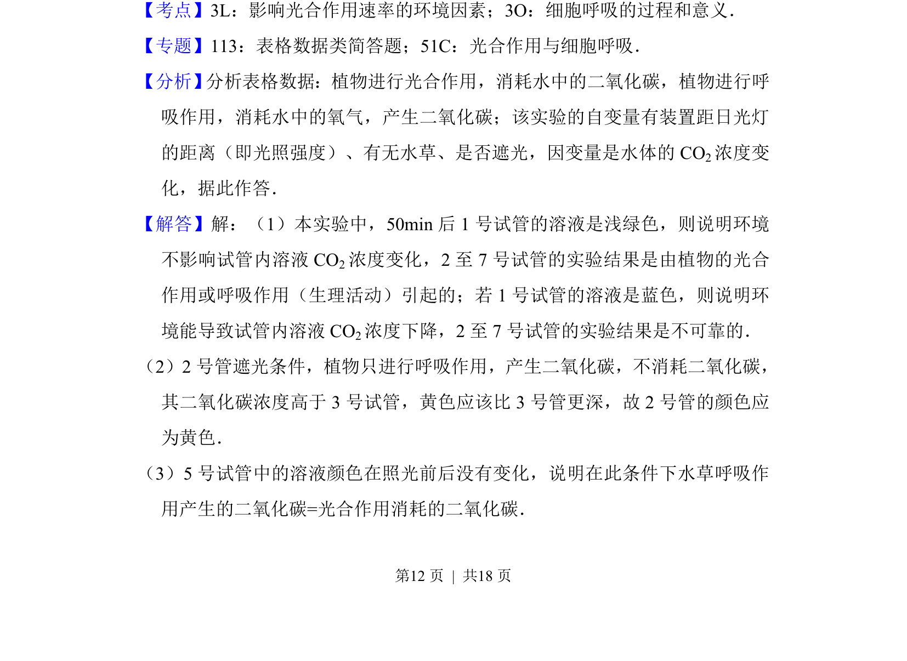
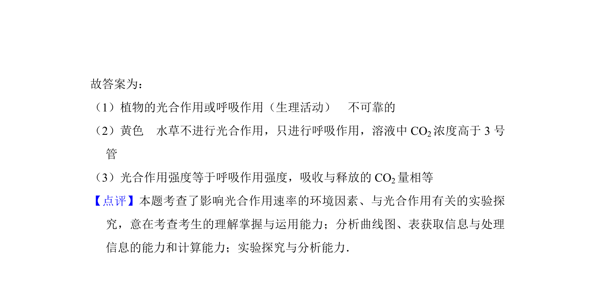

## 题面

## 摘要

考题通过BTB颜色变化研究水草在不同光照条件下光合与呼吸作用的关系

## 关联考点

- [[033-光合作用|光合作用]]
- [[031-呼吸作用|呼吸作用]]
- [[523-CO2浓度|CO2浓度]]
- [[736-光照强度|光照强度]]

## 答案与解析

> 📄 原 PDF 第 11 页：`素材/真题/吉林/2008-2024·（吉林）生物高考真题/2016年高考生物试卷（新课标Ⅱ）（解析卷）.pdf`
