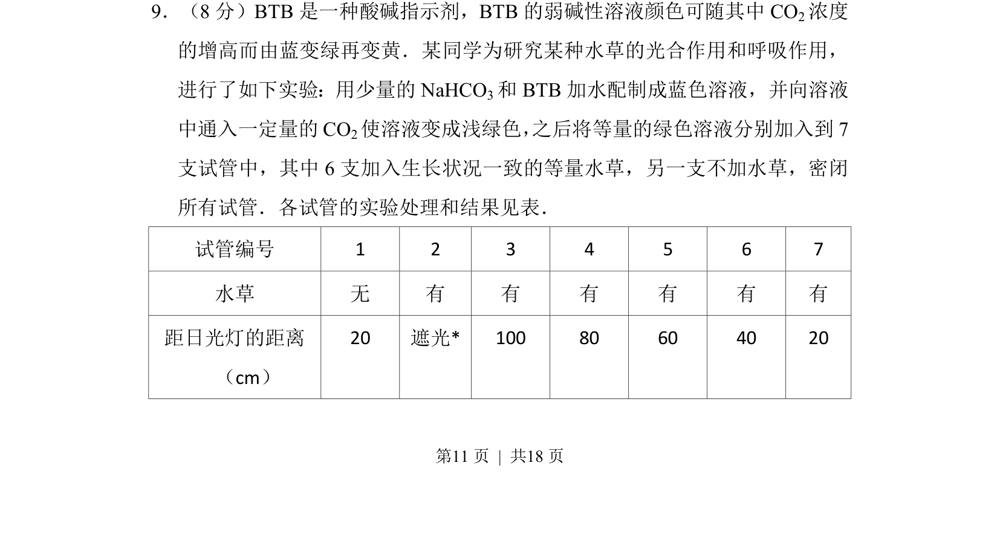
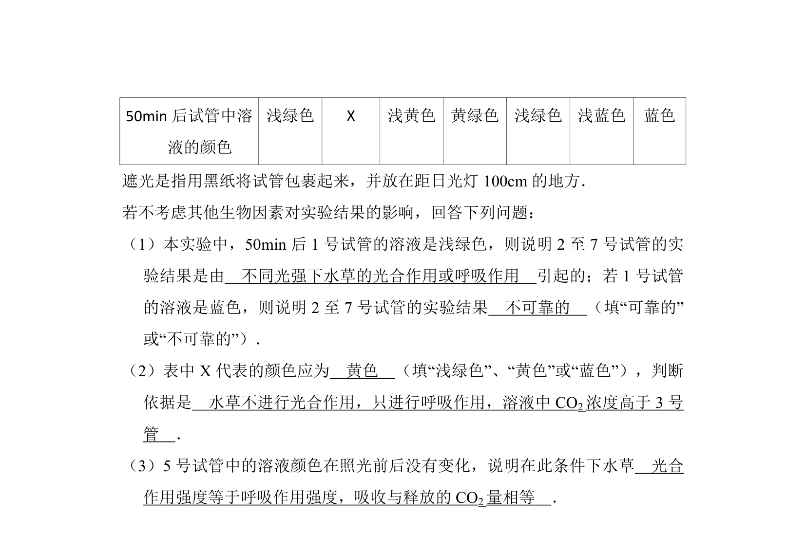
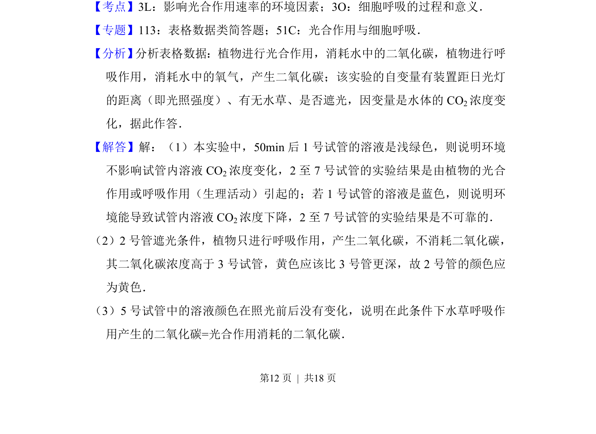
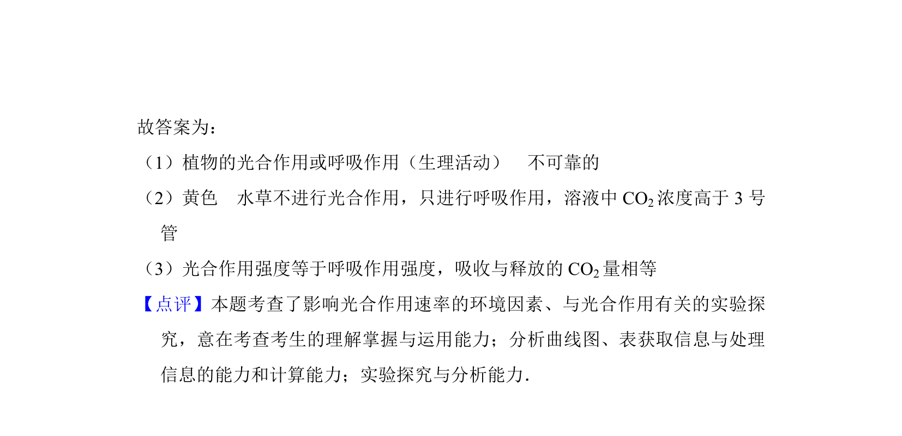

## 题面

## 摘要

考题通过BTB颜色变化研究水草在不同光照条件下光合与呼吸作用的关系

## 关联考点

- [[033-光合作用|光合作用]]
- [[031-呼吸作用|呼吸作用]]
- [[523-CO2浓度|CO2浓度]]
- [[736-光照强度|光照强度]]

## 答案与解析

> 📄 原 PDF 第 11 页：`素材/真题/吉林/2008-2024·（吉林）生物高考真题/2016年高考生物试卷（新课标Ⅱ）（解析卷）.pdf`

<!-- 题干文本-start -->
## 题干文本
9．（8分）BTB是一种酸碱指示剂，BTB的弱碱性溶液颜色可随其中CO 2浓度
的增高而由蓝变绿再变黄．某同学为研究某种水草的光合作用和呼吸作用，
进行了如下实验：用少量的NaHCO 3和BTB加水配制成蓝色溶液，并向溶液
中通入一定量的CO 2使溶液变成浅绿色， 之后将等量的绿色溶液分别加入到7
支试管中，其中6支加入生长状况一致的等量水草，另一支不加水草，密闭
所有试管．各试管的实验处理和结果见表．
试管编号 1 2 3 4 5 6 7
水草 无 有 有 有 有 有 有
距日光灯的距离
（cm）
20 遮光* 100 80 60 40 20
<!-- 题干文本-end -->

<!-- 解析文本-start -->
## 解析文本

<!-- 解析文本-end -->
