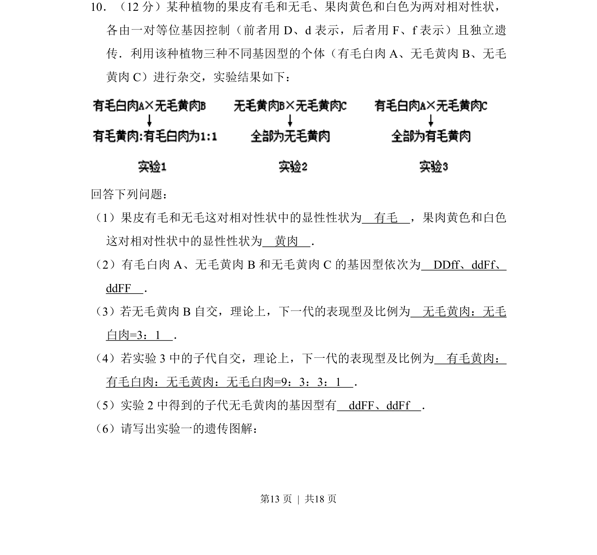
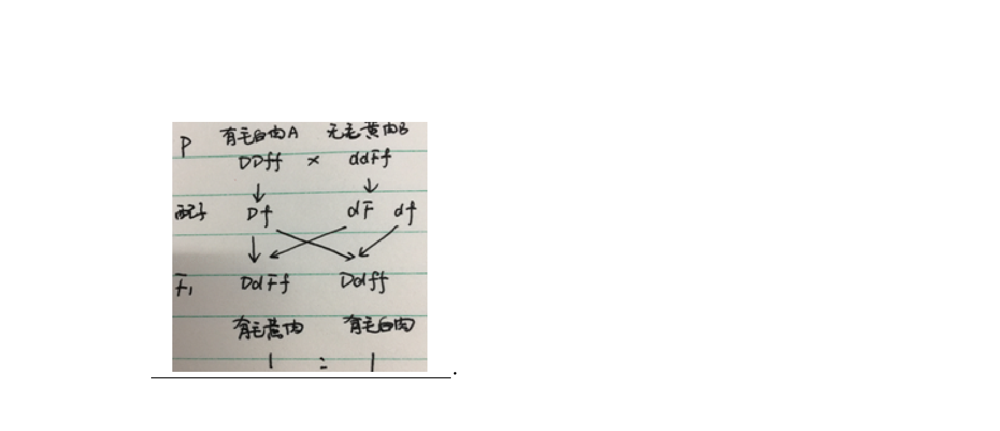
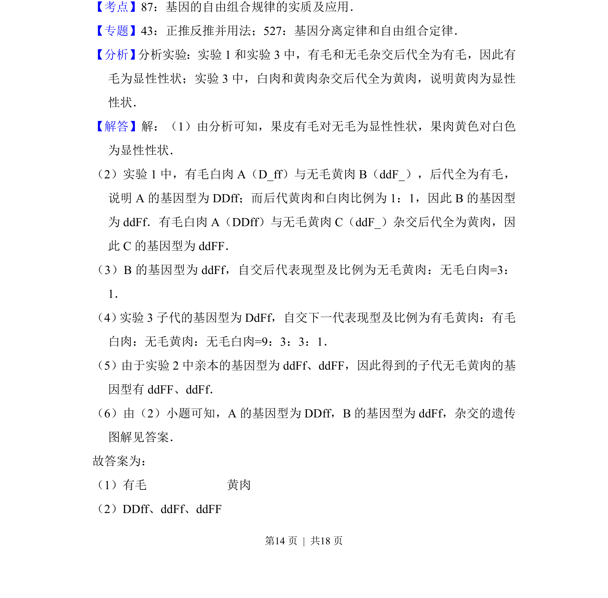
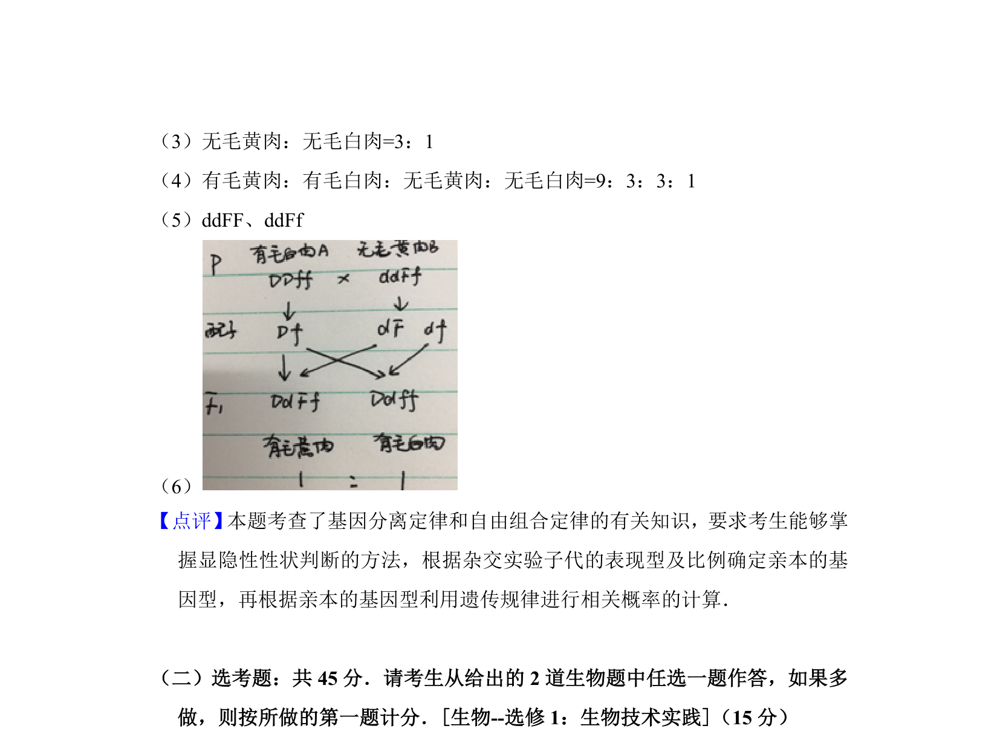

## 题面

## 摘要

考查基因自由组合定律的应用，包括显隐性判断、基因型推导、杂交实验分析及遗传图解书写。

## 关联考点

- [[272-自由组合定律|基因的自由组合定律]]
- [[491-显隐性性状判断|显隐性性状判断]]
- [[575-基因型推导|基因型推导]]
- [[805-杂交实验分析|杂交实验分析]]

## 答案与解析

> 📄 原 PDF 第 13 页：`素材/真题/吉林/2008-2024·（吉林）生物高考真题/2016年高考生物试卷（新课标Ⅱ）（解析卷）.pdf`

<!-- 题干文本-start -->
## 题干文本
10．（12分）某种植物的果皮有毛和无毛、果肉黄色和白色为两对相对性状，
各由一对等位基因控制（前者用D、d表示，后者用F、f表示）且独立遗
传．利用该种植物三种不同基因型的个体（有毛白肉A、无毛黄肉B、无毛
黄肉C）进行杂交，实验结果如下：
回答下列问题：
（1）果皮有毛和无毛这对相对性状中的显性性状为　有毛　，果肉黄色和白色
这对相对性状中的显性性状为　黄肉　．
（2）有毛白肉A、无毛黄肉B和无毛黄肉C的基因型依次为　DDff、ddFf、
ddFF　．
（3）若无毛黄肉B自交，理论上，下一代的表现型及比例为　无毛黄肉：无毛
白肉=3：1　．
（4）若实验3中的子代自交，理论上，下一代的表现型及比例为　有毛黄肉：
有毛白肉：无毛黄肉：无毛白肉=9：3：3：1　．
（5）实验2中得到的子代无毛黄肉的基因型有　ddFF、ddFf　．
（6）请写出实验一的遗传图解：
<!-- 题干文本-end -->

<!-- 解析文本-start -->
## 解析文本

<!-- 解析文本-end -->
