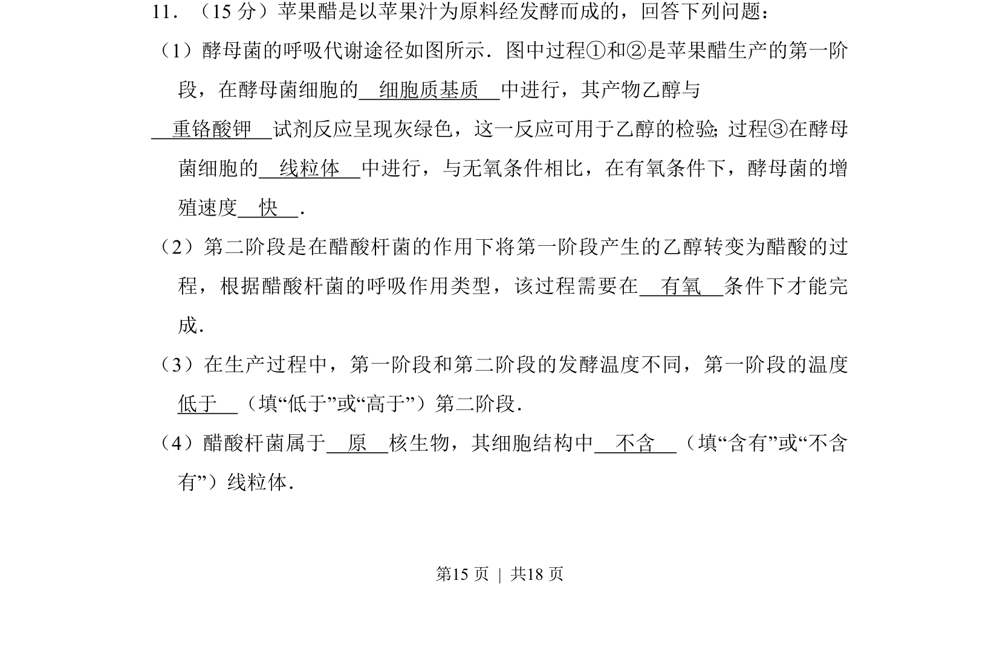
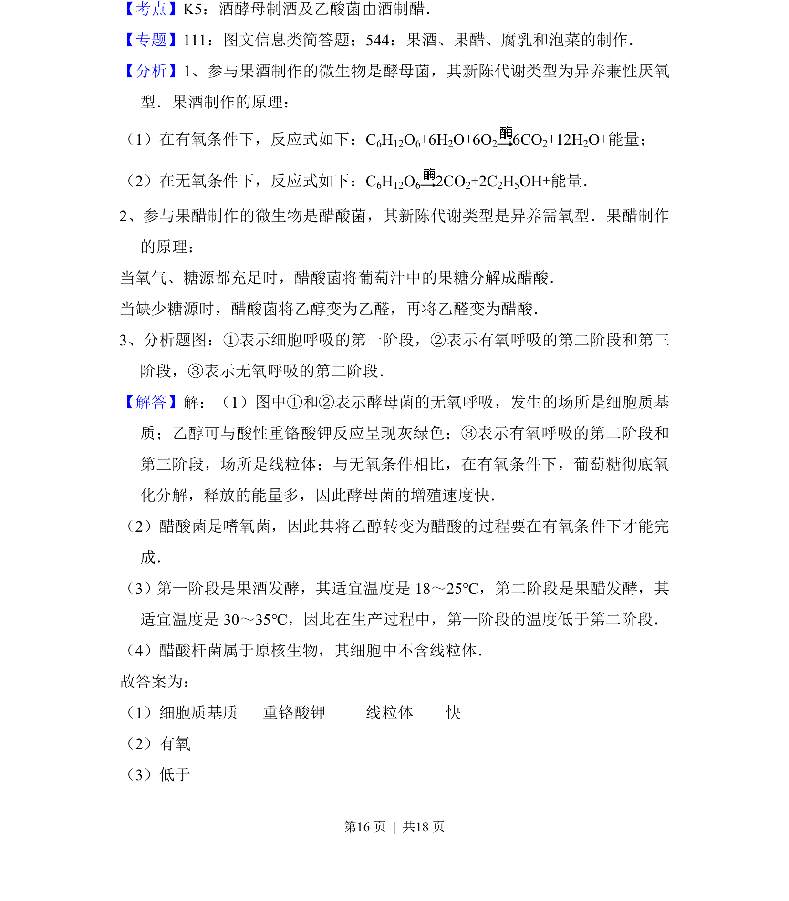
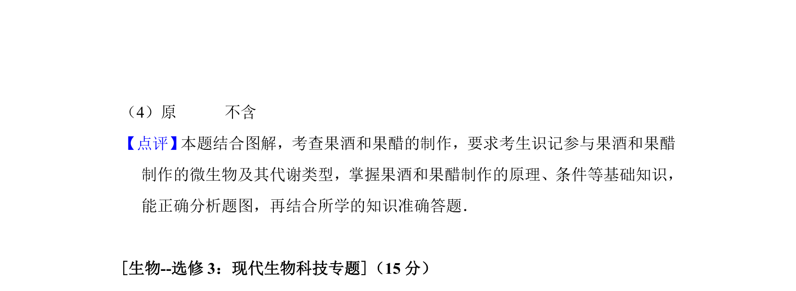

## 题面

## 摘要

本题为生物学科试题，考查果醋制作中酵母菌和醋酸杆菌的代谢过程及实验检测方法。

## 关联考点

- [[241-细胞呼吸|细胞呼吸]]
- [[426-发酵工程|发酵工程]]
- [[560-原核与真核生物|原核与真核生物]]

## 答案与解析

> 📄 原 PDF 第 15 页：`素材/真题/吉林/2008-2024·（吉林）生物高考真题/2016年高考生物试卷（新课标Ⅱ）（解析卷）.pdf`
