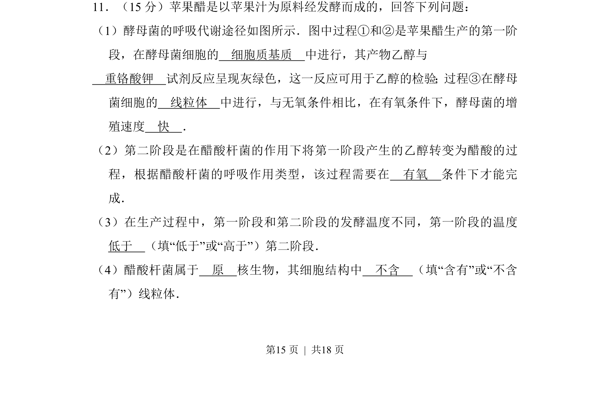
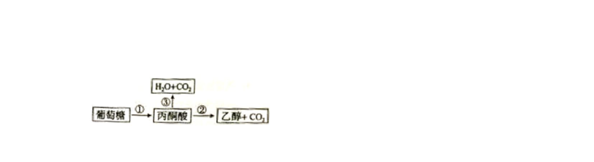
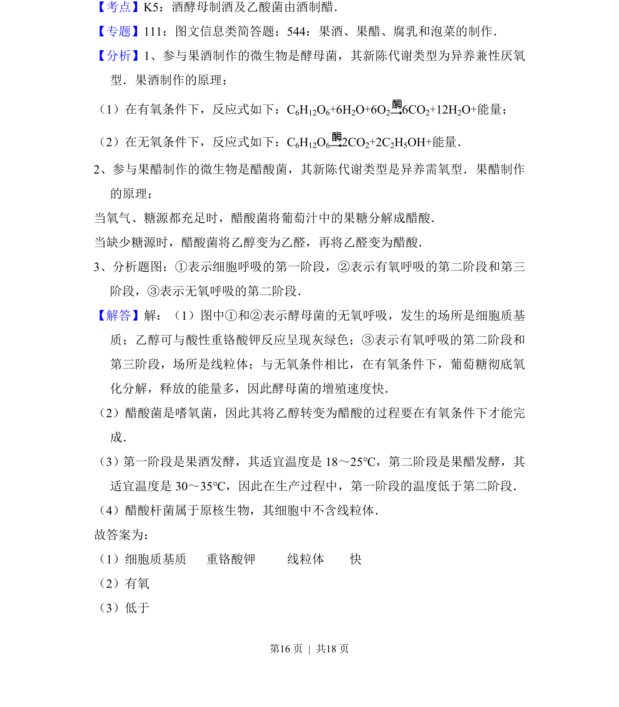
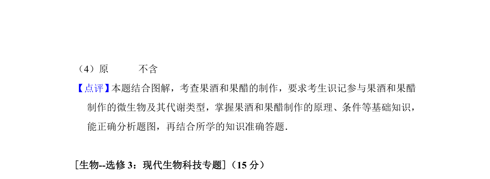

## 题面

## 摘要

本题为生物学科试题，考查果醋制作中酵母菌和醋酸杆菌的代谢过程及实验检测方法。

## 关联考点

- [[241-细胞呼吸|细胞呼吸]]
- [[426-发酵工程|发酵工程]]
- [[560-原核与真核生物|原核与真核生物]]

## 答案与解析

> 📄 原 PDF 第 15 页：`素材/真题/吉林/2008-2024·（吉林）生物高考真题/2016年高考生物试卷（新课标Ⅱ）（解析卷）.pdf`

<!-- 题干文本-start -->
## 题干文本
11．（15分）苹果醋是以苹果汁为原料经发酵而成的，回答下列问题：
（1）酵母菌的呼吸代谢途径如图所示．图中过程①和②是苹果醋生产的第一阶
段，在酵母菌细胞的　细胞质基质　中进行，其产物乙醇与
　重铬酸钾　试剂反应呈现灰绿色，这一反应可用于乙醇的检验；过程③在酵母
菌细胞的　线粒体　中进行，与无氧条件相比，在有氧条件下，酵母菌的增
殖速度　快　．
（2）第二阶段是在醋酸杆菌的作用下将第一阶段产生的乙醇转变为醋酸的过
程，根据醋酸杆菌的呼吸作用类型，该过程需要在　有氧　条件下才能完
成．
（3）在生产过程中，第一阶段和第二阶段的发酵温度不同，第一阶段的温度　
低于　（填“低于”或“高于”）第二阶段．
（4）醋酸杆菌属于　原　核生物，其细胞结构中　不含　（填“含有”或“不含
有”）线粒体．
<!-- 题干文本-end -->

<!-- 解析文本-start -->
## 解析文本

<!-- 解析文本-end -->
