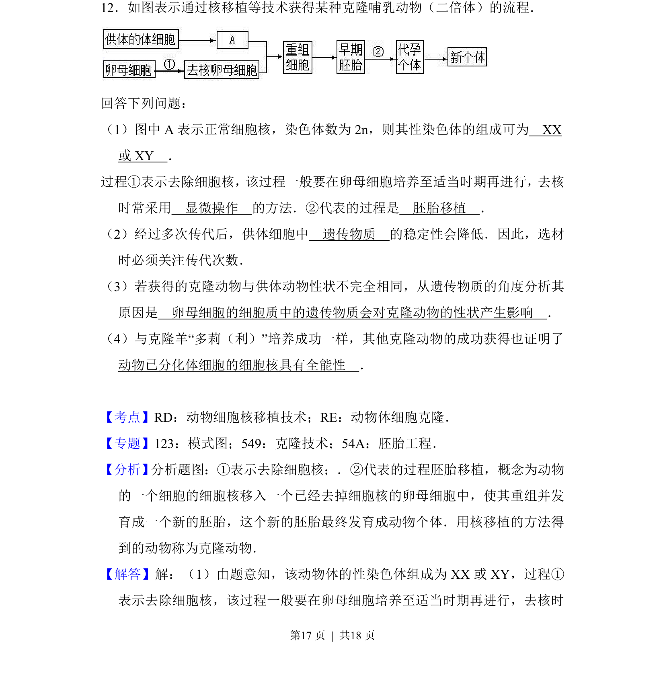
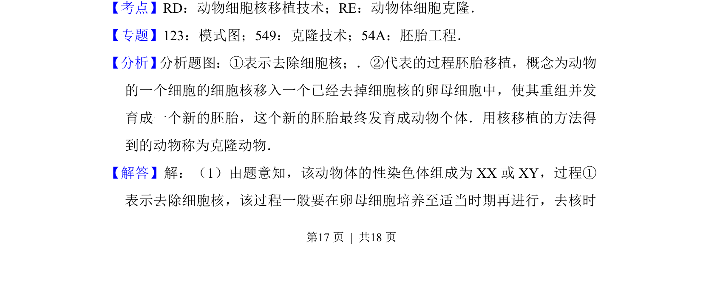
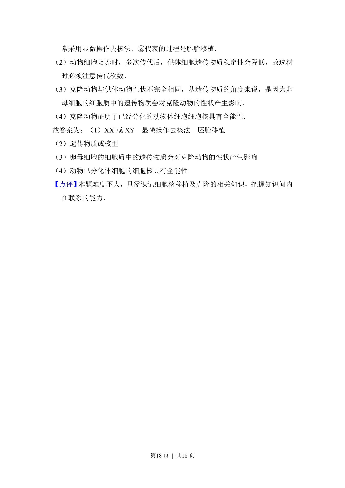

## 题面

## 摘要

该题考查动物体细胞克隆技术流程及遗传物质分析。

## 关联考点

- [[473-动物细胞核移植技术|动物细胞核移植技术]]
- [[556-动物体细胞克隆|动物体细胞克隆]]
- [[456-胚胎移植|胚胎移植]]

## 答案与解析

> 📄 原 PDF 第 17 页：`素材/真题/吉林/2008-2024·（吉林）生物高考真题/2016年高考生物试卷（新课标Ⅱ）（解析卷）.pdf`
