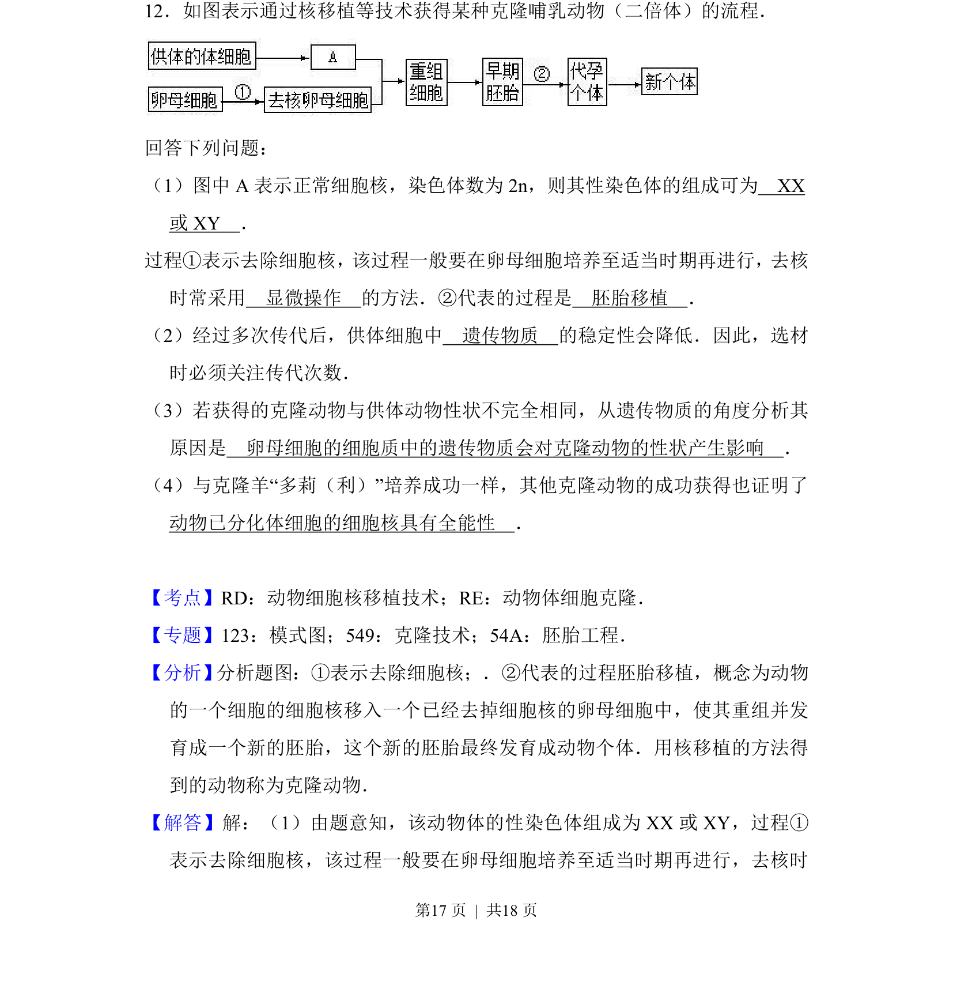
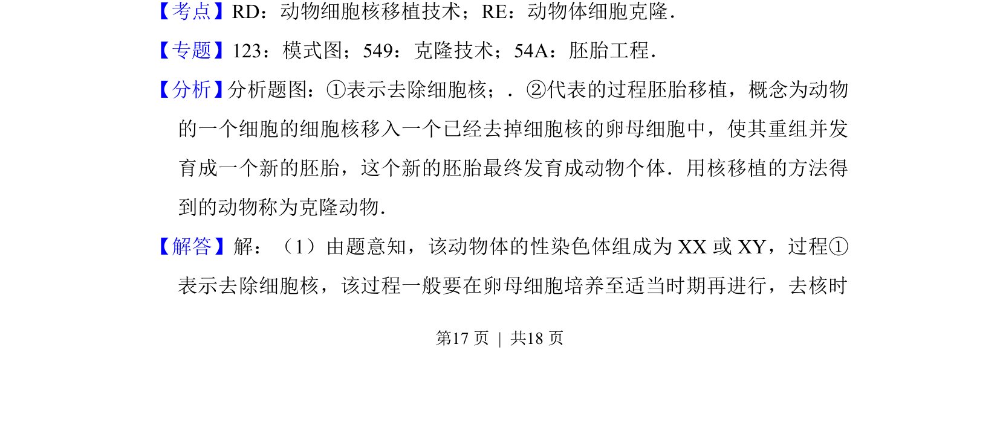
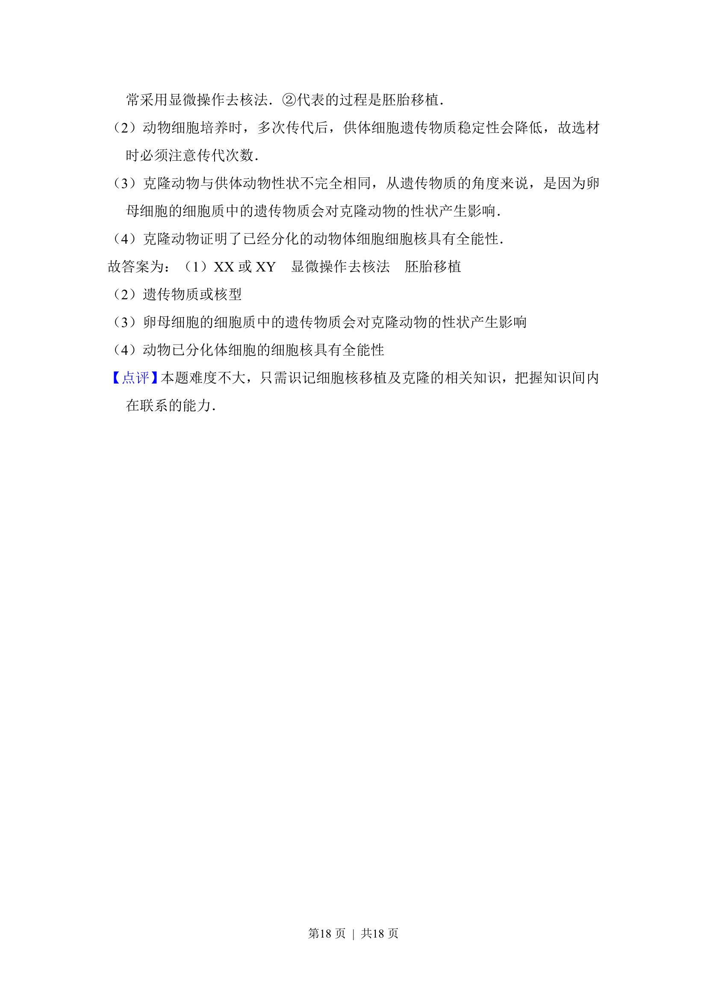

## 题面

## 摘要

该题考查动物体细胞克隆技术流程及遗传物质分析。

## 关联考点

- [[473-动物细胞核移植技术|动物细胞核移植技术]]
- [[556-动物体细胞克隆|动物体细胞克隆]]
- [[456-胚胎移植|胚胎移植]]

## 答案与解析

> 📄 原 PDF 第 17 页：`素材/真题/吉林/2008-2024·（吉林）生物高考真题/2016年高考生物试卷（新课标Ⅱ）（解析卷）.pdf`

<!-- 题干文本-start -->
## 题干文本
12．如图表示通过核移植等技术获得某种克隆哺乳动物（二倍体）的流程．
回答下列问题：
（1）图中A表示正常细胞核，染色体数为2n，则其性染色体的组成可为　XX
或XY　．
过程①表示去除细胞核，该过程一般要在卵母细胞培养至适当时期再进行，去核
时常采用　显微操作　的方法．②代表的过程是　胚胎移植　．
（2）经过多次传代后，供体细胞中　遗传物质　的稳定性会降低．因此，选材
时必须关注传代次数．
（3）若获得的克隆动物与供体动物性状不完全相同，从遗传物质的角度分析其
原因是　卵母细胞的细胞质中的遗传物质会对克隆动物的性状产生影响　．
（4）与克隆羊“多莉（利）”培养成功一样，其他克隆动物的成功获得也证明了　
动物已分化体细胞的细胞核具有全能性　．
<!-- 题干文本-end -->

<!-- 解析文本-start -->
## 解析文本
【考点】RD：动物细胞核移植技术；RE：动物体细胞克隆．菁优网版权所有
【专题】123：模式图；549：克隆技术；54A：胚胎工程．
【分析】 分析题图：①表示去除细胞核；．②代表的过程胚胎移植，概念为动物
的一个细胞的细胞核移入一个已经去掉细胞核的卵母细胞中，使其重组并发
育成一个新的胚胎，这个新的胚胎最终发育成动物个体．用核移植的方法得
到的动物称为克隆动物．
【解答】解：（1）由题意知，该动物体的性染色体组成为XX或XY，过程①
表示去除细胞核，该过程一般要在卵母细胞培养至适当时期再进行，去核时
<!-- 解析文本-end -->
