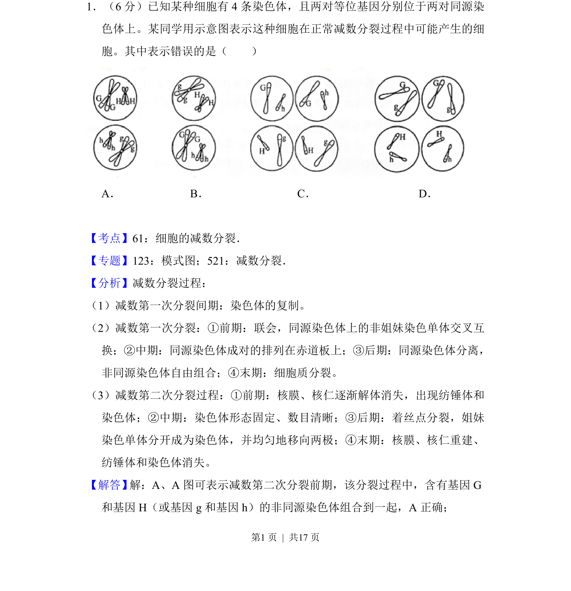
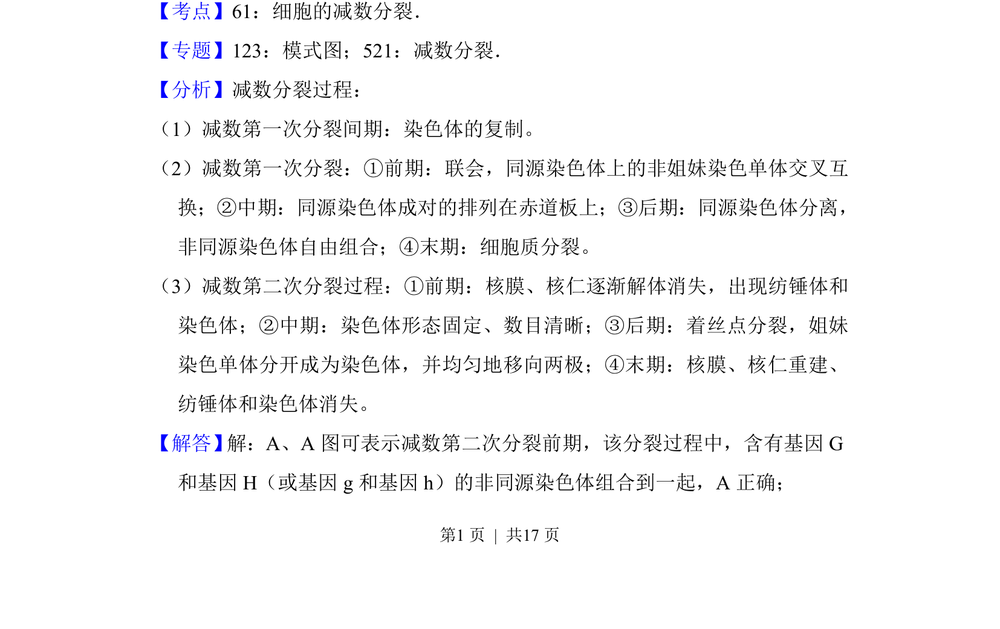
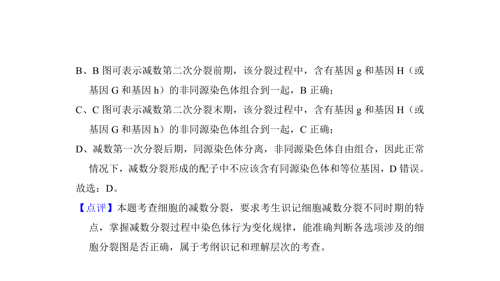

## 题面

## 摘要

减数分裂过程中同源染色体分离与非同源染色体自由组合，结合等位基因判断子细胞染色体组成。

## 关联考点

- [[681-细胞的减数分裂|细胞的减数分裂]]
- [[809-同源染色体分离|同源染色体分离]]
- [[733-非同源染色体自由组合|非同源染色体自由组合]]

## 答案与解析

> 📄 原 PDF 第 1 页：`素材/真题/吉林/2008-2024·（吉林）生物高考真题/2017年高考生物试卷（新课标Ⅱ）（解析卷）.pdf`
