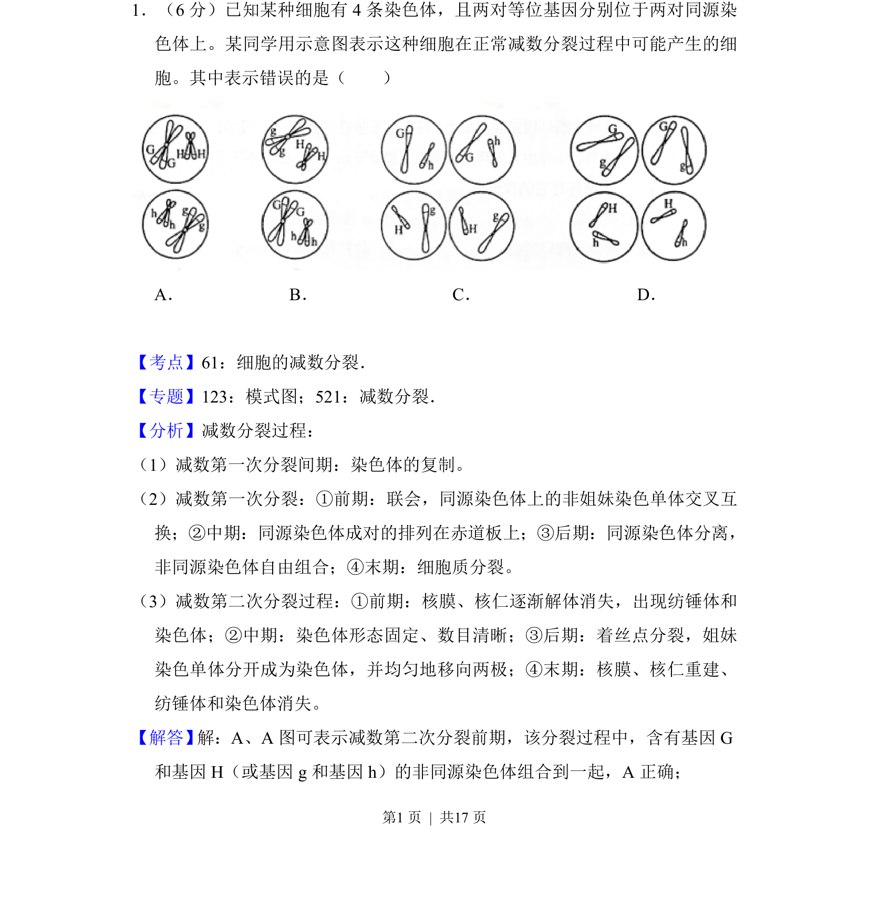
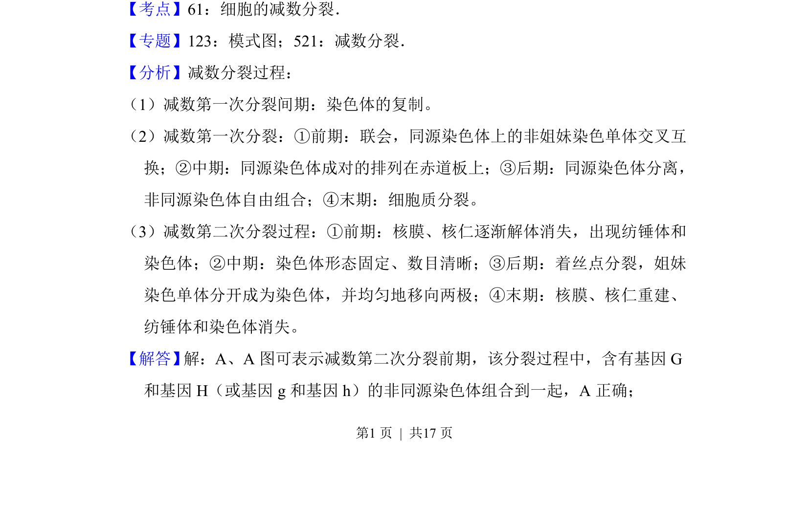
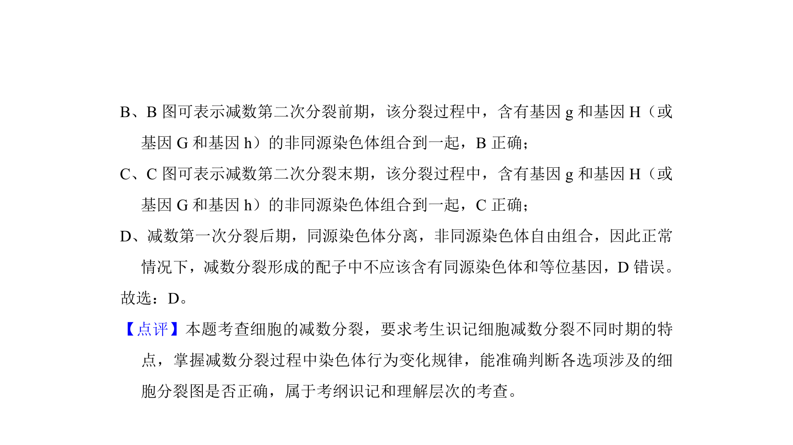

## 题面

## 摘要

减数分裂过程中同源染色体分离与非同源染色体自由组合，结合等位基因判断子细胞染色体组成。

## 关联考点

- [[681-细胞的减数分裂|细胞的减数分裂]]
- [[809-同源染色体分离|同源染色体分离]]
- [[733-非同源染色体自由组合|非同源染色体自由组合]]

## 答案与解析

> 📄 原 PDF 第 1 页：`素材/真题/吉林/2008-2024·（吉林）生物高考真题/2017年高考生物试卷（新课标Ⅱ）（解析卷）.pdf`

<!-- 题干文本-start -->
## 题干文本
1．（6分）已知某种细胞有4条染色体，且两对等位基因分别位于两对同源染
色体上。某同学用示意图表示这种细胞在正常减数分裂过程中可能产生的细
胞。其中表示错误的是（　　）
A．            B．C．                  D．
<!-- 题干文本-end -->

<!-- 解析文本-start -->
## 解析文本
【考点】61：细胞的减数分裂．菁优网版权所有
【专题】123：模式图；521：减数分裂．
【分析】减数分裂过程：
（1）减数第一次分裂间期：染色体的复制。
（2）减数第一次分裂：①前期：联会，同源染色体上的非姐妹染色单体交叉互
换；②中期：同源染色体成对的排列在赤道板上；③后期：同源染色体分离，
非同源染色体自由组合；④末期：细胞质分裂。
（3）减数第二次分裂过程：①前期：核膜、核仁逐渐解体消失，出现纺锤体和
染色体；②中期：染色体形态固定、数目清晰；③后期：着丝点分裂，姐妹
染色单体分开成为染色体，并均匀地移向两极；④末期：核膜、核仁重建、
纺锤体和染色体消失。
【解答】 解：A、A图可表示减数第二次分裂前期，该分裂过程中，含有基因G
和基因H（或基因g和基因h）的非同源染色体组合到一起，A正确；
<!-- 解析文本-end -->
