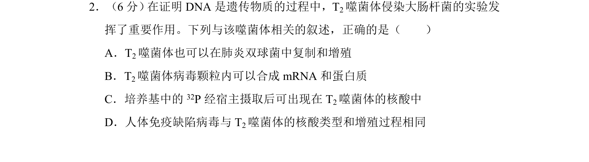
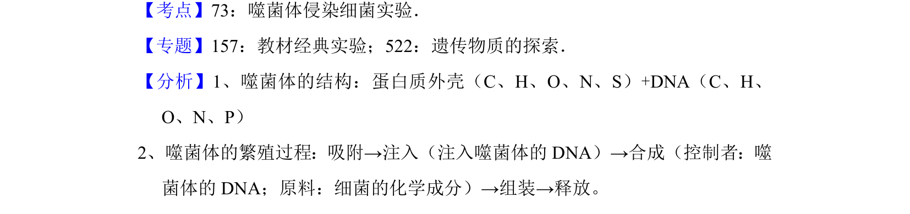

## 题面

## 摘要

该题考查T2噬菌体侵染大肠杆菌实验的相关叙述正误判断。

## 关联考点

- [[778-噬菌体|噬菌体]]
- [[213-核酸|核酸]]
- [[584-增殖|增殖]]
- [[666-实验分析|实验分析]]

## 答案与解析

> 📄 原 PDF 第 2 页：`素材/真题/吉林/2008-2024·（吉林）生物高考真题/2017年高考生物试卷（新课标Ⅱ）（解析卷）.pdf`

<!-- 题干文本-start -->
## 题干文本
2．（6分） 在证明DNA是遗传物质的过程中，T2噬菌体侵染大肠杆菌的实验发
挥了重要作用。下列与该噬菌体相关的叙述，正确的是（　　）
A．T2噬菌体也可以在肺炎双球菌中复制和增殖
B．T2噬菌体病毒颗粒内可以合成mRNA和蛋白质
C．培养基中的 32P经宿主摄取后可出现在T 2噬菌体的核酸中
D．人体免疫缺陷病毒与T 2噬菌体的核酸类型和增殖过程相同
<!-- 题干文本-end -->

<!-- 解析文本-start -->
## 解析文本
【考点】73：噬菌体侵染细菌实验．菁优网版权所有
【专题】157：教材经典实验；522：遗传物质的探索．
【分析】1、噬菌体的结构：蛋白质外壳（C、H、O、N、S）+DNA（C、H、
O、N、P）
2、噬菌体的繁殖过程：吸附→注入（注入噬菌体的DNA）→合成（控制者：噬
菌体的DNA；原料：细菌的化学成分）→组装→释放。
<!-- 解析文本-end -->
