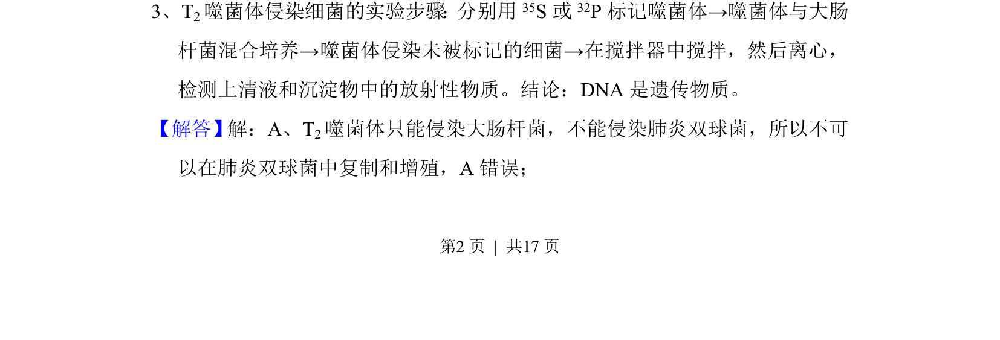
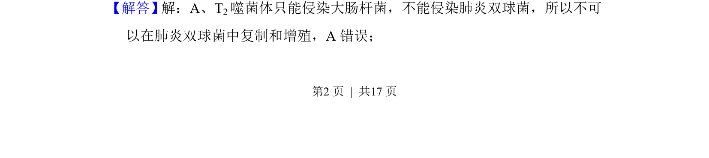
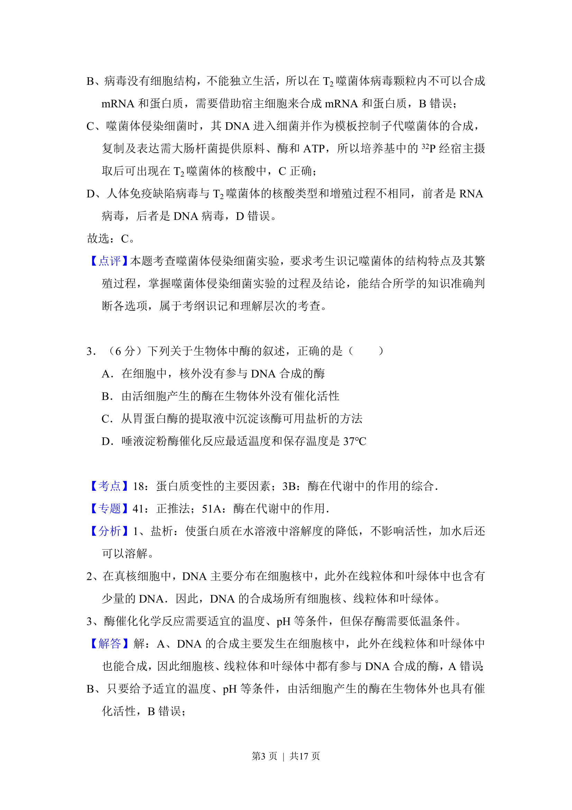
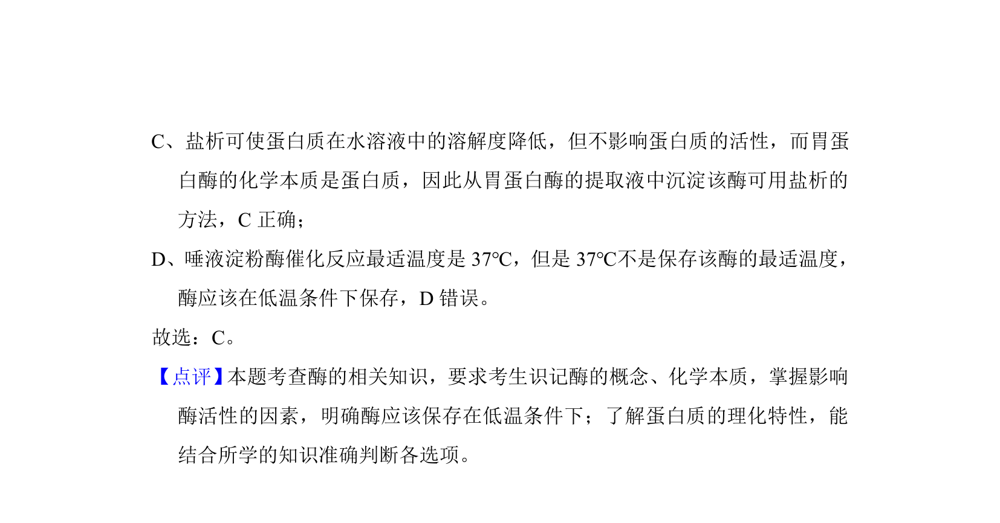

## 题面

## 摘要

该题考查T2噬菌体侵染实验的宿主专一性，指出其只能侵染大肠杆菌。

## 关联考点

- [[816-噬菌体侵染实验|噬菌体侵染实验]]
- [[589-宿主特异性|宿主特异性]]
- [[463-DNA是遗传物质|DNA是遗传物质]]

## 答案与解析

> 📄 原 PDF 第 2 页：`素材/真题/吉林/2008-2024·（吉林）生物高考真题/2017年高考生物试卷（新课标Ⅱ）（解析卷）.pdf`
