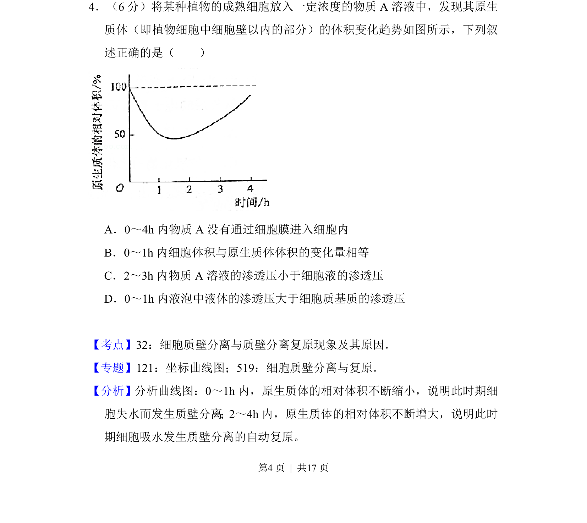
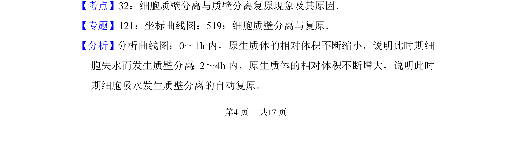
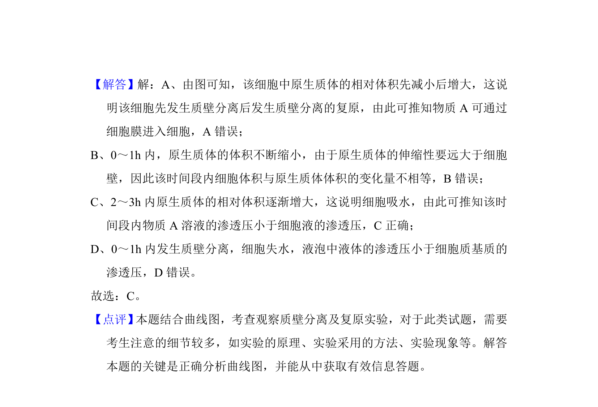

## 题面

## 摘要

植物细胞在不同渗透压溶液中发生质壁分离及复原的过程分析

## 关联考点

- [[262-质壁分离|质壁分离]]
- [[497-渗透压|渗透压]]
- [[799-细胞液|细胞液]]

## 答案与解析

> 📄 原 PDF 第 4 页：`素材/真题/吉林/2008-2024·（吉林）生物高考真题/2017年高考生物试卷（新课标Ⅱ）（解析卷）.pdf`

<!-- 题干文本-start -->
## 题干文本
4．（6分）将某种植物的成熟细胞放入一定浓度的物质A溶液中，发现其原生
质体（即植物细胞中细胞壁以内的部分）的体积变化趋势如图所示，下列叙
述正确的是（　　）
A．0～4h内物质A没有通过细胞膜进入细胞内
B．0～1h内细胞体积与原生质体体积的变化量相等
C．2～3h内物质A溶液的渗透压小于细胞液的渗透压
D．0～1h内液泡中液体的渗透压大于细胞质基质的渗透压
<!-- 题干文本-end -->

<!-- 解析文本-start -->
## 解析文本
【考点】32：细胞质壁分离与质壁分离复原现象及其原因．菁优网版权所有
【专题】121：坐标曲线图；519：细胞质壁分离与复原．
【分析】分析曲线图：0～1h内，原生质体的相对体积不断缩小，说明此时期细
胞失水而发生质壁分离；2～4h内，原生质体的相对体积不断增大，说明此时
期细胞吸水发生质壁分离的自动复原。
<!-- 解析文本-end -->
