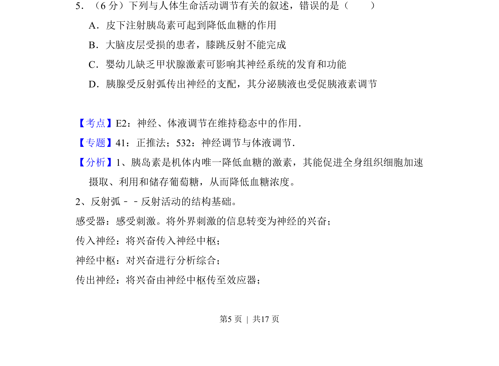
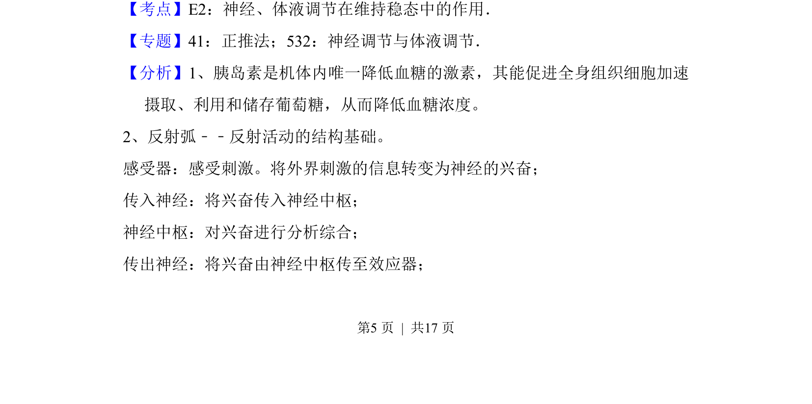
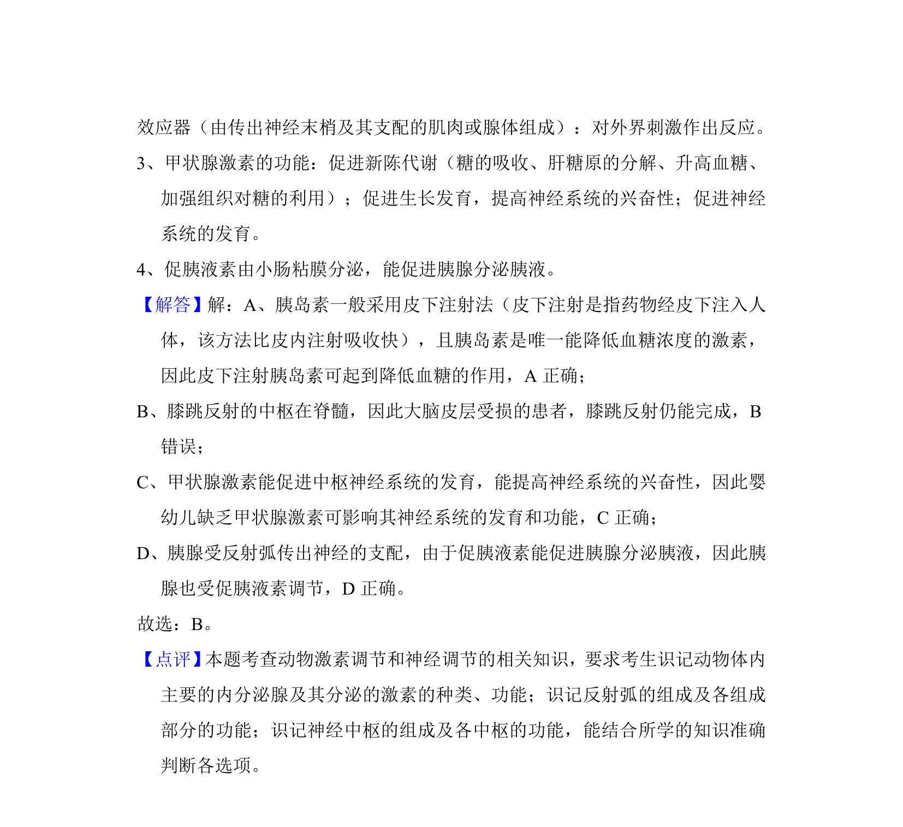

## 题面

## 摘要

考查神经调节和体液调节在人体生命活动中的作用及实例分析

## 关联考点

- [[324-神经调节|神经调节]]
- [[330-体液调节|体液调节]]
- [[340-胰岛素|胰岛素]]
- [[085-反射弧（初中）|反射弧]]

## 答案与解析

> 📄 原 PDF 第 5 页：`素材/真题/吉林/2008-2024·（吉林）生物高考真题/2017年高考生物试卷（新课标Ⅱ）（解析卷）.pdf`
