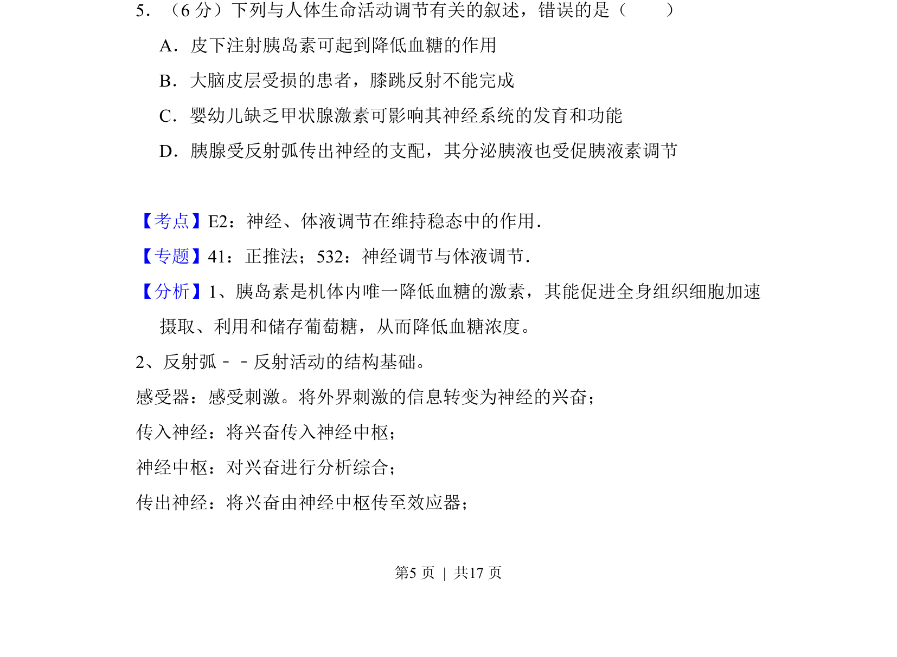
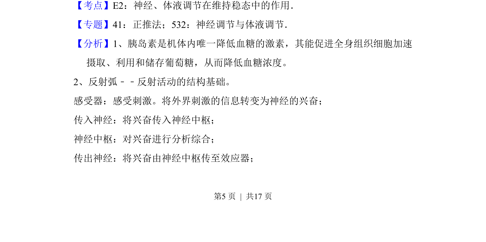
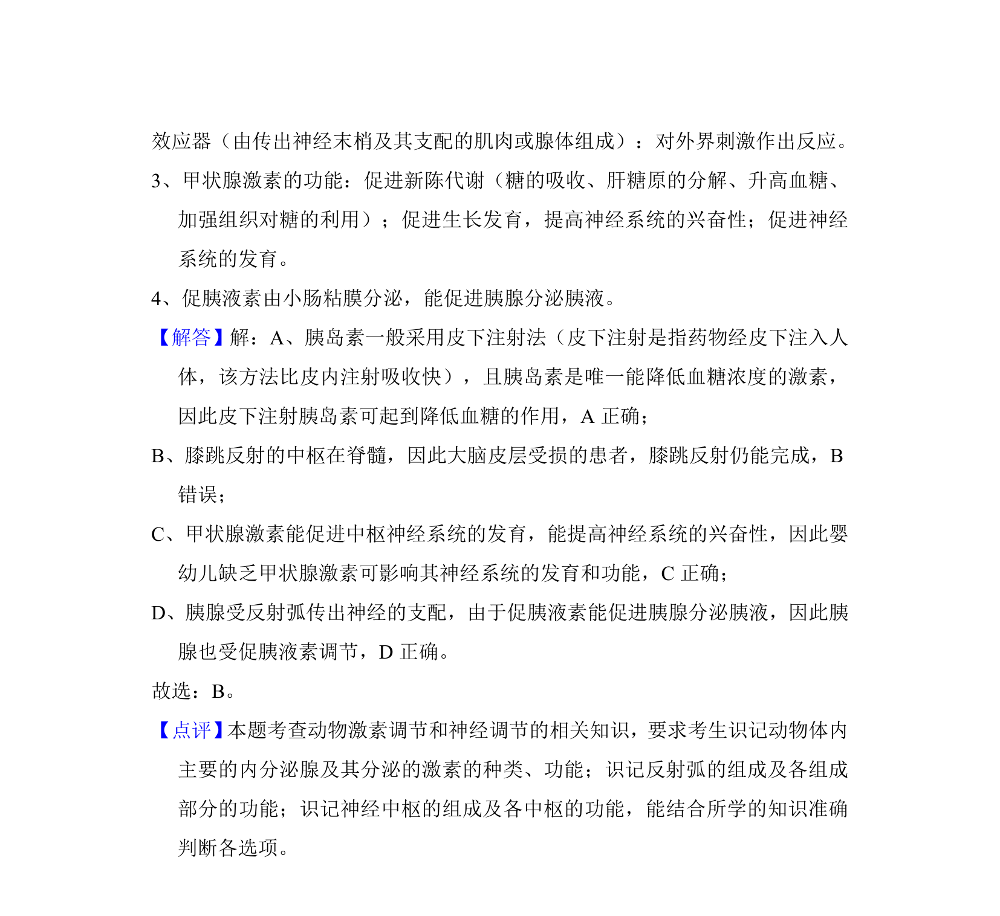

## 题面

## 摘要

考查神经调节和体液调节在人体生命活动中的作用及实例分析

## 关联考点

- [[324-神经调节|神经调节]]
- [[330-体液调节|体液调节]]
- [[340-胰岛素|胰岛素]]
- [[085-反射弧（初中）|反射弧]]

## 答案与解析

> 📄 原 PDF 第 5 页：`素材/真题/吉林/2008-2024·（吉林）生物高考真题/2017年高考生物试卷（新课标Ⅱ）（解析卷）.pdf`

<!-- 题干文本-start -->
## 题干文本
5．（6分）下列与人体生命活动调节有关的叙述，错误的是（　　）
A．皮下注射胰岛素可起到降低血糖的作用
B．大脑皮层受损的患者，膝跳反射不能完成
C．婴幼儿缺乏甲状腺激素可影响其神经系统的发育和功能
D．胰腺受反射弧传出神经的支配，其分泌胰液也受促胰液素调节
<!-- 题干文本-end -->

<!-- 解析文本-start -->
## 解析文本
【考点】E2：神经、体液调节在维持稳态中的作用．菁优网版权所有
【专题】41：正推法；532：神经调节与体液调节．
【分析】1、胰岛素是机体内唯一降低血糖的激素，其能促进全身组织细胞加速
摄取、利用和储存葡萄糖，从而降低血糖浓度。
2、反射弧﹣﹣反射活动的结构基础。 
感受器：感受刺激。将外界刺激的信息转变为神经的兴奋； 
传入神经：将兴奋传入神经中枢；
神经中枢：对兴奋进行分析综合；
传出神经：将兴奋由神经中枢传至效应器；
<!-- 解析文本-end -->
