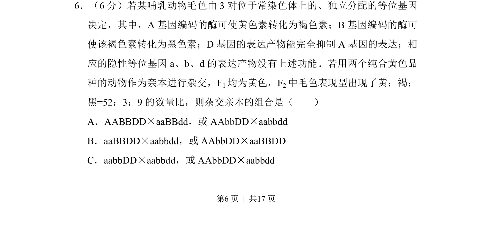
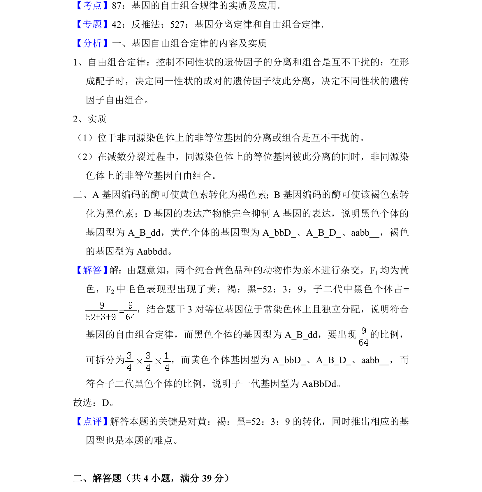

## 题面

## 摘要

通过3对基因的自由组合及互作关系，分析F2特殊性状分离比推断亲本组合。

## 关联考点

- [[272-自由组合定律|基因的自由组合定律]]
- [[573-基因互作|基因互作]]
- [[601-性状分离比|性状分离比]]
- [[716-遗传推断|遗传推断]]

## 答案与解析

> 📄 原 PDF 第 6 页：`素材/真题/吉林/2008-2024·（吉林）生物高考真题/2017年高考生物试卷（新课标Ⅱ）（解析卷）.pdf`
