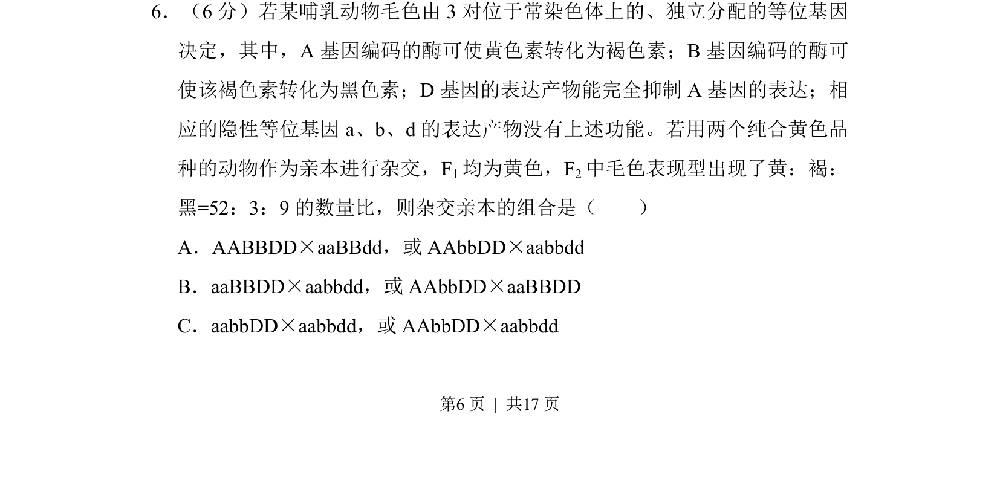
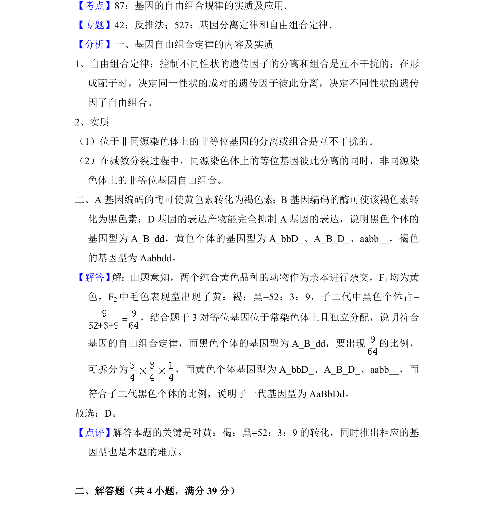

## 题面

## 摘要

通过3对基因的自由组合及互作关系，分析F2特殊性状分离比推断亲本组合。

## 关联考点

- [[272-自由组合定律|基因的自由组合定律]]
- [[573-基因互作|基因互作]]
- [[601-性状分离比|性状分离比]]
- [[716-遗传推断|遗传推断]]

## 答案与解析

> 📄 原 PDF 第 6 页：`素材/真题/吉林/2008-2024·（吉林）生物高考真题/2017年高考生物试卷（新课标Ⅱ）（解析卷）.pdf`

<!-- 题干文本-start -->
## 题干文本
6．（6分）若某哺乳动物毛色由3对位于常染色体上的、独立分配的等位基因
决定，其中，A基因编码的酶可使黄色素转化为褐色素；B基因编码的酶可
使该褐色素转化为黑色素；D基因的表达产物能完全抑制A基因的表达；相
应的隐性等位基因a、b、d的表达产物没有上述功能。若用两个纯合黄色品
种的动物作为亲本进行杂交，F1均为黄色，F2中毛色表现型出现了黄：褐：
黑=52：3：9的数量比，则杂交亲本的组合是（　　）
A．AABBDD×aaBBdd，或AAbbDD×aabbdd
B．aaBBDD×aabbdd，或AAbbDD×aaBBDD
C．aabbDD×aabbdd，或AAbbDD×aabbdd
<!-- 题干文本-end -->

<!-- 解析文本-start -->
## 解析文本

<!-- 解析文本-end -->
