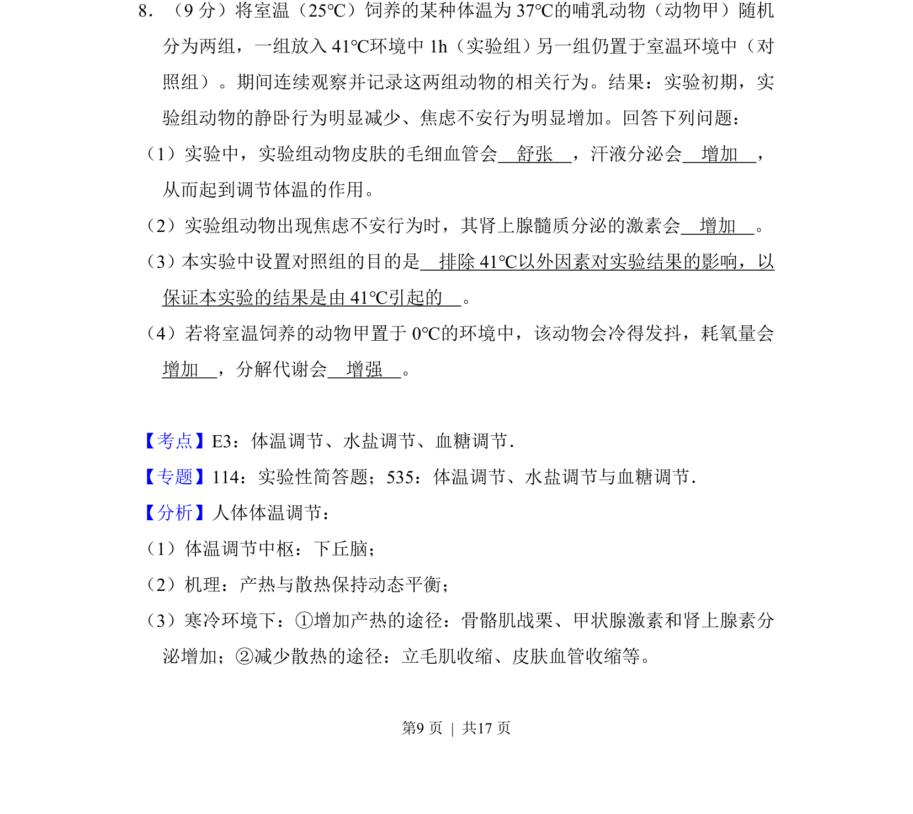
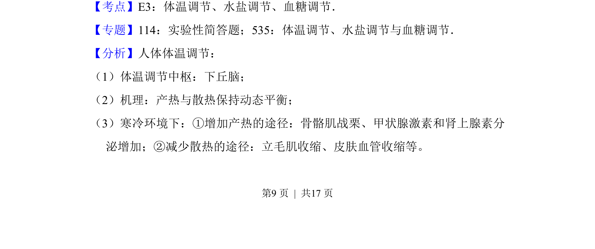
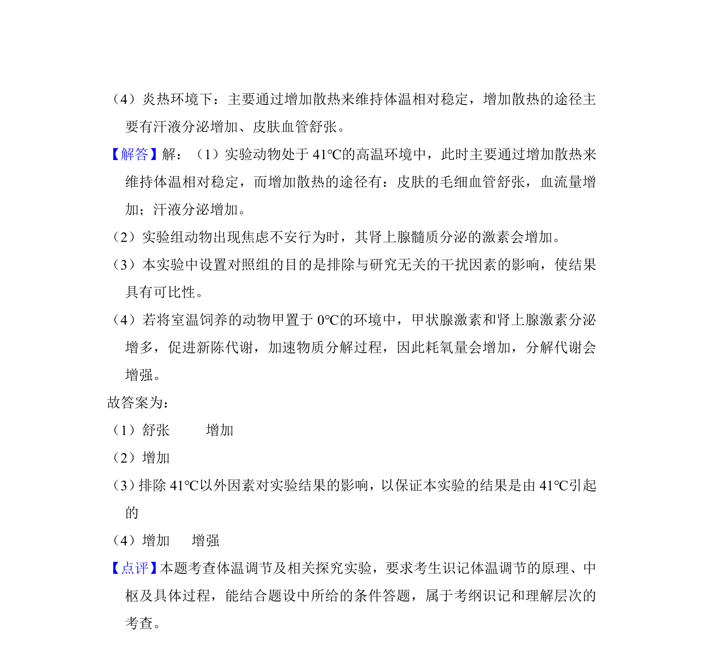

## 题面

## 摘要

本题以动物实验为背景，考查体温调节机制及实验设计原则。

## 关联考点

- [[542-体温调节|体温调节]]
- [[662-神经-体液调节|神经-体液调节]]
- [[485-对照实验|对照实验]]

## 答案与解析

> 📄 原 PDF 第 9 页：`素材/真题/吉林/2008-2024·（吉林）生物高考真题/2017年高考生物试卷（新课标Ⅱ）（解析卷）.pdf`

<!-- 题干文本-start -->
## 题干文本
8．（9分）将室温（25℃）饲养的某种体温为37℃的哺乳动物（动物甲）随机
分为两组，一组放入41℃环境中1h（实验组）另一组仍置于室温环境中（对
照组）。期间连续观察并记录这两组动物的相关行为。结果：实验初期，实
验组动物的静卧行为明显减少、焦虑不安行为明显增加。回答下列问题：
（1）实验中，实验组动物皮肤的毛细血管会　舒张　，汗液分泌会　增加　，
从而起到调节体温的作用。
（2）实验组动物出现焦虑不安行为时，其肾上腺髓质分泌的激素会　增加　。
（3）本实验中设置对照组的目的是　排除41℃以外因素对实验结果的影响，以
保证本实验的结果是由41℃引起的　。
（4）若将室温饲养的动物甲置于0℃的环境中，该动物会冷得发抖，耗氧量会　
增加　，分解代谢会　增强　。
<!-- 题干文本-end -->

<!-- 解析文本-start -->
## 解析文本
【考点】E3：体温调节、水盐调节、血糖调节．菁优网版权所有
【专题】114：实验性简答题；535：体温调节、水盐调节与血糖调节．
【分析】人体体温调节：
（1）体温调节中枢：下丘脑；
（2）机理：产热与散热保持动态平衡；
（3）寒冷环境下：①增加产热的途径：骨骼肌战栗、甲状腺激素和肾上腺素分
泌增加；②减少散热的途径：立毛肌收缩、皮肤血管收缩等。
<!-- 解析文本-end -->
