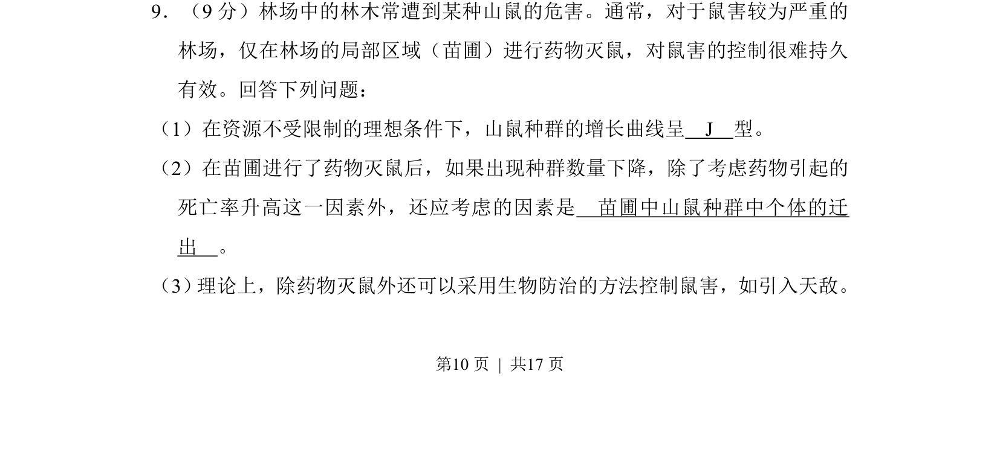
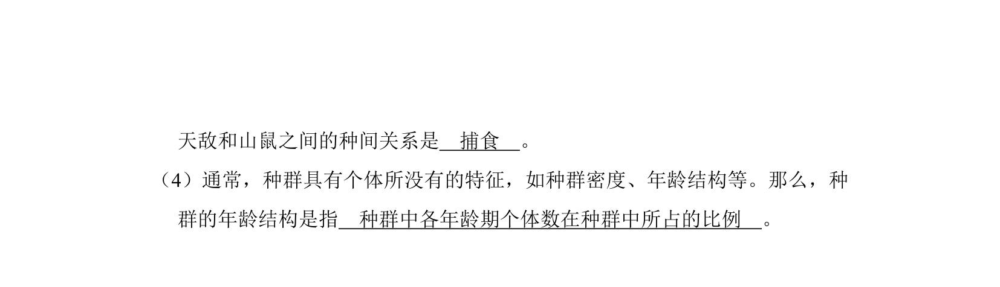
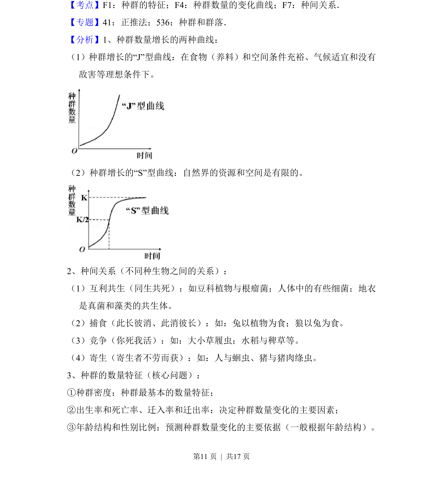
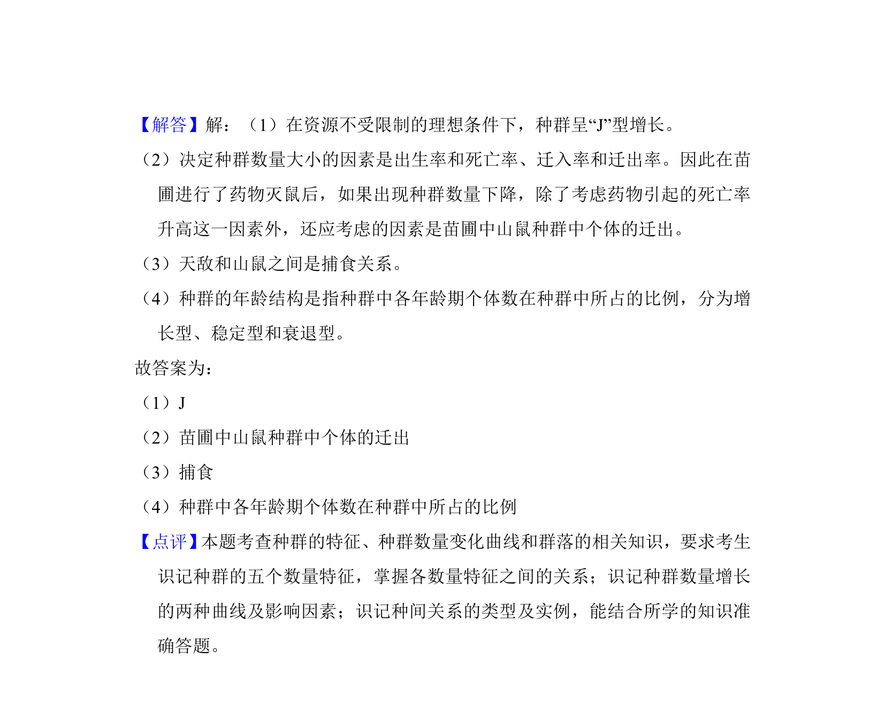

## 题面

## 摘要

该题考查种群数量增长类型及药物灭鼠效果影响因素。

## 关联考点

- [[663-种群增长模型|种群增长模型]]
- [[783-死亡率|死亡率]]
- [[785-迁出|迁出]]

## 答案与解析

> 📄 原 PDF 第 10 页：`素材/真题/吉林/2008-2024·（吉林）生物高考真题/2017年高考生物试卷（新课标Ⅱ）（解析卷）.pdf`

<!-- 题干文本-start -->
## 题干文本
9．（9分）林场中的林木常遭到某种山鼠的危害。通常，对于鼠害较为严重的
林场，仅在林场的局部区域（苗圃）进行药物灭鼠，对鼠害的控制很难持久
有效。回答下列问题：
（1）在资源不受限制的理想条件下，山鼠种群的增长曲线呈　J　型。
（2）在苗圃进行了药物灭鼠后，如果出现种群数量下降，除了考虑药物引起的
死亡率升高这一因素外，还应考虑的因素是　苗圃中山鼠种群中个体的迁
出　。
（3） 理论上，除药物灭鼠外还可以采用生物防治的方法控制鼠害，如引入天敌。
<!-- 题干文本-end -->

<!-- 解析文本-start -->
## 解析文本

<!-- 解析文本-end -->
