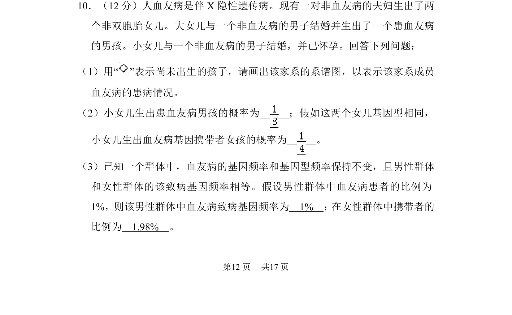
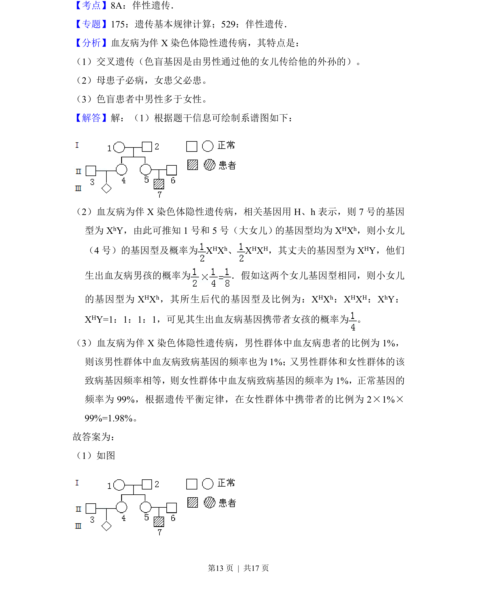
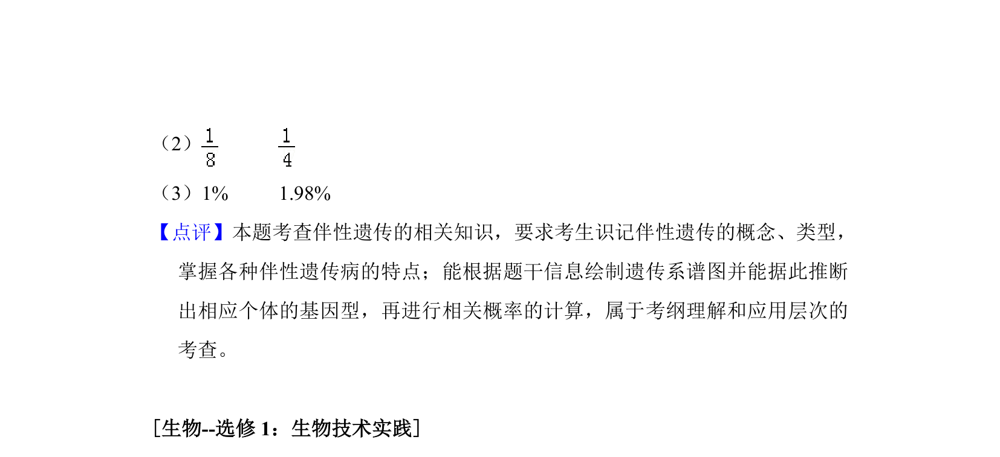

## 题面

## 摘要

该题通过血友病家系考查伴X隐性遗传的系谱图绘制、概率计算及群体基因频率与基因型频率的应用。

## 关联考点

- [[802-伴X隐性遗传|伴X隐性遗传]]
- [[506-系谱图|系谱图]]
- [[803-基因频率|基因频率]]
- [[718-遗传概率|遗传概率]]

## 答案与解析

> 📄 原 PDF 第 12 页：`素材/真题/吉林/2008-2024·（吉林）生物高考真题/2017年高考生物试卷（新课标Ⅱ）（解析卷）.pdf`

<!-- 题干文本-start -->
## 题干文本
10．（12分）人血友病是伴X隐性遗传病。现有一对非血友病的夫妇生出了两
个非双胞胎女儿。大女儿与一个非血友病的男子结婚并生出了一个患血友病
的男孩。小女儿与一个非血友病的男子结婚，并已怀孕。回答下列问题：
（1）用“ ”表示尚未出生的孩子，请画出该家系的系谱图，以表示该家系成员
血友病的患病情况。
（2）小女儿生出患血友病男孩的概率为　 　；假如这两个女儿基因型相同，
小女儿生出血友病基因携带者女孩的概率为　 　。
（3）已知一个群体中，血友病的基因频率和基因型频率保持不变，且男性群体
和女性群体的该致病基因频率相等。假设男性群体中血友病患者的比例为
1%，则该男性群体中血友病致病基因频率为　1%　； 在女性群体中携带者的
比例为　1.98%　。
<!-- 题干文本-end -->

<!-- 解析文本-start -->
## 解析文本

<!-- 解析文本-end -->
