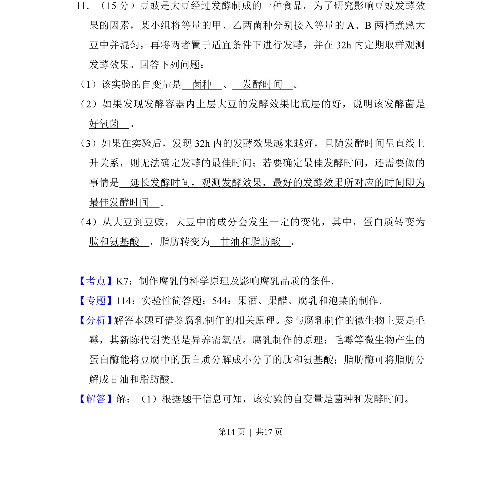
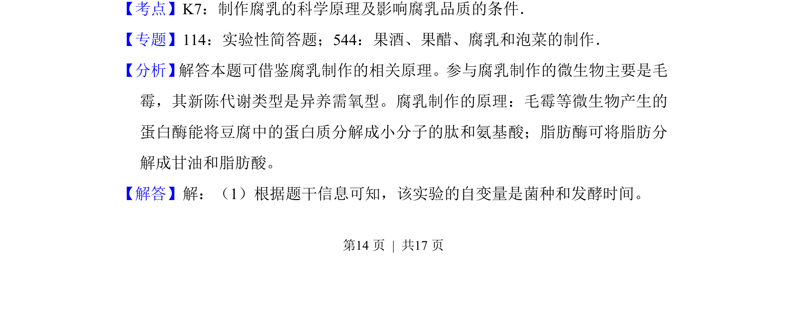
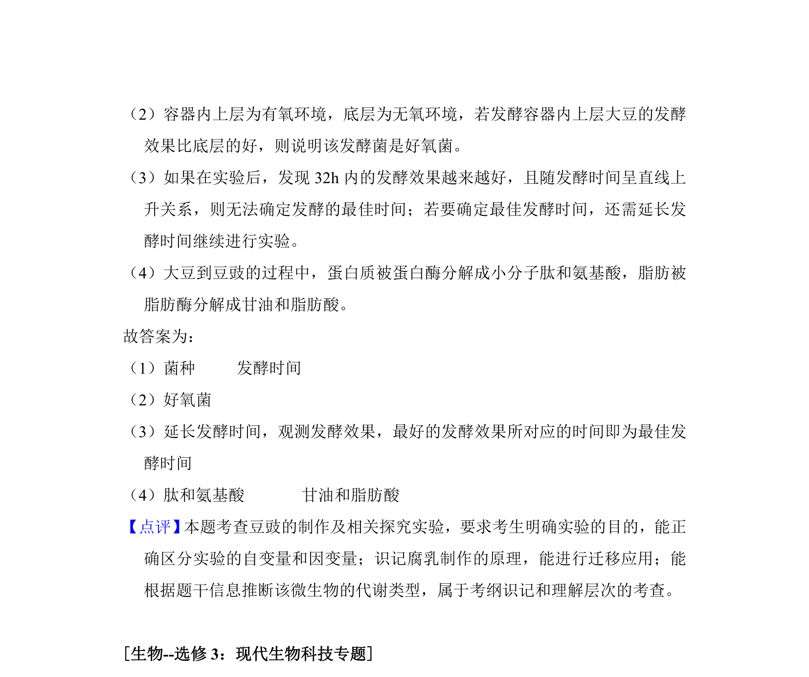

## 题面

## 摘要

该题考查影响豆豉发酵效果因素的实验设计与分析。

## 关联考点

- [[694-菌种|菌种]]
- [[566-发酵时间|发酵时间]]
- [[585-好氧菌|好氧菌]]
- [[811-变量控制|变量控制]]

## 答案与解析

> 📄 原 PDF 第 14 页：`素材/真题/吉林/2008-2024·（吉林）生物高考真题/2017年高考生物试卷（新课标Ⅱ）（解析卷）.pdf`

<!-- 题干文本-start -->
## 题干文本
11．（15分）豆豉是大豆经过发酵制成的一种食品。为了研究影响豆豉发酵效
果的因素，某小组将等量的甲、乙两菌种分别接入等量的A、B两桶煮熟大
豆中并混匀，再将两者置于适宜条件下进行发酵，并在32h内定期取样观测
发酵效果。回答下列问题：
（1）该实验的自变量是　菌种　、　发酵时间　。
（2）如果发现发酵容器内上层大豆的发酵效果比底层的好，说明该发酵菌是　
好氧菌　。
（3）如果在实验后，发现32h内的发酵效果越来越好，且随发酵时间呈直线上
升关系，则无法确定发酵的最佳时间；若要确定最佳发酵时间，还需要做的
事情是　延长发酵时间，观测发酵效果，最好的发酵效果所对应的时间即为
最佳发酵时间　。
（4）从大豆到豆豉，大豆中的成分会发生一定的变化，其中，蛋白质转变为　
肽和氨基酸　，脂肪转变为　甘油和脂肪酸　。
<!-- 题干文本-end -->

<!-- 解析文本-start -->
## 解析文本
【考点】K7：制作腐乳的科学原理及影响腐乳品质的条件．菁优网版权所有
【专题】114：实验性简答题；544：果酒、果醋、腐乳和泡菜的制作．
【分析】 解答本题可借鉴腐乳制作的相关原理。参与腐乳制作的微生物主要是毛
霉，其新陈代谢类型是异养需氧型。腐乳制作的原理：毛霉等微生物产生的
蛋白酶能将豆腐中的蛋白质分解成小分子的肽和氨基酸；脂肪酶可将脂肪分
解成甘油和脂肪酸。
【解答】解：（1）根据题干信息可知，该实验的自变量是菌种和发酵时间。
<!-- 解析文本-end -->
