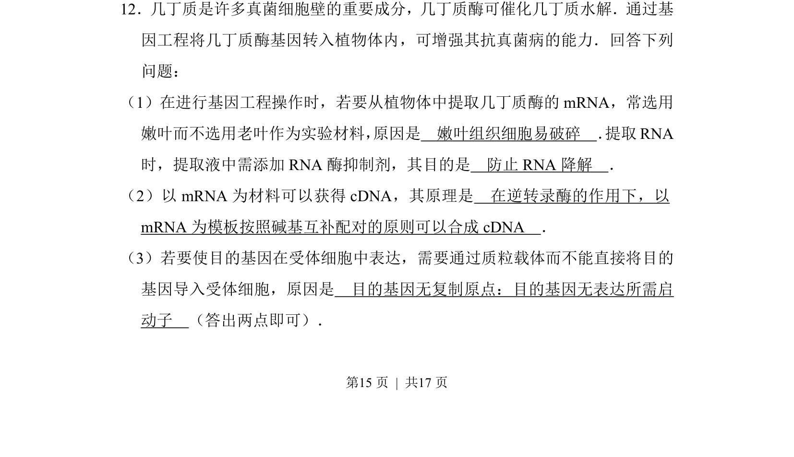
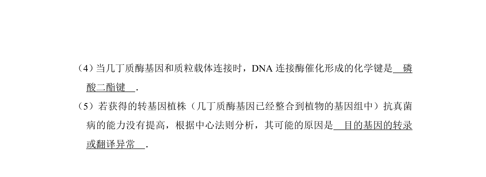
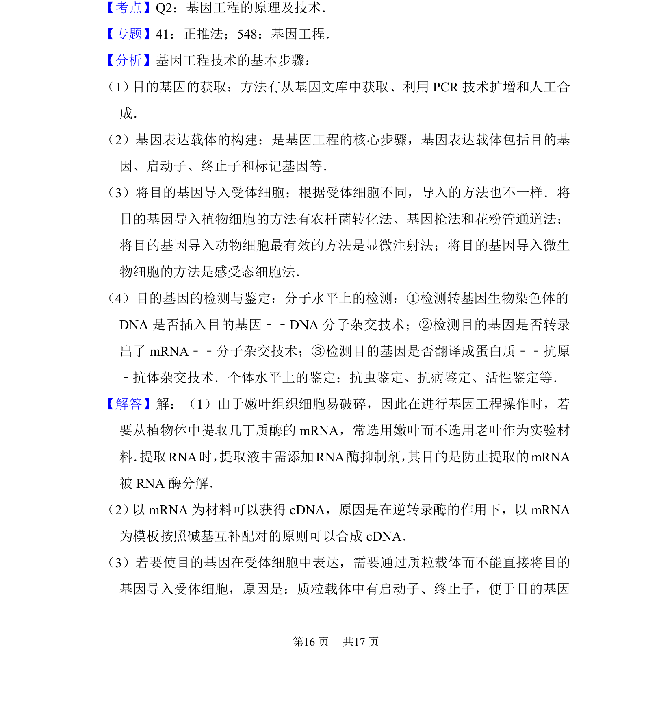
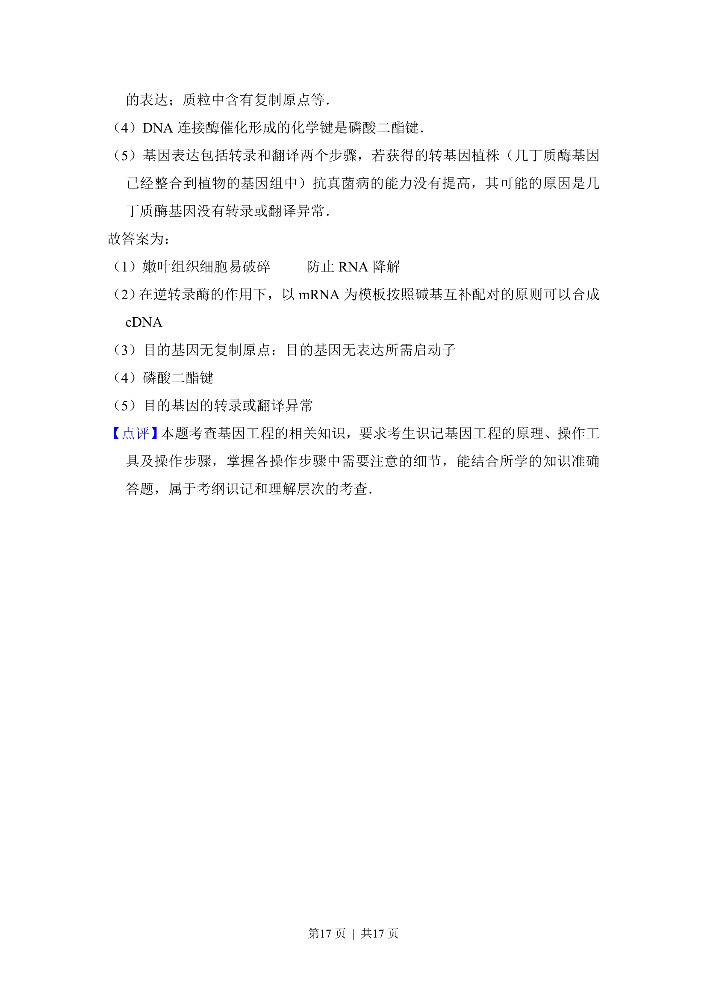

## 题面

## 摘要

本题主要考查基因工程中获取目的基因和构建表达载体的相关原理。

## 关联考点

- [[411-基因工程|基因工程]]
- [[逆转录]]
- [[质粒载体]]
- [[RNA保护]]

## 答案与解析

> 📄 原 PDF 第 15 页：`素材/真题/吉林/2008-2024·（吉林）生物高考真题/2017年高考生物试卷（新课标Ⅱ）（解析卷）.pdf`
