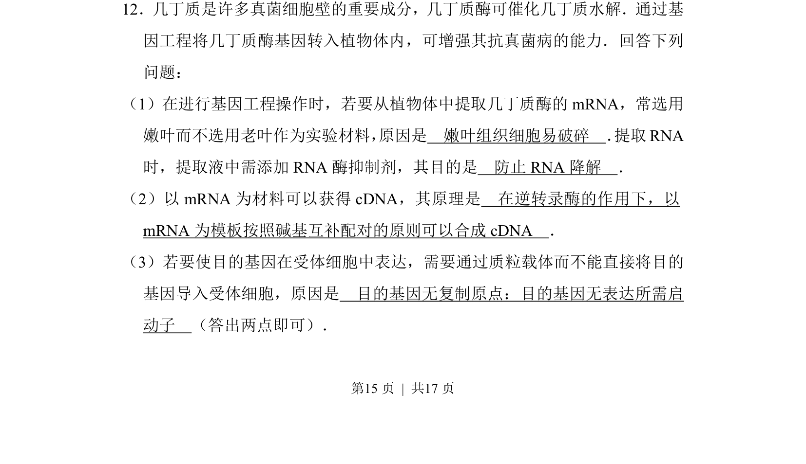
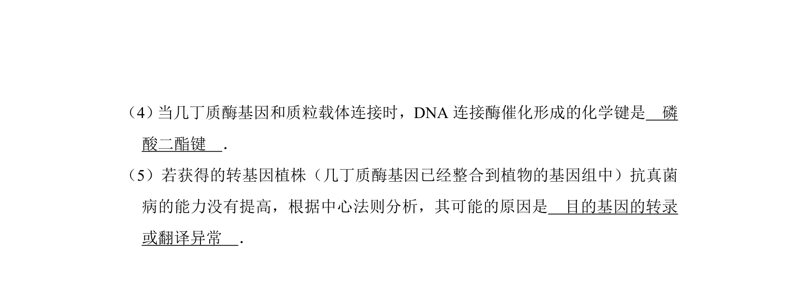
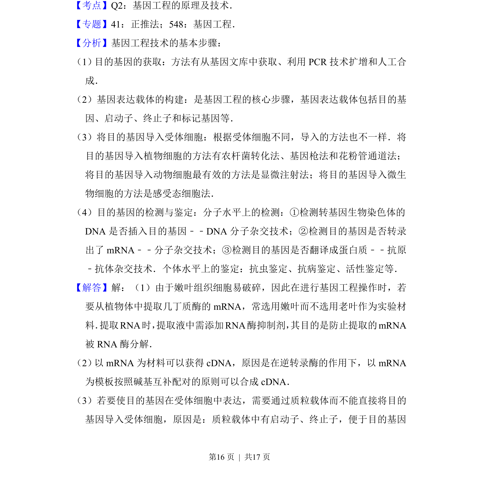
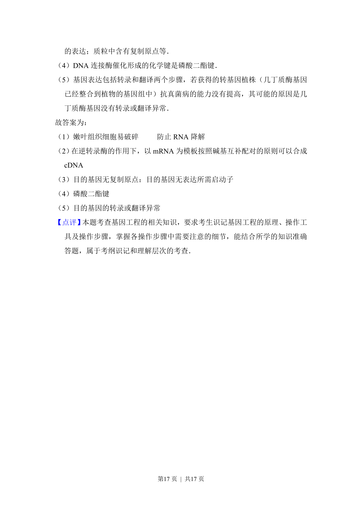

## 题面

## 摘要

本题主要考查基因工程中获取目的基因和构建表达载体的相关原理。

## 关联考点

- [[411-基因工程|基因工程]]
- [[513-逆转录|逆转录]]
- [[710-质粒载体|质粒载体]]
- [[531-RNA保护|RNA保护]]

## 答案与解析

> 📄 原 PDF 第 15 页：`素材/真题/吉林/2008-2024·（吉林）生物高考真题/2017年高考生物试卷（新课标Ⅱ）（解析卷）.pdf`

<!-- 题干文本-start -->
## 题干文本
12．几丁质是许多真菌细胞壁的重要成分，几丁质酶可催化几丁质水解．通过基
因工程将几丁质酶基因转入植物体内，可增强其抗真菌病的能力．回答下列
问题：
（1）在进行基因工程操作时，若要从植物体中提取几丁质酶的mRNA，常选用
嫩叶而不选用老叶作为实验材料， 原因是　嫩叶组织细胞易破碎　． 提取RNA
时，提取液中需添加RNA酶抑制剂，其目的是　防止RNA降解　．
（2）以mRNA为材料可以获得cDNA，其原理是　在逆转录酶的作用下，以
mRNA为模板按照碱基互补配对的原则可以合成cDNA　．
（3）若要使目的基因在受体细胞中表达，需要通过质粒载体而不能直接将目的
基因导入受体细胞，原因是　目的基因无复制原点：目的基因无表达所需启
动子　（答出两点即可）．
<!-- 题干文本-end -->

<!-- 解析文本-start -->
## 解析文本

<!-- 解析文本-end -->
