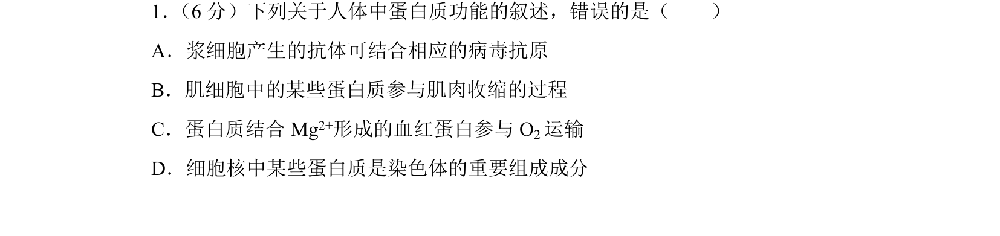
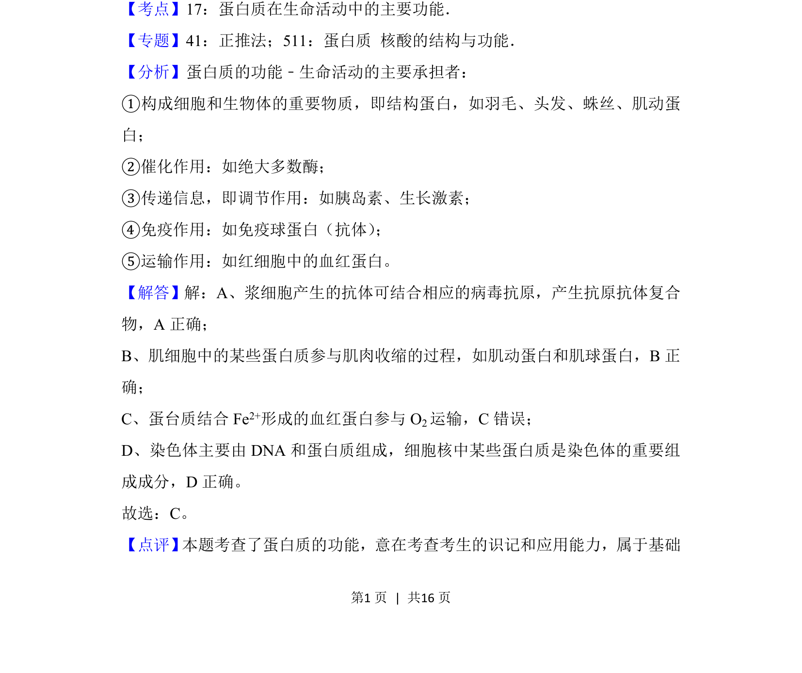

## 题面

## 摘要

本题考查人体蛋白质的多种功能，如免疫、肌肉收缩、运输氧气及构成染色体等。

## 关联考点

- [[696-蛋白质功能|蛋白质功能]]
- [[162-抗体|抗体]]
- [[703-血红蛋白|血红蛋白]]
- [[798-染色体结构蛋白|染色体结构蛋白]]

## 答案与解析

> 📄 原 PDF 第 1 页：`素材/真题/吉林/2008-2024·（吉林）生物高考真题/2018年高考生物试卷（新课标Ⅱ）（解析卷）.pdf`
