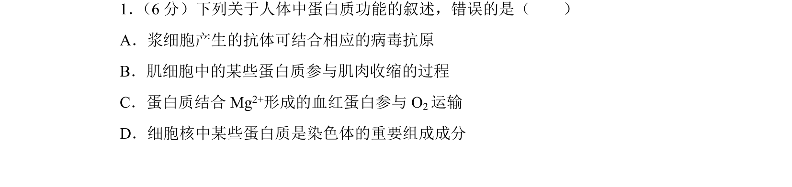
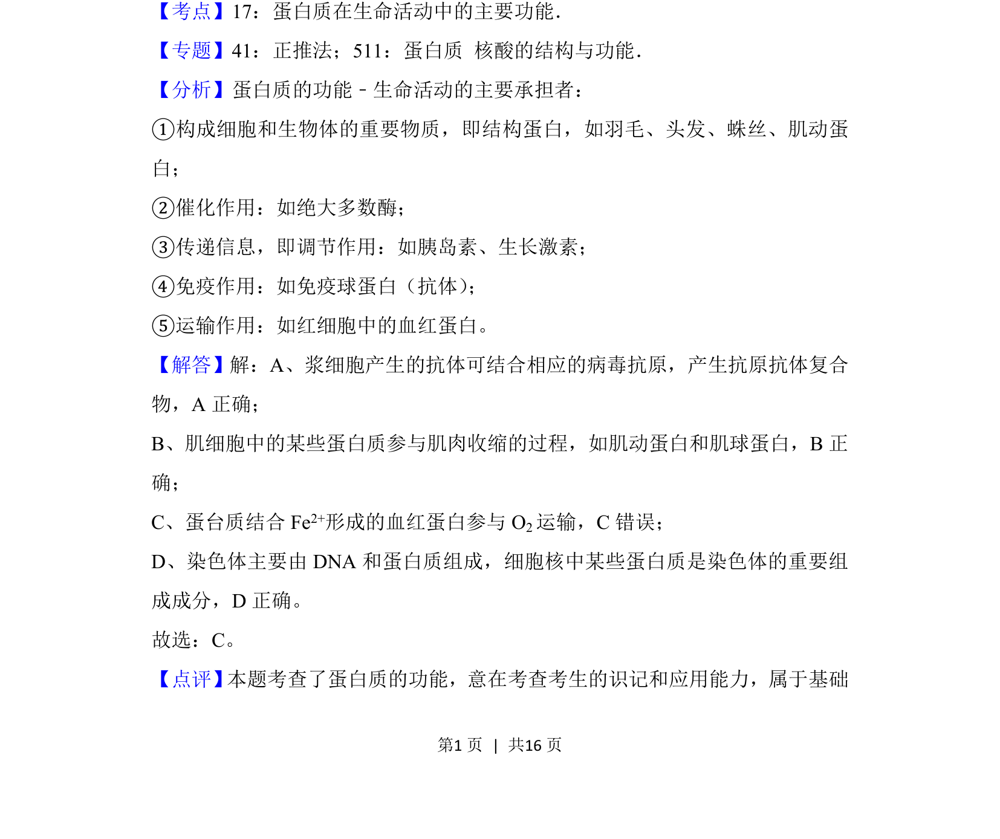

## 题面

## 摘要

本题考查人体蛋白质的多种功能，如免疫、肌肉收缩、运输氧气及构成染色体等。

## 关联考点

- [[696-蛋白质功能|蛋白质功能]]
- [[162-抗体|抗体]]
- [[703-血红蛋白|血红蛋白]]
- [[798-染色体结构蛋白|染色体结构蛋白]]

## 答案与解析

> 📄 原 PDF 第 1 页：`素材/真题/吉林/2008-2024·（吉林）生物高考真题/2018年高考生物试卷（新课标Ⅱ）（解析卷）.pdf`

<!-- 题干文本-start -->
## 题干文本
1． （6分）下列关于人体中蛋白质功能的叙述，错误的是（　　）
A．浆细胞产生的抗体可结合相应的病毒抗原
B．肌细胞中的某些蛋白质参与肌肉收缩的过程
C．蛋白质结合Mg 2+形成的血红蛋白参与O 2运输
D．细胞核中某些蛋白质是染色体的重要组成成分
<!-- 题干文本-end -->

<!-- 解析文本-start -->
## 解析文本
【考点】17：蛋白质在生命活动中的主要功能．菁优网版权所有
【专题】41：正推法；511：蛋白质 核酸的结构与功能．
【分析】蛋白质的功能﹣生命活动的主要承担者：
①构成细胞和生物体的重要物质，即结构蛋白，如羽毛、头发、蛛丝、肌动蛋
白；
②催化作用：如绝大多数酶；
③传递信息，即调节作用：如胰岛素、生长激素；
④免疫作用：如免疫球蛋白（抗体） ；
⑤运输作用：如红细胞中的血红蛋白。
【解答】解：A、浆细胞产生的抗体可结合相应的病毒抗原，产生抗原抗体复合
物，A正确；
B、肌细胞中的某些蛋白质参与肌肉收缩的过程，如肌动蛋白和肌球蛋白，B正
确；
C、蛋台质结合Fe 2+形成的血红蛋白参与O 2运输，C错误；
D、染色体主要由DNA和蛋白质组成，细胞核中某些蛋白质是染色体的重要组
成成分，D正确。
故选：C。
【点评】 本题考查了蛋白质的功能，意在考查考生的识记和应用能力，属于基础
<!-- 解析文本-end -->
