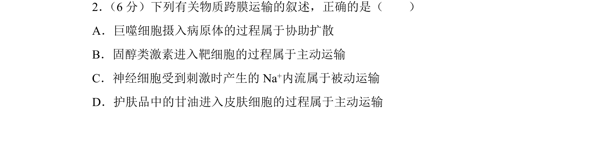
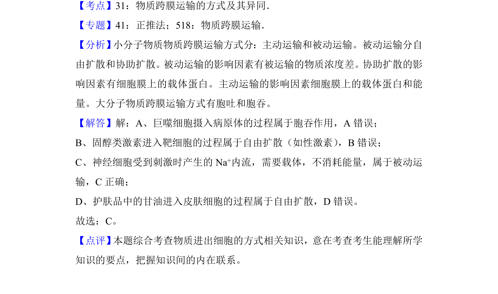

## 题面

## 摘要

该题考查物质跨膜运输方式的辨析，包括胞吞、自由扩散及被动运输实例。

## 关联考点

- [[635-物质跨膜运输|物质跨膜运输]]
- [[707-被动运输|被动运输]]
- [[256-主动运输|主动运输]]
- [[260-胞吞|胞吞]]

## 答案与解析

> 📄 原 PDF 第 2 页：`素材/真题/吉林/2008-2024·（吉林）生物高考真题/2018年高考生物试卷（新课标Ⅱ）（解析卷）.pdf`
