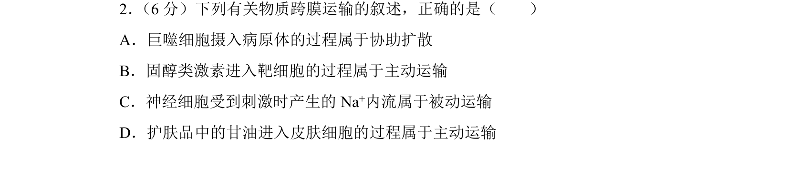
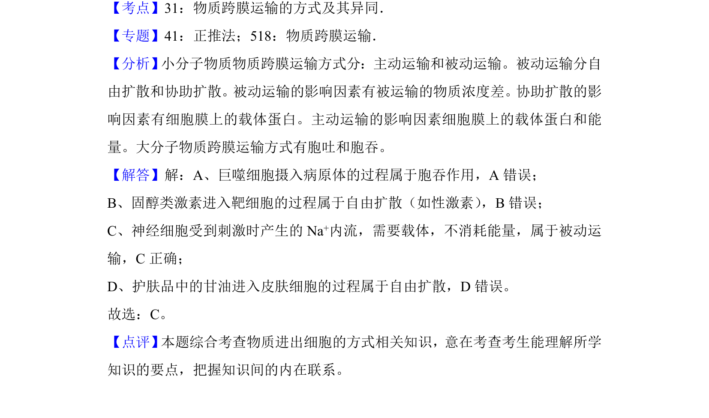

## 题面

## 摘要

该题考查物质跨膜运输方式的辨析，包括胞吞、自由扩散及被动运输实例。

## 关联考点

- [[635-物质跨膜运输|物质跨膜运输]]
- [[707-被动运输|被动运输]]
- [[256-主动运输|主动运输]]
- [[260-胞吞|胞吞]]

## 答案与解析

> 📄 原 PDF 第 2 页：`素材/真题/吉林/2008-2024·（吉林）生物高考真题/2018年高考生物试卷（新课标Ⅱ）（解析卷）.pdf`

<!-- 题干文本-start -->
## 题干文本
2． （6分）下列有关物质跨膜运输的叙述，正确的是（　　）
A．巨噬细胞摄入病原体的过程属于协助扩散
B．固醇类激素进入靶细胞的过程属于主动运输
C．神经细胞受到刺激时产生的Na +内流属于被动运输
D．护肤品中的甘油进入皮肤细胞的过程属于主动运输
<!-- 题干文本-end -->

<!-- 解析文本-start -->
## 解析文本
【考点】31：物质跨膜运输的方式及其异同．菁优网版权所有
【专题】41：正推法；518：物质跨膜运输．
【分析】 小分子物质物质跨膜运输方式分：主动运输和被动运输。被动运输分自
由扩散和协助扩散。被动运输的影响因素有被运输的物质浓度差。协助扩散的影
响因素有细胞膜上的载体蛋白。主动运输的影响因素细胞膜上的载体蛋白和能
量。大分子物质跨膜运输方式有胞吐和胞吞。
【解答】解：A、巨噬细胞摄入病原体的过程属于胞吞作用，A错误；
B、固醇类激素进入靶细胞的过程属于自由扩散（如性激素） ，B错误；
C、神经细胞受到刺激时产生的Na +内流，需要载体，不消耗能量，属于被动运
输，C正确；
D、护肤品中的甘油进入皮肤细胞的过程属于自由扩散，D错误。
故选：C。
【点评】 本题综合考查物质进出细胞的方式相关知识，意在考查考生能理解所学
知识的要点，把握知识间的内在联系。
<!-- 解析文本-end -->
