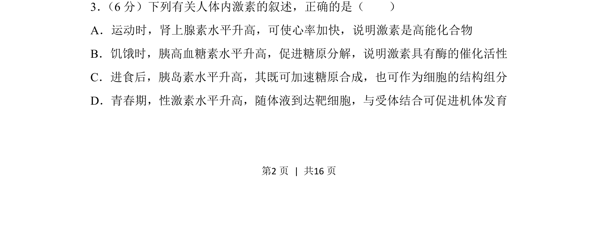
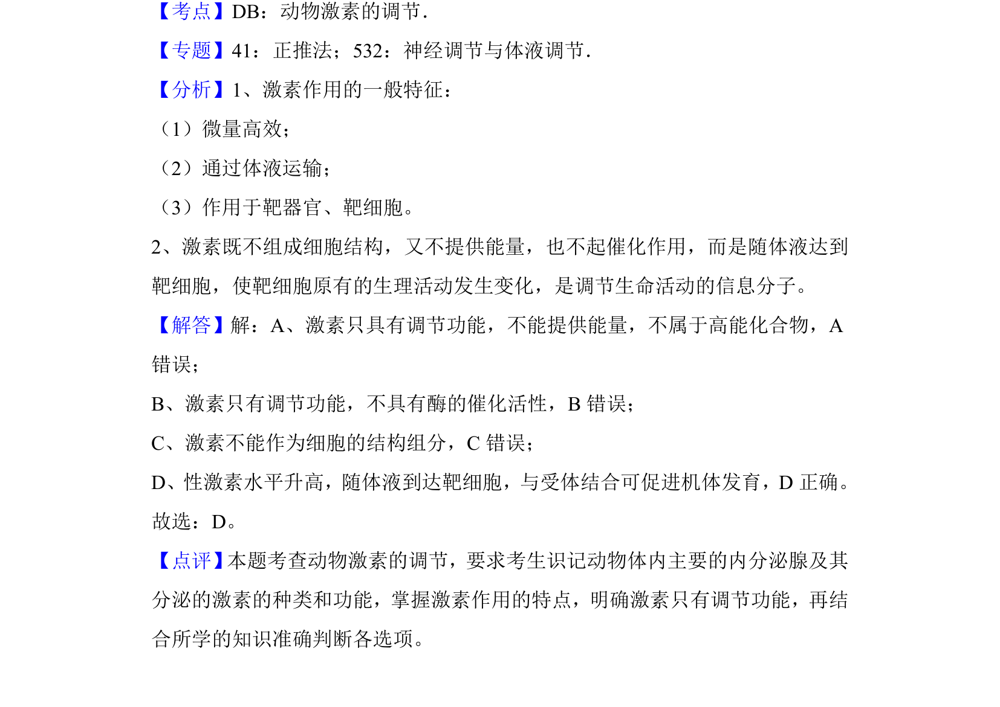

## 题面

## 摘要

该题考查人体内激素的作用机制，辨析激素、酶、高能化合物等概念的区别。

## 关联考点

- [[331-激素调节|激素调节]]
- [[164-物质分类|物质分类]]
- [[243-酶的特性|酶的特性]]

## 答案与解析

> 📄 原 PDF 第 2 页：`素材/真题/吉林/2008-2024·（吉林）生物高考真题/2018年高考生物试卷（新课标Ⅱ）（解析卷）.pdf`
