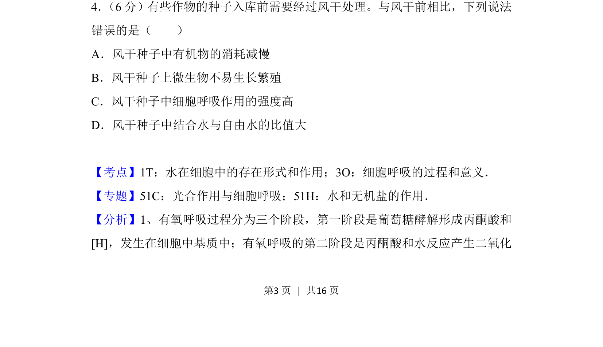
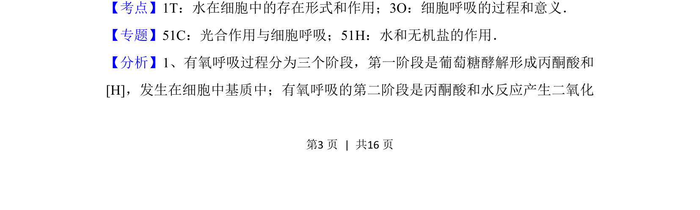
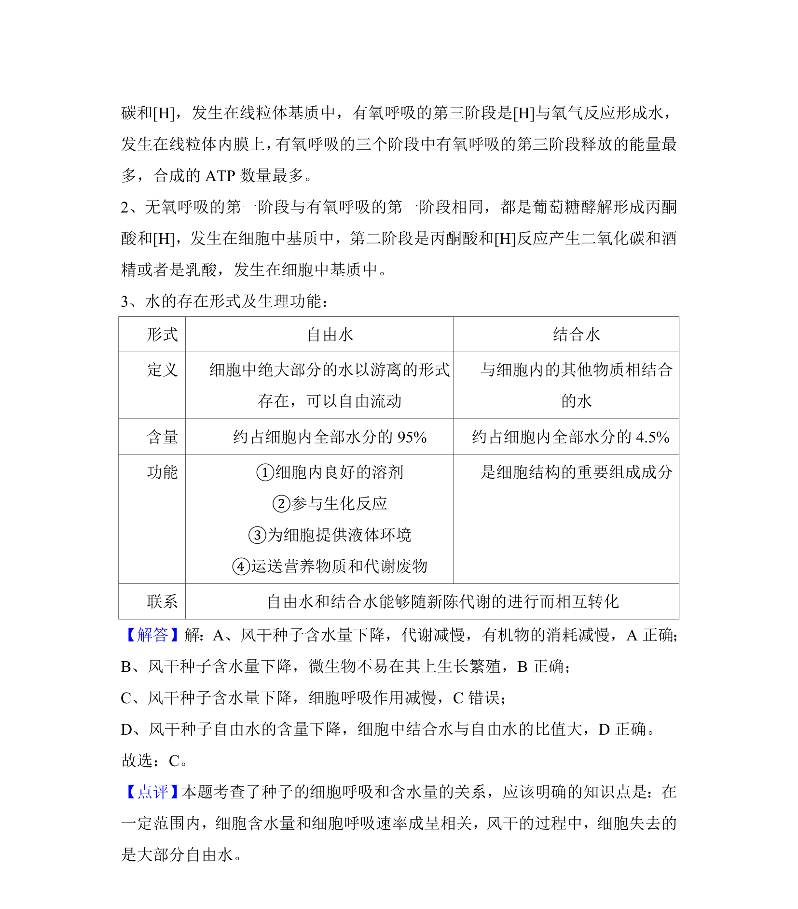

## 题面

## 摘要

考查种子风干处理后细胞呼吸、有机物消耗、微生物生长及水分存在形式的变化。

## 关联考点

- [[241-细胞呼吸|细胞呼吸]]
- [[623-水存在形式|水存在形式]]
- [[468-代谢速率|代谢速率]]

## 答案与解析

> 📄 原 PDF 第 3 页：`素材/真题/吉林/2008-2024·（吉林）生物高考真题/2018年高考生物试卷（新课标Ⅱ）（解析卷）.pdf`

<!-- 题干文本-start -->
## 题干文本
4． （6分）有些作物的种子入库前需要经过风干处理。与风干前相比，下列说法
错误的是（　　）
A．风干种子中有机物的消耗减慢
B．风干种子上微生物不易生长繁殖
C．风干种子中细胞呼吸作用的强度高
D．风干种子中结合水与自由水的比值大
<!-- 题干文本-end -->

<!-- 解析文本-start -->
## 解析文本
【考点】1T：水在细胞中的存在形式和作用；3O：细胞呼吸的过程和意义．菁优网版权所有
【专题】51C：光合作用与细胞呼吸；51H：水和无机盐的作用．
【分析】1、有氧呼吸过程分为三个阶段，第一阶段是葡萄糖酵解形成丙酮酸和
[H]，发生在细胞中基质中；有氧呼吸的第二阶段是丙酮酸和水反应产生二氧化
<!-- 解析文本-end -->
