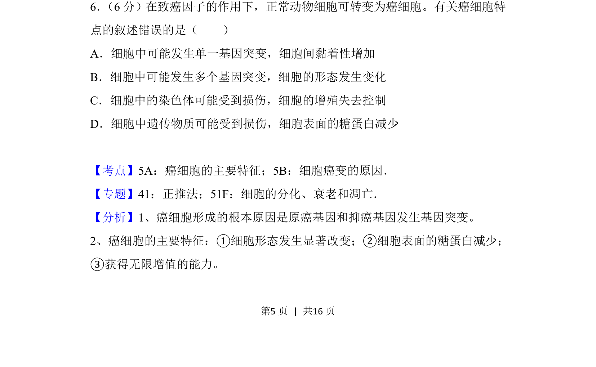
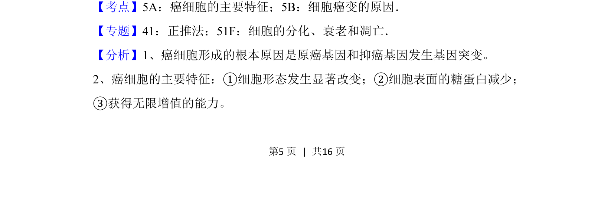
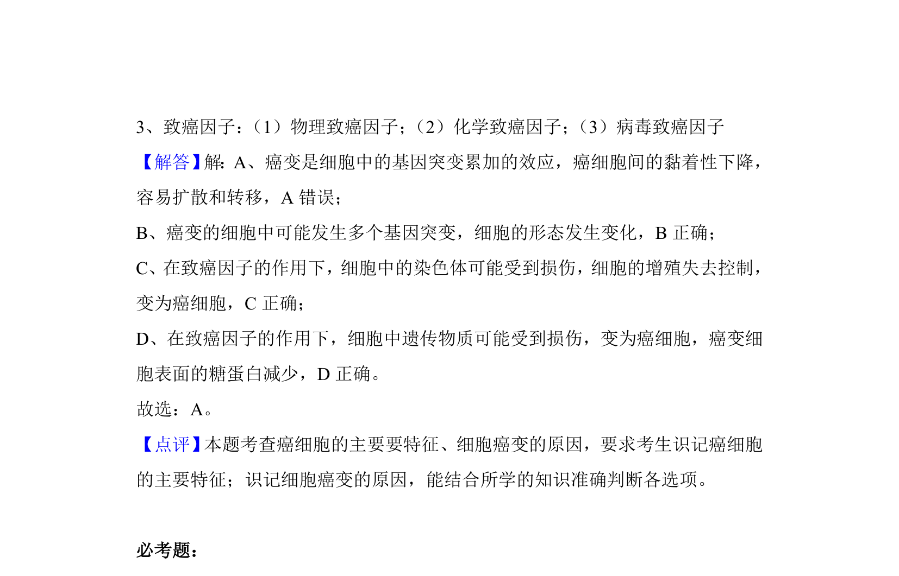

## 题面

## 摘要

考查癌细胞的主要特征及细胞癌变原因，选出错误叙述。

## 关联考点

- [[655-癌细胞主要特征|癌细胞主要特征]]
- [[797-细胞癌变原因|细胞癌变原因]]

## 答案与解析

> 📄 原 PDF 第 5 页：`素材/真题/吉林/2008-2024·（吉林）生物高考真题/2018年高考生物试卷（新课标Ⅱ）（解析卷）.pdf`

<!-- 题干文本-start -->
## 题干文本
6． （6分）在致癌因子的作用下，正常动物细胞可转变为癌细胞。有关癌细胞特
点的叙述错误的是（　　）
A．细胞中可能发生单一基因突变，细胞间黏着性增加
B．细胞中可能发生多个基因突变，细胞的形态发生变化
C．细胞中的染色体可能受到损伤，细胞的增殖失去控制
D．细胞中遗传物质可能受到损伤，细胞表面的糖蛋白减少
<!-- 题干文本-end -->

<!-- 解析文本-start -->
## 解析文本
【考点】5A：癌细胞的主要特征；5B：细胞癌变的原因．菁优网版权所有
【专题】41：正推法；51F：细胞的分化、衰老和凋亡．
【分析】1、癌细胞形成的根本原因是原癌基因和抑癌基因发生基因突变。
2、癌细胞的主要特征：①细胞形态发生显著改变；②细胞表面的糖蛋白减少；
③获得无限增值的能力。
<!-- 解析文本-end -->
